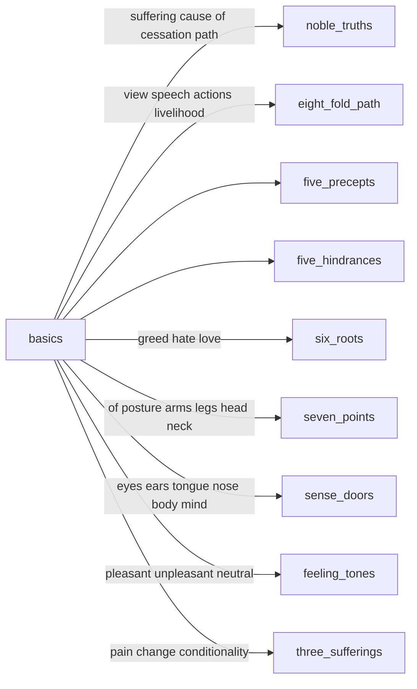

---
tags:
  - context
  - basics 
  - dukkha 
  - nibanna 
  - stream entry
---
# basics

<iframe width="835" height="470" src="https://www.youtube.com/embed/YYml4qwg1CE" title="Insight" frameborder="0" allow="accelerometer; autoplay; clipboard-write; encrypted-media; gyroscope; picture-in-picture; web-share" allowfullscreen></iframe>

## what are the four noble truths?

The Four Noble Truths are considered the cornerstone of Buddhist teaching, and were the first teachings given by the Buddha after his enlightenment. They are as follows:

1. The truth of suffering (dukkha): This truth states that all forms of existence are marked by suffering, frustration, and dissatisfaction. This includes physical suffering, emotional suffering, and a general sense of unease or dissatisfaction with life.
1. The truth of the cause of suffering (samudaya): This truth states that suffering arises from craving and attachment to things, and from ignorance of the true nature of reality.
1. The truth of the end of suffering (nirodha): This truth states that it is possible to end suffering by completely letting go of craving and attachment, and by realizing the true nature of reality.
1. The truth of the path to the end of suffering (magga): This truth outlines the Eightfold Path as the way to end suffering, which consists of right understanding, right intention, right speech, right action, right livelihood, right effort, right mindfulness, and right concentration.

These Four Noble Truths provide a roadmap for individuals to understand the nature of suffering, its causes, and how to overcome it. By following the Eightfold Path, individuals can end their suffering, attain peace, and eventually reach enlightenment.

## in buddhism what are the three universal truths?

In Buddhism, the Three Universal Truths are the fundamental principles that underlie the teachings of the Buddha. They are:

1. The truth of suffering ([dukkha](dukka.md)): This truth acknowledges that all forms of existence are characterized by suffering, including physical and mental suffering.
1. The truth of the cause of suffering (samudaya): This truth states that suffering arises from craving and attachment to things, and from ignorance of the true nature of reality.
1. The truth of the end of suffering (nirodha): This truth states that it is possible to end suffering by letting go of craving and attachment and by realizing the nature of reality.

These Three Universal Truths form the foundation of the Buddhist path to liberation, and understanding them is considered an essential step in attaining enlightenment. By recognizing the truth of suffering, practitioners can cultivate a sense of urgency to end it, and by recognizing the truth of its cause and cessation, they can develop a path to end suffering and achieve lasting happiness.

## caturapramāṇa

Caturapramāṇa refers to the Four Reliances in Buddhist philosophy. These Four Reliances are guidelines for how to approach and understand Buddhist teachings and scriptures. The Four Reliances are:

1. Rely on the teachings, not the person: The teachings of the Buddha should be relied upon, rather than the personality or charisma of the teacher.
1. Rely on the meanng, not just the words: The meaning behind the teachings is more important than the words used to express them.
1. Rely on the definitive meaning, not the provisional: The teachings should be understood in their final, definitive meaning, not just in a provisional or interpretive sense.
1. Rely on wisdom, not just faith: Wisdom should be developed through personal experience and investigation, not just through blind faith.

## categories of meditations

There are many different types of meditation, but they can generally be grouped into a few broad categories:

- MINDFULNESS meditation: This type of meditation involves focusing one's attention on the present moment and observing thoughts, emotions, and sensations without judgment.
- Loving-kindness meditation: This type of meditation involves cultivating feelings of love, kindness, and compassion towards oneself and others.
- CONCENTRATION meditation: This type of meditation involves focusing one's attention on a specific object, such as the breath, a mantra, or an image, with the aim of improving CONCENTRATION and mental clarity.
- Movement meditation: This type of meditation involves focusing on physical movements, such as walking, yoga, or tai chi, with the aim of becoming more present and mindful.
- Mantra meditation: This type of meditation involves repeating a word or phrase (a mantra) in order to still the mind and achieve a state of deep relaxation and concentration.
- Transcendental meditation: This type of meditation involves repeating a personal mantra, assigned by a teacher, in a specific way, with the aim of transcending ordinary awareness and experiencing a state of pure consciousness.
- Chakra meditation: This type of meditation involves focusing on the seven chakras (energy centers) in the body to promote balance, peace, and spiritual growth.

These are just a few examples of the many types of meditation. It's important to experiment with different techniques to find what works best for you and your goals.

## what are the primary teachings in buddhism?

Buddhism teaches that all beings can achieve ultimate liberation from the cycle of suffering and rebirth, known as nirvana or enlightenment, by following the Eightfold Path. The primary teachings of Buddhism can be summarized as follows:

- The Four Noble Truths: These are the basic principles of Buddhism, which state that all existence is suffering, that suffering arises from craving and ignorance, that it is possible to end suffering, and that the Eightfold Path is the way to achieve this end.
- The Eightfold Path: This is the path to the end of suffering and the attainment of enlightenment. It consists of right understanding, right intention, right speech, right action, right livelihood, right effort, right mindfulness, and right concentration.
- The Three Universal Truths: These are the truths of all phenomena, which state that all things are impermanent, that all beings are subject to suffering, and that there is no permanent self or soul.
- Dependent Origination: This is the teaching that all phenomena arise in dependence upon other phenomena, and that everything is interdependent and interconnected.
- The Five Precepts: These are ethical guidelines that provide a foundation for Buddhist moral conduct, and consist of abstaining from harming living beings, taking what is not given, engaging in sexual misconduct, speaking falsehoods, and taking intoxicants.
- Compassion and Bodhisattva Ideal: Buddhism teaches the development of compassion and the aspiration to attain enlightenment for the benefit of all beings, as exemplified by the bodhisattva, a being who has made a vow to attain enlightenment for the sake of all beings.

These are some of the core teachings in Buddhism, and there are many other aspects and practices within the tradition, such as meditation, chanting, and visualization, which are designed to help individuals cultivate these principles and attain liberation.

## 7 factors of awakening

The 7 factors of awakening, also known as the 7 limbs of awakening, are:

1. MINDFULNESS (sati)
1. Investigation of the Dhamma (dhamma vicaya)
1. Energy (viriya)
1. Joy or rapture (pīti)
1. Relaxation or tranquility (passaddhi)
1. CONCENTRATION (samādhi)
1. Equanimity (upekkha)
1. These factors are seen as interdependent and are developed through meditation and the cultivation of virtuous conduct. The ultimate aim is the realization of the Four Noble Truths and the attainment of enlightenment.

## what are the kleshas

The Kleshas, also known as the "Five Afflictions" or "Five Poisons," are negative mental states or emotions in Buddhism.

They are:

1. ignorance
2. attachment
3. aversion
4. pride
5. jealousy

These mental states are believed to be the root cause of suffering and keep individuals trapped in cyclic existence. Practicing MINDFULNESS and meditation is said to help overcome the Kleshas and achieve liberation from suffering.

## three marks of existence

In Buddhism, there are three types of suffering, which are known as the Three Universal Truths or the Three Marks of Existence. They are:

1. Dukkha-dukkha: This refers to the suffering that arises from painful experiences, such as sickness, old age, and death.
1. Samkhara-dukkha: This refers to the suffering that arises from the impermanence of all things, including pleasant experiences that are bound to change or come to an end.
1. Viparinama-dukkha: This refers to the suffering that arises from our tendency to cling to things or experiences that are impermanent and constantly changing. This includes the suffering that arises from attachment, craving, and aversion.

## what are the attributes of enlightenment

Enlightenment is a term used in various spiritual traditions to describe a state of spiritual awakening, liberation, or self-realization. The specific attributes of enlightenment can vary across traditions, but some of the most common ones include:

- Wisdom: Enlightenment is characterized by deep insight into the nature of reality, including the impermanence, interdependence, and lack of inherent existence of all phenomena.
- Compassion: Enlightenment is often associated with a profound sense of compassion and empathy for all beings, free from discrimination or prejudice.
- Freedom: Enlightenment is considered to bring a sense of freedom from mental afflictions such as attachment, aversion, ignorance, and greed.
- Inner peace: Enlightenment is said to bring a deep sense of inner peace, equanimity, and well-being, even in the face of adversity.
- Integration: Enlightenment is considered to bring a sense of integration and wholeness, where the mind, body, and emotions are aligned and functioning harmoniously.
- Direct experience: Enlightenment is considered to be a direct experience of reality, free from the dualistic distinctions between self and other, subject and object.
- These are some of the most commonly described attributes of enlightenment in spiritual traditions, but it is important to note that these descriptions are meant to be guidelines rather than definitive explanations of what enlightenment is. The ultimate nature of enlightenment can only be directly experienced and realized through spiritual practice, and not through conceptual understanding alone.

## what is Mitta Sutta

The Metta Sutta, also known as the "Discourse on Loving-Kindness" or the "Karaniya Metta Sutta," is a Buddhist text that is considered to be one of the most important discourses on the practice of loving-kindness and compassion. It is part of the Pali Canon, the collection of early Buddhist texts, and is found in the Khuddaka Nikaya of the Sutta Pitaka.

The Metta Sutta is a teaching on the cultivation of universal loving-kindness and compassion, which are considered to be key qualities for spiritual development and the achievement of inner peace. The sutta offers a series of verses that encourage the practitioner to cultivate feelings of loving-kindness and compassion for themselves and others, including friends and enemies.

In addition to its importance as a teaching on loving-kindness, the Metta Sutta is also highly regarded for its poetic and meditative quality. It is often recited and used as a focus for meditation and has been widely translated into various languages.

## in buddhism what meditations use dicohtomies

In Buddhism, there are several meditation practices that use dichotomies or pairs of opposites.

- One well-known practice is the development of MINDFULNESS (sati) and clear comprehension (sampajañña).
- Another practice that involves dichotomies is the contemplation of the rise and fall of physical and mental phenomena (udaya-vaya).
- Additionally, the Four Noble Truths also involve a dichotomy, with the first truth being the recognition of dukkha (suffering) and the fourth truth being the path to the end of suffering.

These dichotomies are used as tools to help the practitioner understand the nature of reality and to develop greater insight and wisdom.

## the 51 mental formations

In Buddhism, the 51 mental formations (Pali: cetasikas) are mental factors or states of mind that accompany each conscious thought or experience.

They are listed in the Abhidhamma, the Theravada Buddhist philosophical text, as:

1. faith
2. energy
3. mindfulness
4. concentration
5. wisdom
6. shame
7. fear of wrongdoing
8. shame of wrongdoing
9. conscience
10. non-greed
11. non-hatred
12. equanimity
13. intention
14. contact
15. feeling
16. perception
17. volition
18. one-pointedness
19. desire
20. interest
21. attention
22. determination
23. decision
24. persistence
25. mindfulness
26. equanimity
27. confidence
28. tranquility
29. joy
30. pleasure
31. gladness
32. delight
33. calmness
34. happiness
35. self-possession
36. awareness
37. non-delusion
38. kindness
39. compassion
40. altruistic joy
41. equanimity towards beings
42. physical serenity
43. mental serenity
44. faith
45. moral shame
46. moral dread
47. mental faculty
48. physical faculty
49. diligence
50. circumspection
51. shame at misdeeds
52. dread of misdeeds
53. energy
54. mindfulness
55. equanimity
56. non-remorse
57. non-regret
58. non-shame
59. non-fear
60. non-perversion
61. non-torpor
62. non-agitation
63. non-ignorance

These mental factors can be seen as interdependent and can arise in any combination, either in wholesome or unwholesome ways, depending on the conditions and circumstances that prompt their arising.

## 6 roots

1. Faith (saddhā)
1. Energy (viriya)
1. MINDFULNESS (sati)
1. CONCENTRATION (samādhi)
1. Wisdom (paññā)
1. Moral Discipline (sīla)

## Lokavipatti

The Lokavipatti Sutta is a Buddhist discourse found in the Pali Canon's Majjhima Nikaya.

It deals with the subject of avoiding errors or pitfalls (Lokavipatti) in one's spiritual journey.

The sutta lists six factors that can cause one to fall into error:

1. desire for sense objects
1. wrong views
1. lack of learning and inquiry
1. heedlessness
1. bad companionship
1. laziness

The sutta provides guidance on how to avoid these pitfalls by cultivating the opposite qualities, such as renunciation of sense desires, right views, learning and inquiry, mindfulness, good companionship, and diligence.

The sutta emphasizes the importance of developing wisdom and insight to overcome obstacles in one's spiritual path.

## diagram

## five hindrances

The five hindrances are obstacles that can arise during meditation and prevent one from attaining deep states of concentration and insight. They are:

- Sensory desire (kamacchanda): The strong attachment to pleasant sensory experiences and desire for more.
- Ill-will (vyapada): Feelings of hostility, anger, and aversion towards oneself or others.
- Sloth and torpor (thina-middha): A state of dullness or sleepiness that hinders alertness and clarity of mind.
- Restlessness and worry (uddhacca-kukkucca): An agitated and restless mind that is distracted by worries, fears, and anxieties.
- Doubt (vicikiccha): The lack of faith in oneself or the practice, leading to uncertainty and indecisiveness.

By recognizing and working to overcome these hindrances, one can develop greater concentration, insight, and inner peace in meditation and in daily life.

## no birth no death

- see also [signlessness](thich.md#signlessness) and [emptiness](emptiness.md)

you've probably heard of the laws of conservation of energy

the idea in buddhism of no birth, no death is similar

energy is not created or destroyed it just changes form

an objective comparison is a water, in different forms water is still water

we could say a wave is born, and a wave dies, but does it really?

this story is not different for for other forms, energy is always changing forms

a drop of water in the ocean is not different from the drop of water in a wave

a wave happens, it appears, from the wind, currents or other forces

but if you examine a wave, there are no "wave atoms" there is just water

no different if it is still water or in a wave
