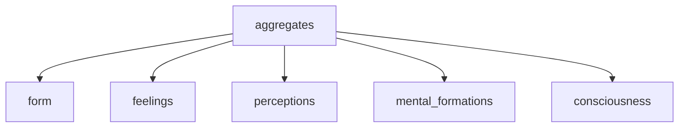

---
tags:
  - primordial confusion 
  - aggregates 
  - no self 
  - deduction 
---
# aggregates

- this is one way to **divide and conquer** the ==fabricated== idea of a permanent self or ego
- use the deduction tag above for similar examples

--8<-- "snippets/dogen.md"

<iframe width="802" height="501" src="https://www.youtube.com/embed/dx4j8eA_aDc" title="220321 Understanding Aggregates \ \ Thanissaro Bhikkhu \ \ Dhamma Talk" frameborder="0" allow="accelerometer; autoplay; clipboard-write; encrypted-media; gyroscope; picture-in-picture; web-share" allowfullscreen></iframe>

- 5 heaps or aggregates
- like baggage everyone carries around on their shoulders
- like the [6 senses](sense.md) if you take one of these away the person exists
- therefore no self is found in any individual aggregate
- you are not your body, feelings, perceptions, mental formations or consciousness
- these all [arise from interdependent causes](interdependence.md) and pass away

--8<-- "snippets/5_aggregates.md"

## what is khanda sutta

The Khandha Sutta is a discourse from the Pali Canon of Theravada Buddhism. The word "khandha" in Pali refers to the five aggregates of physical and mental phenomena that make up the concept of an individual self.

The five aggregates are:

- form (body)
- feelings
- perceptions
- mental formations
- consciousness

In the Khandha Sutta, the Buddha teaches about the nature of the five aggregates and their interdependence. He explains that these aggregates are not a permanent, unchanging self, but are instead impermanent and constantly changing phenomena that arise and pass away in response to different conditions.

The Khandha Sutta is often used as a teaching tool to help practitioners understand the nature of self and reality. By examining the five aggregates, practitioners can gain insight into the impermanence and lack of self in all things and develop a more profound understanding of dependent origination, the idea that all phenomena arise in dependence upon other phenomena.

Through this insight, practitioners can overcome attachment and ignorance, and eventually attain liberation from the cycle of birth and death. The Khandha Sutta is an important text in Theravada Buddhism and is widely studied by practitioners seeking to deepen their understanding of Buddhist teachings.

## Alagaddupama Sutta

The Alagaddupama Sutta discusses the five aggregates of experience: form, sensation, perception, mental formations, and consciousness. It explains how these aggregates are the source of suffering and how to liberate oneself from them.

The Buddha teaches that the aggregates are not permanent or solid. They are constantly changing and impermanent. He also teaches that the aggregates are not self. They are not something that you are. They are simply experiences that you have.

The Buddha teaches that when you cling to the aggregates, you suffer. When you try to control them or make them permanent, you suffer. When you identify with them, you suffer.

The Buddha teaches that the way to liberate yourself from suffering is to let go of the aggregates. Let go of your attachment to them. Let go of your need to control them. Let go of your need to make them permanent. Let go of your need to identify with them.

When you let go of the aggregates, you are free from suffering. You are free to experience the world without attachment. You are free to experience the world without suffering.