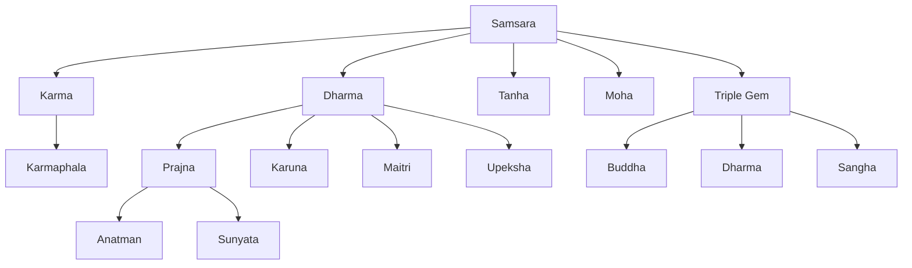
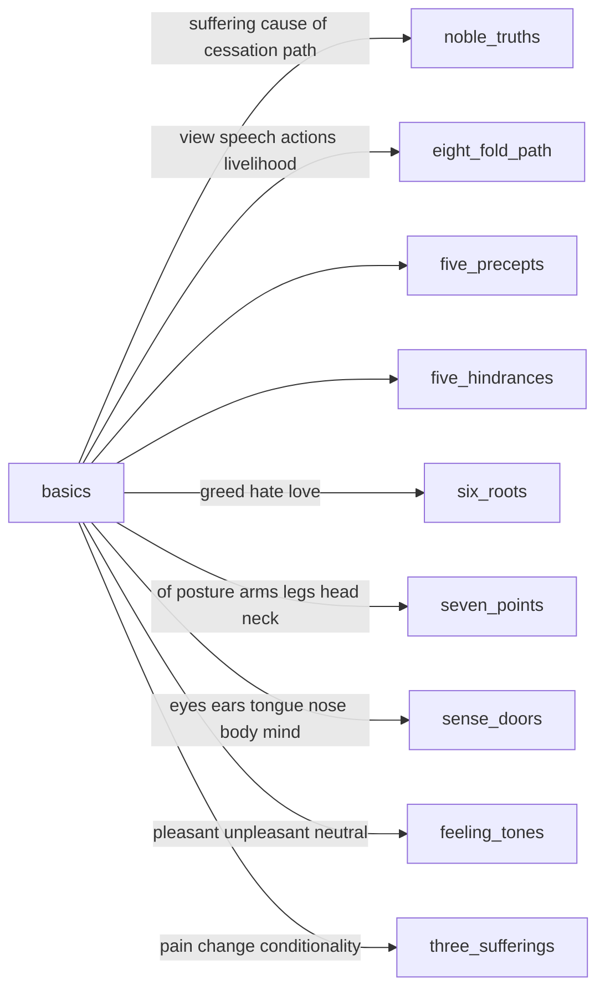
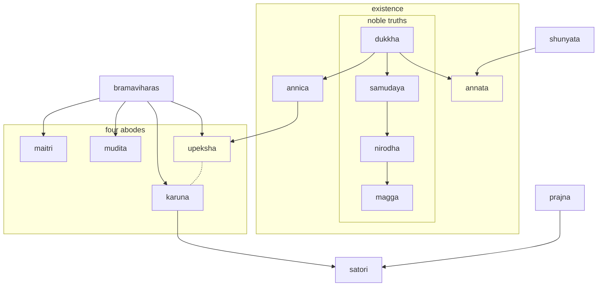
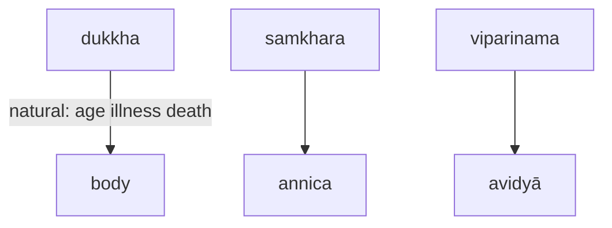

---
tags:
  - context
  - basics
  - dukkha
  - nibanna
  - stream entry
---

# basics

<iframe width="835" height="470" src="https://www.youtube.com/embed/YYml4qwg1CE" title="Insight" frameborder="0" allow="accelerometer; autoplay; clipboard-write; encrypted-media; gyroscope; picture-in-picture; web-share" allowfullscreen></iframe>

| Sanskrit Term | Definition |
| --- | --- |
| Dharma | The teachings of the Buddha |
| Buddha | One who has achieved enlightenment |
| Samsara | The cycle of birth, death, and rebirth |
| Nirvana | The ultimate goal of Buddhist practice, liberation from suffering and rebirth |
| Karma | The law of cause and effect; the accumulation of past actions influencing present and future experiences |
| Sangha | The community of Buddhist practitioners |
| Bodhisattva | One who is on the path to Buddhahood and seeks to help others achieve liberation |
| Prajna | Wisdom, particularly the insight into the nature of reality |
| Samadhi | Meditative concentration, the practice of stilling the mind |
| Emptiness | The Buddhist understanding of the ultimate nature of reality, that all phenomena lack inherent existence |
| Sutra | A canonical text containing the Buddha's teachings |
| Mantra | A sacred sound or phrase used for meditation or spiritual practice |
| Vajra | A ritual implement symbolizing spiritual power and clarity |
| Mudra | A symbolic hand gesture used in meditation and ritual |
| Mandala | A symbolic representation of the universe used in meditation and ritual |
| Guru | A spiritual teacher or guide |
| Tantra | A set of practices and texts that utilize ritual and visualization to achieve spiritual transformation |
| Zen | A school of Mahayana Buddhism emphasizing meditation and direct experience |
| Tathagata | Another name for the Buddha, meaning "thus-gone" or "thus-come" |
| Dukkha | Suffering or unsatisfactoriness |
| Bodhicitta | The altruistic intention to attain enlightenment for the benefit of all sentient beings |
| Anicca | Impermanence, the understanding that all things are constantly changing |
| Skandhas | The five aggregates that make up a person's experience: form, feeling, perception, mental formations, and consciousness |
| Sunyata | Emptiness, the ultimate nature of reality as understood in Mahayana Buddhism |
| Upaya | Skillful means, the use of various methods to help others achieve spiritual goals |
| Bodhi | Awakening, the state of enlightenment |
| Amitabha | A Buddha of the Pure Land school, associated with the western direction and the vow to help beings achieve rebirth in a pure land |
| Dzogchen | A system of meditation and spiritual practice in Tibetan Buddhism emphasizing direct awareness of the nature of the mind |
| Nyingma | The oldest school of Tibetan Buddhism, known for its emphasis on the Dzogchen teachings |
| Gelug | A school of Tibetan Buddhism founded by the scholar and saint Je Tsongkhapa, emphasizing study and monastic discipline |
| Kagyu | A school of Tibetan Buddhism emphasizing meditation and the transmission of teachings from teacher to student |
| Mahamudra | A system of meditation and spiritual practice in the Kagyu school of Tibetan Buddhism, emphasizing the nature of mind |
| Madhyamaka | A philosophical system of Mahayana Buddhism emphasizing the understanding of emptiness |
| Pratityasamutpada | Dependent origination, the understanding that all phenomena arise in dependence on causes and conditions |
| Bodhisattva Vow | A commitment to seek enlightenment for the benefit of all sentient beings |
| Three Jewels | The Buddha, the Dharma, and the Sangha, the objects of refuge in Buddhism |
| Three Yanas | The three vehicles or paths in Buddhism: Hinayana, Mahayana, and Vajrayana |
| Hinayana | The "lesser vehicle" of Buddhism, emphasizing individual liberation

| Sutta | Type of Meditation |
| --- | --- |
| Anapanasati Sutta | Mindfulness of breath |
| Satipatthana Sutta | Four foundations of mindfulness |
| Metta Sutta | Loving-kindness |
| Karaniya Metta Sutta | Loving-kindness |
| Asubha Sutta | Contemplation of the unattractive |
| Anattalakkhana Sutta | Contemplation of non-self |
| Adittapariyaya Sutta | Contemplation of impermanence |
| Bahiya Sutta | Contemplation of the external world |
| Kayagatasati Sutta | Mindfulness of the body |
| Dhammacakkappavattana Sutta | Turning the wheel of Dharma |

## what are the four noble truths?

The Four Noble Truths are considered the cornerstone of Buddhist teaching, and were the first teachings given by the Buddha after his enlightenment. They are as follows:

1. The truth of suffering (dukkha): This truth states that all forms of existence are marked by suffering, frustration, and dissatisfaction. This includes physical suffering, emotional suffering, and a general sense of unease or dissatisfaction with life.
1. The truth of the cause of suffering (samudaya): This truth states that suffering arises from craving and attachment to things, and from ignorance of the true nature of reality.
1. The truth of the end of suffering (nirodha): This truth states that it is possible to end suffering by completely letting go of craving and attachment, and by realizing the true nature of reality.
1. The truth of the path to the end of suffering (magga): This truth outlines the Eightfold Path as the way to end suffering, which consists of right understanding, right intention, right speech, right action, right livelihood, right effort, right mindfulness, and right concentration.

These Four Noble Truths provide a roadmap for individuals to understand the nature of suffering, its causes, and how to overcome it. By following the Eightfold Path, individuals can end their suffering, attain peace, and eventually reach enlightenment.

## basic disagram

## three dharma seals

- Anicca (impermanence), everything changes
- Anatta (non-self), nothing has a separate existence
- Dukkha (suffering), all conditioned things are unsatisfactory

The three dharma seals are a central teaching in Buddhism. They help us to understand the nature of reality and to liberate ourselves from suffering.

## Three Doors of Liberation

The Three Doors of Liberation are a Buddhist teaching on how to overcome suffering. They are:

- Emptiness: The realization that all phenomena are empty of any inherent nature or essence. This means that there is no such thing as a permanent, unchanging, or independent entity. Everything is constantly changing and evolving, and everything is interconnected.
- Signlessness: The realization that all phenomena are devoid of any inherent signs or marks. This means that there is no such thing as a permanent, unchanging, or independent entity that can be identified or described. Everything is constantly changing and evolving, and everything is interconnected.
- Aimlessness: The realization that all phenomena are devoid of any inherent goal or destination. This means that there is no such thing as a permanent, unchanging, or independent entity that can be achieved or attained. Everything is constantly changing and evolving, and everything is interconnected.

The Three Doors of Liberation are not a destination, but a journey. They are a way of seeing the world that can help us to let go of our attachments and to find peace and happiness.

## sanskrit word map

| Prajna (प्रज्ञा) | Description                                                                                                                                                                                                                                                                               |
| ------------- | ----------------------------------------------------------------------------------------------------------------------------------------------------------------------------------------------------------------------------------------------------------------------------------------- |
| Pra (प्र)      | Means "before" or "preliminary"                                                                                                                                                                                                                                                           |
| Jna (ज्ञ)      | Means "to know" or "to understand"                                                                                                                                                                                                                                                        |
| Prajna (प्रज्ञा) | Refers to the wisdom or understanding that comes from deep meditation and insight into the true nature of reality, particularly the concept of emptiness. Prajna is one of the six perfections (paramitas) in Mahayana Buddhism, and is considered essential for achieving enlightenment. |

| Four Types of Prajna  |                                                                                                                                                                                                     |
| --------------------- | --------------------------------------------------------------------------------------------------------------------------------------------------------------------------------------------------- |
| Shravaka Prajna       | Refers to the wisdom or understanding attained by Hinayana practitioners, who seek to attain individual liberation (nirvana) through the realization of the Four Noble Truths.                      |
| Pratyekabuddha Prajna | Refers to the wisdom or understanding attained by solitary practitioners who seek to attain enlightenment for themselves alone, without the help of a teacher or community.                         |
| Bodhisattva Prajna    | Refers to the wisdom or understanding attained by Mahayana practitioners, who seek to attain enlightenment not only for themselves but for the benefit of all sentient beings.                      |
| Tathagata Prajna      | Refers to the highest form of wisdom or understanding, attained by fully enlightened Buddhas, who have realized the ultimate nature of reality and have the ability to teach others to do the same. |

| Three Characteristics of Existence | Description                                                                                                                                                                                                                                                                                                                        |
| ---------------------------------- | ---------------------------------------------------------------------------------------------------------------------------------------------------------------------------------------------------------------------------------------------------------------------------------------------------------------------------------- |
| Anicca                             | Refers to the idea that all things are constantly changing and in a state of flux. Nothing in the world is permanent, and everything is subject to birth, aging, sickness, and death.                                                                                                                                              |
| Dukkha                             | Refers to the idea that all things in the world are inherently unsatisfactory and cannot provide lasting happiness or fulfillment. This suffering is caused by our attachment to impermanent things and our ignorance of the true nature of reality.                                                                               |
| Anatta                             | Refers to the idea that there is no fixed or permanent self or soul. Rather, our sense of self is an ever-changing product of our thoughts, emotions, and experiences. The concept of anatta is closely related to the idea of emptiness (shunyata), which is the ultimate nature of all phenomena according to Mahayana Buddhism. |

| English Translation | Sanskrit |
| ------------------- | -------- |
| Loving-kindness     | Maitri   |
| Compassion          | Karuna   |
| Sympathetic Joy     | Mudita   |
| Equanimity          | Upeksha  |

| Term    | Definition                                                                                                                                                                                                                                                                                                    |
| ------- | ------------------------------------------------------------------------------------------------------------------------------------------------------------------------------------------------------------------------------------------------------------------------------------------------------------- |
| Bodhi   | A Sanskrit term used in Buddhism that refers to the state of awakening, enlightenment, or liberation that one can attain through the practice of meditation, ethical conduct, and other spiritual disciplines. It is considered the ultimate goal of Buddhist practice.                                       |
| Satori  | A Japanese term used in Zen Buddhism that refers to a sudden flash of understanding or insight that can lead to a state of enlightenment. It is often associated with the practice of meditation and koans, which are riddles or paradoxical statements.                                                      |
| Nirvana | A Sanskrit term used in various Buddhist traditions that refers to the state of liberation or enlightenment that one can attain through the practice of meditation and other spiritual disciplines. It is often associated with the cessation of suffering and the realization of the true nature of reality. |

## karuna

Karuna is a Sanskrit term used in Buddhism that refers to the quality of compassion, or the desire to alleviate the suffering of others. It is one of the four Brahmaviharas, or sublime attitudes, that are cultivated through meditation practice in Buddhist teachings. The practice of Karuna involves cultivating a sense of empathy and concern for the welfare of all beings, and taking action to relieve their suffering whenever possible. It is considered a key component of the path to enlightenment, and is often associated with the Bodhisattva ideal, in which an individual seeks to attain enlightenment for the benefit of all sentient beings.

## prajna

Prajna, which is also known as wisdom or insight, is a fundamental concept in Buddhism that refers to a deep understanding of the nature of reality and the causes of suffering. According to Buddhist teachings, prajna is one of the two wings of enlightenment, along with compassion, and is essential for attaining liberation from the cycle of rebirth and suffering. Prajna is often contrasted with ordinary knowledge, which is based on conceptual thinking and discrimination, and is described as a direct and intuitive understanding that arises from the practice of meditation and other spiritual disciplines. By cultivating prajna, Buddhists aim to develop a more profound and transformative understanding of the nature of existence and to overcome the ignorance and delusion that give rise to suffering.

## upekkha

Upekkha, which is also known as equanimity, is one of the four Brahma Viharas or sublime states in Buddhism. It refers to a state of balanced and even-minded awareness, characterized by a sense of peace and acceptance towards all experiences, whether pleasant or unpleasant. According to Buddhist teachings, cultivating upekkha can help individuals to overcome the afflictions of attachment, aversion, and ignorance, which are the root causes of suffering. By developing a sense of equanimity, Buddhists aim to cultivate a deeper understanding and acceptance of the impermanent and ever-changing nature of reality, as well as a greater sense of empathy and compassion towards all living beings.

## annica

Anicca, which means impermanence, is one of the three characteristics of existence in Buddhism. It refers to the notion that all things are in a constant state of flux and that nothing is permanent or unchanging. According to Buddhist teachings, the realization of impermanence is essential for spiritual growth and liberation, as it helps individuals to let go of attachment, craving, and suffering. By accepting the impermanent nature of all things, Buddhists aim to cultivate a deeper sense of equanimity, wisdom, and compassion in their lives.

Anicca is both change and impermanence. Change is a more literal translation of the word, while impermanence is a more abstract concept. Change means that everything in the world is constantly changing, from the smallest particle to the largest galaxy. Even our own bodies are constantly changing, as cells die and are replaced. Impermanence means that nothing lasts forever. Everything in the world is eventually destroyed, even the most powerful empires and the most beautiful works of art.

The concept of anicca is one of the most important concepts in Buddhism. By understanding anicca, we can learn to let go of attachments to things that are impermanent, and to accept the ever-changing nature of reality.

## in buddhism what are the three universal truths?

## concepts

| Concept                | Meaning                                                                         |
| ---------------------- | ------------------------------------------------------------------------------- |
| annica -  Impermanence | All conditioned things are impermanent and constantly changing                  |
| Emptiness              | All phenomena are empty of inherent existence and dependently originated        |
| annata - No self       | There is no permanent, unchanging, independent self or soul                     |
| Signless               | All phenomena are without any inherent characteristics or signs                 |
| Aimlessness            | There is no ultimate goal or purpose                                            |
| satori bodhi Nirvana   | The ultimate goal of Buddhism, a state of liberation from suffering and rebirth |

## signlessness

Buddhist signlessness in Sanskrit is called animitta. It is the third of the three marks of existence, along with impermanence and suffering. Animitta refers to the absence of any inherent signs or marks in phenomena.

In Buddhism, it is believed that all phenomena are empty of any inherent nature or essence. This means that there is no such thing as a permanent, unchanging, or independent entity. Everything is constantly changing and evolving, and everything is interconnected.

Animitta is often described as the realization that all phenomena are empty of any inherent meaning or significance. This does not mean that phenomena are meaningless, but rather that their meaning is dependent on the context in which they arise.

Animitta is a difficult concept to grasp, but it is an essential part of Buddhist practice. It is said that when we achieve animitta, we will find true wisdom and enlightenment.

## aimlessness

Aimlessness in Buddhism is called Apranihita or uncommittedness or wishlessness in Sanskritapraṇihita अप्रणिहित. It is a form of "concentration" in some schools of Buddhist meditation. It is a state of mind where you are not attached to any particular goal or outcome. You are simply present in the moment, observing your thoughts and feelings without judgment.

Aimlessness is not the same as laziness or apathy. It is not about giving up on your goals or dreams. It is about letting go of your attachment to them. When you are aimless, you are free to enjoy the journey, even if you don't know where you are going.

Aimlessness can be a difficult concept to grasp, but it is an essential part of Buddhist practice. It is said that when we achieve aimlessness, we will find true happiness and enlightenment.

## suttas

- Dhammacakkappavattana Sutta (The Setting in Motion of the Wheel of Dhamma): MN 26
- Anatta Sutta (The Non-Self Sutta): MN 3
- Nibbida Sutta (The Extinction of Suffering Sutta): MN 22
- Satipatthana Sutta (The Four Foundations of Mindfulness Sutta): MN 10
- Samadhi Sutta (The Factors of Concentration Sutta): MN 12
- Khandha Sutta (The Five Aggregates Sutta): MN 22
- Anicca Sutta (The Impermanence Sutta): MN 27
- Dukkha Sutta (The Suffering Sutta): MN 3
- Metta Sutta (The Loving-Kindness Sutta): MN 117
- Upekka Sutta (The Equanimity Sutta): MN 121

## universal truths

In Buddhism, the Three Universal Truths are the fundamental principles that underlie the teachings of the Buddha. They are:

1. The truth of suffering ([dukkha](dukka.md)): This truth acknowledges that all forms of existence are characterized by suffering, including physical and mental suffering.
1. The truth of the cause of suffering (samudaya): This truth states that suffering arises from craving and attachment to things, and from ignorance of the true nature of reality.
1. The truth of the end of suffering (nirodha): This truth states that it is possible to end suffering by letting go of craving and attachment and by realizing the nature of reality.

These Three Universal Truths form the foundation of the Buddhist path to liberation, and understanding them is considered an essential step in attaining enlightenment. By recognizing the truth of suffering, practitioners can cultivate a sense of urgency to end it, and by recognizing the truth of its cause and cessation, they can develop a path to end suffering and achieve lasting happiness.

## nirodha

Nirodha is a concept in Buddhism that refers to the cessation or ending of suffering. It is one of the Four Noble Truths, which are considered the foundational teachings of Buddhism.

According to Buddhist philosophy, suffering (dukkha) arises from craving, attachment, and ignorance. Nirodha is the state in which these causes of suffering have been eliminated, and the mind is in a state of complete equanimity and peace.

Nirodha is achieved through the practice of the Noble Eightfold Path, which includes right understanding, intention, speech, action, livelihood, effort, mindfulness, and concentration. By following these eight steps, one can gradually overcome the causes of suffering and attain Nirodha.

Nirodha is often associated with the concept of Nirvana, which is the ultimate goal of Buddhist practice. While Nirodha refers specifically to the cessation of suffering, Nirvana is a state of ultimate liberation and enlightenment that goes beyond the absence of suffering.

In Buddhist practice, the realization of Nirodha is considered a profound spiritual accomplishment, as it allows one to live in a state of freedom and peace, no longer driven by the forces of craving and attachment.

## caturapramāṇa

Caturapramāṇa refers to the Four Reliances in Buddhist philosophy. These Four Reliances are guidelines for how to approach and understand Buddhist teachings and scriptures. The Four Reliances are:

1. Rely on the teachings, not the person: The teachings of the Buddha should be relied upon, rather than the personality or charisma of the teacher.
1. Rely on the meanng, not just the words: The meaning behind the teachings is more important than the words used to express them.
1. Rely on the definitive meaning, not the provisional: The teachings should be understood in their final, definitive meaning, not just in a provisional or interpretive sense.
1. Rely on wisdom, not just faith: Wisdom should be developed through personal experience and investigation, not just through blind faith.

## categories of meditations

There are many different types of meditation, but they can generally be grouped into a few broad categories:

- MINDFULNESS meditation: This type of meditation involves focusing one's attention on the present moment and observing thoughts, emotions, and sensations without judgment.
- Loving-kindness meditation: This type of meditation involves cultivating feelings of love, kindness, and compassion towards oneself and others.
- CONCENTRATION meditation: This type of meditation involves focusing one's attention on a specific object, such as the breath, a mantra, or an image, with the aim of improving CONCENTRATION and mental clarity.
- Movement meditation: This type of meditation involves focusing on physical movements, such as walking, yoga, or tai chi, with the aim of becoming more present and mindful.
- Mantra meditation: This type of meditation involves repeating a word or phrase (a mantra) in order to still the mind and achieve a state of deep relaxation and concentration.
- Transcendental meditation: This type of meditation involves repeating a personal mantra, assigned by a teacher, in a specific way, with the aim of transcending ordinary awareness and experiencing a state of pure consciousness.
- Chakra meditation: This type of meditation involves focusing on the seven chakras (energy centers) in the body to promote balance, peace, and spiritual growth.

These are just a few examples of the many types of meditation. It's important to experiment with different techniques to find what works best for you and your goals.

## what are the primary teachings in buddhism?

Buddhism teaches that all beings can achieve ultimate liberation from the cycle of suffering and rebirth, known as nirvana or enlightenment, by following the Eightfold Path. The primary teachings of Buddhism can be summarized as follows:

- The Four Noble Truths: These are the basic principles of Buddhism, which state that all existence is suffering, that suffering arises from craving and ignorance, that it is possible to end suffering, and that the Eightfold Path is the way to achieve this end.
- The Eightfold Path: This is the path to the end of suffering and the attainment of enlightenment. It consists of right understanding, right intention, right speech, right action, right livelihood, right effort, right mindfulness, and right concentration.
- The Three Universal Truths: These are the truths of all phenomena, which state that all things are impermanent, that all beings are subject to suffering, and that there is no permanent self or soul.
- Dependent Origination: This is the teaching that all phenomena arise in dependence upon other phenomena, and that everything is interdependent and interconnected.
- The Five Precepts: These are ethical guidelines that provide a foundation for Buddhist moral conduct, and consist of abstaining from harming living beings, taking what is not given, engaging in sexual misconduct, speaking falsehoods, and taking intoxicants.
- Compassion and Bodhisattva Ideal: Buddhism teaches the development of compassion and the aspiration to attain enlightenment for the benefit of all beings, as exemplified by the bodhisattva, a being who has made a vow to attain enlightenment for the sake of all beings.

These are some of the core teachings in Buddhism, and there are many other aspects and practices within the tradition, such as meditation, chanting, and visualization, which are designed to help individuals cultivate these principles and attain liberation.

## 7 factors of awakening

- [playlist](https://www.youtube.com/playlist?list=PLCXN1GlAupG0zwUfPOv9uoBFI6DYDuTNf)

<iframe width="560" height="315" src="https://www.youtube.com/embed/videoseries?list=PLCXN1GlAupG0zwUfPOv9uoBFI6DYDuTNf" title="YouTube video player" frameborder="0" allow="accelerometer; autoplay; clipboard-write; encrypted-media; gyroscope; picture-in-picture; web-share" allowfullscreen></iframe>

The 7 factors of awakening, also known as the 7 limbs of awakening, are:

1. MINDFULNESS (sati)
1. Investigation of the Dhamma (dhamma vicaya)
1. Energy (viriya)
1. Joy or rapture (pīti)
1. Relaxation or tranquility (passaddhi)
1. CONCENTRATION (samādhi)
1. Equanimity (upekkha)
1. These factors are seen as interdependent and are developed through meditation and the cultivation of virtuous conduct. The ultimate aim is the realization of the Four Noble Truths and the attainment of enlightenment.

## what are the kleshas

The Kleshas, also known as the "Five Afflictions" or "Five Poisons," are negative mental states or emotions in Buddhism.

They are:

1. ignorance
2. attachment
3. aversion
4. pride
5. jealousy

These mental states are believed to be the root cause of suffering and keep individuals trapped in cyclic existence. Practicing MINDFULNESS and meditation is said to help overcome the Kleshas and achieve liberation from suffering.

## three marks of existence

In Buddhism, there are three types of suffering, which are known as the Three Universal Truths or the Three Marks of Existence. They are:

1. Dukkha-dukkha: This refers to the suffering that arises from painful experiences, such as sickness, old age, and death.
1. Samkhara-dukkha: This refers to the suffering that arises from the impermanence of all things, including pleasant experiences that are bound to change or come to an end.
1. Viparinama-dukkha: This refers to the suffering that arises from our tendency to cling to things or experiences that are impermanent and constantly changing. This includes the suffering that arises from attachment, craving, and aversion.

## what are the attributes of enlightenment

Enlightenment is a term used in various spiritual traditions to describe a state of spiritual awakening, liberation, or self-realization. The specific attributes of enlightenment can vary across traditions, but some of the most common ones include:

- Wisdom: Enlightenment is characterized by deep insight into the nature of reality, including the impermanence, interdependence, and lack of inherent existence of all phenomena.
- Compassion: Enlightenment is often associated with a profound sense of compassion and empathy for all beings, free from discrimination or prejudice.
- Freedom: Enlightenment is considered to bring a sense of freedom from mental afflictions such as attachment, aversion, ignorance, and greed.
- Inner peace: Enlightenment is said to bring a deep sense of inner peace, equanimity, and well-being, even in the face of adversity.
- Integration: Enlightenment is considered to bring a sense of integration and wholeness, where the mind, body, and emotions are aligned and functioning harmoniously.
- Direct experience: Enlightenment is considered to be a direct experience of reality, free from the dualistic distinctions between self and other, subject and object.
- These are some of the most commonly described attributes of enlightenment in spiritual traditions, but it is important to note that these descriptions are meant to be guidelines rather than definitive explanations of what enlightenment is. The ultimate nature of enlightenment can only be directly experienced and realized through spiritual practice, and not through conceptual understanding alone.

## what is Mitta Sutta

The Metta Sutta, also known as the "Discourse on Loving-Kindness" or the "Karaniya Metta Sutta," is a Buddhist text that is considered to be one of the most important discourses on the practice of loving-kindness and compassion. It is part of the Pali Canon, the collection of early Buddhist texts, and is found in the Khuddaka Nikaya of the Sutta Pitaka.

The Metta Sutta is a teaching on the cultivation of universal loving-kindness and compassion, which are considered to be key qualities for spiritual development and the achievement of inner peace. The sutta offers a series of verses that encourage the practitioner to cultivate feelings of loving-kindness and compassion for themselves and others, including friends and enemies.

In addition to its importance as a teaching on loving-kindness, the Metta Sutta is also highly regarded for its poetic and meditative quality. It is often recited and used as a focus for meditation and has been widely translated into various languages.

## in buddhism what meditations use dicohtomies

In Buddhism, there are several meditation practices that use dichotomies or pairs of opposites.

- One well-known practice is the development of MINDFULNESS (sati) and clear comprehension (sampajañña).
- Another practice that involves dichotomies is the contemplation of the rise and fall of physical and mental phenomena (udaya-vaya).
- Additionally, the Four Noble Truths also involve a dichotomy, with the first truth being the recognition of dukkha (suffering) and the fourth truth being the path to the end of suffering.

These dichotomies are used as tools to help the practitioner understand the nature of reality and to develop greater insight and wisdom.

## 6 roots

1. Faith (saddhā)
1. Energy (viriya)
1. MINDFULNESS (sati)
1. CONCENTRATION (samādhi)
1. Wisdom (paññā)
1. Moral Discipline (sīla)

## Lokavipatti

The Lokavipatti Sutta is a Buddhist discourse found in the Pali Canon's Majjhima Nikaya.

It deals with the subject of avoiding errors or pitfalls (Lokavipatti) in one's spiritual journey.

The sutta lists six factors that can cause one to fall into error:

1. desire for sense objects
1. wrong views
1. lack of learning and inquiry
1. heedlessness
1. bad companionship
1. laziness

The sutta provides guidance on how to avoid these pitfalls by cultivating the opposite qualities, such as renunciation of sense desires, right views, learning and inquiry, mindfulness, good companionship, and diligence.

The sutta emphasizes the importance of developing wisdom and insight to overcome obstacles in one's spiritual path.

## five hindrances

The five hindrances are obstacles that can arise during meditation and prevent one from attaining deep states of concentration and insight. They are:

- Sensory desire (kamacchanda): The strong attachment to pleasant sensory experiences and desire for more.
- Ill-will (vyapada): Feelings of hostility, anger, and aversion towards oneself or others.
- Sloth and torpor (thina-middha): A state of dullness or sleepiness that hinders alertness and clarity of mind.
- Restlessness and worry (uddhacca-kukkucca): An agitated and restless mind that is distracted by worries, fears, and anxieties.
- Doubt (vicikiccha): The lack of faith in oneself or the practice, leading to uncertainty and indecisiveness.

By recognizing and working to overcome these hindrances, one can develop greater concentration, insight, and inner peace in meditation and in daily life.

## no birth no death

- see also [signlessness](thich.md#signlessness) and [emptiness](emptiness.md)

you've probably heard of the laws of conservation of energy

the idea in buddhism of no birth, no death is similar

energy is not created or destroyed it just changes form

an objective comparison is a water, in different forms water is still water

we could say a wave is born, and a wave dies, but does it really?

this story is not different for for other forms, energy is always changing forms

a drop of water in the ocean is not different from the drop of water in a wave

a wave happens, it appears, from the wind, currents or other forces

but if you examine a wave, there are no "wave atoms" there is just water

no different if it is still water or in a wave

## the 51 mental formations

In Buddhism, the 51 mental formations (Pali: cetasikas) are mental factors or states of mind that accompany each conscious thought or experience.

They are listed in the Abhidhamma, the Theravada Buddhist philosophical text, as:

1. faith
2. energy
3. mindfulness
4. concentration
5. wisdom
6. shame
7. fear of wrongdoing
8. shame of wrongdoing
9. conscience
10. non-greed
11. non-hatred
12. equanimity
13. intention
14. contact
15. feeling
16. perception
17. volition
18. one-pointedness
19. desire
20. interest
21. attention
22. determination
23. decision
24. persistence
25. mindfulness
26. equanimity
27. confidence
28. tranquility
29. joy
30. pleasure
31. gladness
32. delight
33. calmness
34. happiness
35. self-possession
36. awareness
37. non-delusion
38. kindness
39. compassion
40. altruistic joy
41. equanimity towards beings
42. physical serenity
43. mental serenity
44. faith
45. moral shame
46. moral dread
47. mental faculty
48. physical faculty
49. diligence
50. circumspection
51. shame at misdeeds
52. dread of misdeeds
53. energy
54. mindfulness
55. equanimity
56. non-remorse
57. non-regret
58. non-shame
59. non-fear
60. non-perversion
61. non-torpor
62. non-agitation
63. non-ignorance

These mental factors can be seen as interdependent and can arise in any combination, either in wholesome or unwholesome ways, depending on the conditions and circumstances that prompt their arising.

| Technique          | Method                                        | Focus                            | Topic                                   |
|--------------------|-----------------------------------------------|----------------------------------|-----------------------------------------|
| Samatha            | Calming the mind through concentration         | One-pointedness, tranquility     | Developing concentration and focus     |
| Vipassana          | Insight meditation, investigating reality      | Mindfulness, awareness           | Gaining insight and wisdom             |
| Anapanasati        | Mindfulness of breathing                       | Breath awareness                 | Cultivating mindfulness and awareness  |
| Satipathana        | Foundations of mindfulness                     | Body, sensations, mind, objects   | Developing mindfulness and awareness   |
| Maranasati         | Mindfulness of death                            | Contemplation of death            | Overcoming fear and attachment to life |
