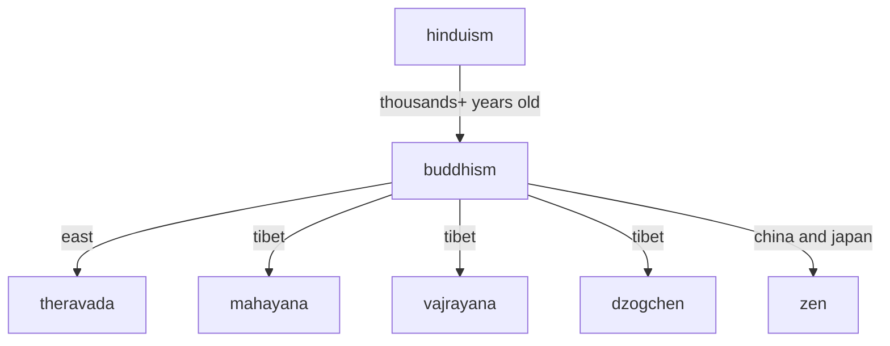

---
tags:
  - buddhism
---
# buddhism

```mermaid
graph TD;
    subgraph Enlightenment
        A[Enlightenment]
    end
    subgraph Three Jewels
        B[Buddha]
        C[Dharma]
        D[Sangha]
    end
    subgraph Four Noble Truths
        E[Suffering (Dukkha)]
        F[Origin of suffering (Samudaya)]
        G[Cessation of suffering (Nirodha)]
        H[Path leading to the cessation of suffering (Magga)]
    end
    subgraph Noble Eightfold Path
        I[Right View]
        J[Right Intention]
        K[Right Speech]
        L[Right Action]
        M[Right Livelihood]
        N[Right Effort]
        O[Right Mindfulness]
        P[Right Concentration]
    end
    subgraph Five Precepts
        Q[Do not kill]
        R[Do not steal]
        S[Do not engage in sexual misconduct]
        T[Do not lie]
        U[Do not use intoxicants]
    end
    subgraph Six Perfections
        V[Generosity]
        W[Ethics]
        X[Patience]
        Y[Diligence]
        Z[Concentration]
        AA[Wisdom]
    end
    subgraph Three Universal Truths
        AB[Impermanence (Anicca)]
        AC[Suffering (Dukkha)]
        AD[Non-self (Anatta)]
    end
    subgraph Three Characteristics of Existence
        AE[Impermanence (Anicca)]
        AF[Suffering (Dukkha)]
        AG[Non-self (Anatta)]
    end
    subgraph Meditation Practices
        AH[Vipassana]
        AI[Samatha]
        AJ[Mettabhavana (Loving-kindness)]
        AK[Chanting]
        AL[Walking meditation]
        AM[Body scan meditation]
    end
    subgraph Schools of Buddhism
        AN[Theravada]
        AO[Mahayana]
        AP[Vajrayana]
    end
    subgraph Four Brahma Viharas
        AQ[Loving-kindness (Metta)]
        AR[Compassion (Karuna)]
        AS[Sympathetic Joy (Mudita)]
        AT[Equanimity (Upekkha)]
    end
    subgraph Twelve Dependent Origination
        AU[Ignorance (Avijja)]
        AV[Volitional Activities (Sankhara)]
        AW[Consciousness (Vinnana)]
        AX[Mind and Body (Nama-rupa)]
        AY[Six Senses (Salayatana)]
        AZ[Contact (Phassa)]
        BA[Sensation (Vedana)]
        BB[Craving (Tanha)]
        BC[Attachment (Upadana)]
        BD[Becoming (Bhava)]
        BE[Birth (Jati)]
        BF[Aging and Death (Jara-marana)]
    end
    A --> {Three Jewels}
    A --> {Four Noble Truths}
    A --> {Noble Eightfold Path}
    A --> {Five Precepts}
    A --> {Six Perfections}
    A --> {Three Universal Truths}
    A --> {Three Characteristics of Existence}
    A --> {Meditation Practices}
    A --> {Schools of Buddhism}
    A --> {Four Brahma Viharas}
    A --> {Twelve Dependent Origination}
```

## tldr too long didn't read

- once a day practice [anapanasati](anapanasati.md)
- once a day practice [maranasati](maranasati.md)

- use the [2 links below](#recommended-sites) to study buddhism
- make a lifelong habit of studying buddhism

## a rant after 5 years of studying buddhism

I wish I had a webpage like this one when I started...

tmi: my journey

i started studying meditaiton and variations of buddhism during covid

so reading books, watching videos, attending online events

there's way tmi about buddhism, for starters buddha taught 84,000 paths to enlightenment

the pali canon is a big old bookshelf

despite all that info everyone and their cousin wrote another book on meditation and sold it

english translations are often translations of translations of variations of buddhism as it spread to other countries

each of these variations below added a bunch of new jargon

after dozens of books in these variations below I settled on [tldr](#tldr-too-long-didnt-read)

## recommended sites

- [plum village](https://plumvillage.org/)
- [dhammatalks](https://www.dhammatalks.org/)

## variations

- [buddhism by country](https://en.wikipedia.org/wiki/Buddhism_by_country)


