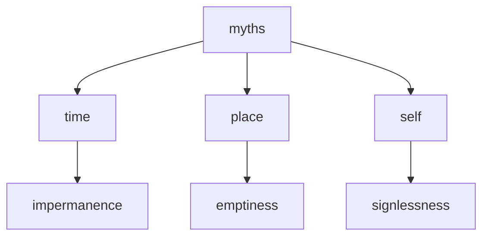

---
tags:
  - myths 
  - time 
  - space 
  - impermanence 
  - emptiness
  - no self 
  - delusion 
  - basics 
---
# three great myths

The "three great myths" of time, place, and self refer to the Buddhist teaching of the illusory nature of these concepts. These myths are seen as fundamental sources of suffering and ignorance, and are said to obscure our true understanding of reality.

- The myth of time - The Buddhist teaching on the myth of time is that our concept of time as a linear progression of past, present, and future is an illusion. In reality, time is seen as a continuous and interdependent phenomenon, with no permanent beginning or end.
- The myth of place - The Buddhist teaching on the myth of place is that our belief in a permanent, unchanging self is an illusion. Our sense of self is seen as a constantly changing and interdependent phenomenon, shaped by our thoughts, emotions, and experiences.
- The myth of self - The Buddhist teaching on the myth of self is that our belief in a permanent, unchanging self is an illusion. Our sense of self is seen as a constantly changing and interdependent phenomenon, shaped by our thoughts, emotions, and experiences. This illusion creates a sense of separation and duality, leading to suffering and ignorance.

By transcending these myths and realizing their illusory nature, one can experience a state of inner peace, happiness, and freedom from suffering.

## place

One of the famous stories that illustrate the myth of place is the story of a bridge between two countries. In this story, two neighboring countries are separated by a large river, and the only way to travel between the two countries is by boat. One day, a wise and compassionate king of one of the countries decided to build a bridge across the river so that people could easily travel between the two countries.

The king gathered his architects and engineers and set out to build the bridge. However, as they were constructing the bridge, they encountered many problems and obstacles, and the work seemed to go on forever. After many years of hard work and setbacks, the bridge was finally completed, and the people rejoiced.

But the next day, the king woke up to find that the bridge had disappeared overnight. He was devastated and called his architects and engineers to find out what had happened. They told him that the bridge had never really existed in the first place, that it was only a dream or a mirage.

The king was confused and asked his advisors to explain what had happened. They told him that the bridge was a symbol of the myth of place, the idea that we can create something permanent and enduring in a world that is constantly changing and impermanent. The bridge was a reflection of the king's attachment to a particular place and the illusion of permanence that comes with that attachment.

The story teaches us that the myth of place is a powerful illusion that can blind us to the true nature of reality. We become attached to a particular place or idea and forget that everything is impermanent and constantly changing. When we cling to the idea of a fixed and permanent self or identity, we suffer, and we create suffering for others. Only by letting go of our attachment to place, identity, and self can we find true peace and liberation.

## time

One of the Buddhist myths about time is the story of Kala, the personification of time. Kala is often depicted as a fierce deity with multiple heads and arms, wielding various weapons. In the Buddhist tradition, Kala is not seen as a positive force, but rather as an obstacle to spiritual progress.

According to the story, Kala was once a powerful king who ruled over a vast empire. One day, while out hunting in the forest, Kala encountered a wise hermit who was meditating under a tree. The hermit had achieved a deep state of inner peace and contentment, and Kala was amazed by this.

Kala asked the hermit how he had attained such a state of serenity, and the hermit replied that he had achieved it by living in the present moment and letting go of attachment to the past and future. Kala was intrigued by this and asked the hermit to teach him how to do the same.

The hermit agreed to teach Kala, but warned him that it would take a long time to master. Kala agreed to this and began his training. However, he soon became impatient and frustrated with the slow progress he was making.

One day, Kala decided to take matters into his own hands and attempted to force his way into the present moment. He believed that he could conquer time itself and achieve the same inner peace as the hermit in an instant.

But Kala's attempt was unsuccessful, and he was instead consumed by the very thing he was trying to conquer. He became trapped in a never-ending cycle of past and future, unable to escape the grip of time.

The story of Kala is a cautionary tale about the dangers of attachment and impatience, and the importance of living in the present moment. It illustrates the Buddhist understanding of time as a fleeting and impermanent phenomenon that cannot be controlled or conquered.

## self

--8<-- "snippets/dogen.md"

There was once a man named Malunkyaputta who approached the Buddha with a series of questions related to the nature of the universe and the existence of a self.

The Buddha responded with a story of a man who had been shot with a poisoned arrow. The man's family and friends gathered around him, but instead of allowing a doctor to remove the arrow, the man insisted on knowing who had shot the arrow, where the arrow had come from, what kind of wood it was made of, and other irrelevant details.

The Buddha used this story to illustrate that it is more important to address and resolve the immediate problem of suffering, rather than getting bogged down in philosophical questions that cannot be answered and do not help to alleviate suffering.

The Buddha also emphasized the idea that the self is an illusion and that clinging to the notion of a permanent self only leads to more suffering. He encouraged his followers to see through this illusion and cultivate an understanding of the impermanence and interconnectedness of all things.
