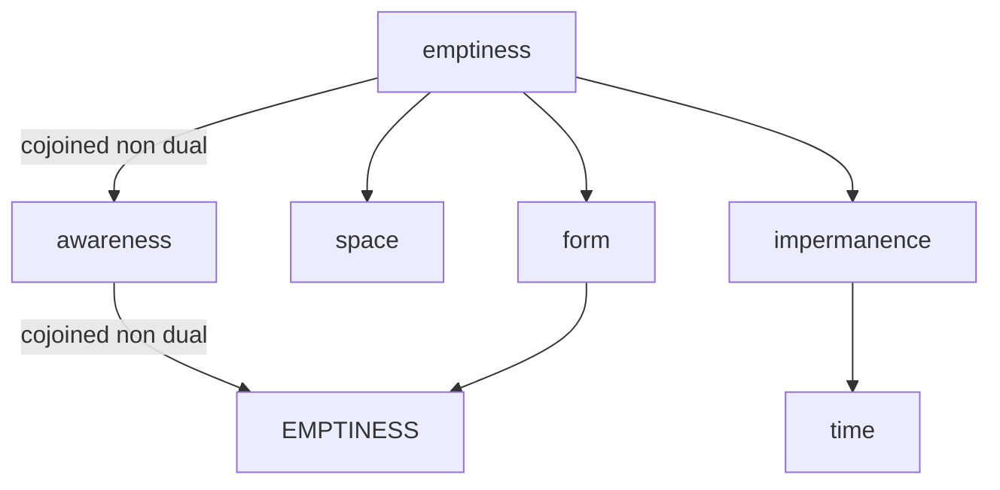

---
tags:
  - impermanence 
  - EMPTINESS 
  - time 
  - maranasati
---
# impermanence

<iframe width="802" height="501" src="https://www.youtube.com/embed/tY7WcDaURp0" title="040807 Questioning Impermanence \ \ Thanissaro Bhikkhu \ \ Dhamma Talks" frameborder="0" allow="accelerometer; autoplay; clipboard-write; encrypted-media; gyroscope; picture-in-picture; web-share" allowfullscreen></iframe>

## definition

Anicca, which means impermanence, is one of the three characteristics of existence in Buddhism. It refers to the notion that all things are in a constant state of flux and that nothing is permanent or unchanging. According to Buddhist teachings, the realization of impermanence is essential for spiritual growth and liberation, as it helps individuals to let go of attachment, craving, and suffering. By accepting the impermanent nature of all things, Buddhists aim to cultivate a deeper sense of equanimity, wisdom, and compassion in their lives.

ANICCA, or impermanence, is a central concept in Buddhism that refers to the ever-changing and transient nature of all phenomena. According to the Buddhist understanding, nothing in the world remains the same from one moment to the next, and everything is subject to constant transformation and decay. This includes not only physical objects but also thoughts, emotions, and experiences. By recognizing the impermanent nature of all things, Buddhists aim to develop a deeper understanding of the world and to cultivate a greater sense of detachment, wisdom, and compassion.

The Sanskrit term for "everything is changing" is "Sarvam Anityam" (सर्वं अनित्यम्). "Sarvam" means "everything" and "anityam" means "impermanent" or "not permanent". This concept of impermanence is a fundamental teaching in Buddhism and is one of the Three Universal Truths (ti-lakkhana).

## cormac

> The world has created no living thing that it does not intend to destroy
>> [cormac mccarthy](../cormac.md)

Meditation on impermanence is a common practice in Buddhism, where it is recognized as one of the Three Universal Truths along with suffering and non-self.

This type of meditation involves reflecting on the transience and fleeting nature of all things, including our own bodies, thoughts, and emotions.

The goal of meditation on impermanence is to cultivate a sense of detachment and to overcome attachment to the material world.

By understanding that everything is impermanent and constantly changing, practitioners aim to develop a greater appreciation for the present moment and to reduce feelings of fear and anxiety about the future.

One common method of impermanence meditation is to reflect on the different stages of life, such as birth, aging, illness, and death.

Practitioners may also focus on the impermanence of physical objects and the changing nature of their thoughts and emotions.

## benefits

- Reducing fear of death: By understanding that all things are impermanent and subject to change, one can reduce fear of death and the unknown.
- A greater appreciation of the present moment: By contemplating death, practitioners may develop a greater appreciation for the present moment and a deeper sense of gratitude for life.
- Reduced attachment: By contemplating the impermanence of all things, practitioners may become less attached to material possessions and to the self, reducing suffering and increasing peace of mind.
- Improved wisdom and understanding: Maranasati can help practitioners develop a deeper understanding of the nature of reality and the Buddhist teachings, leading to increased wisdom and insight.
- Overcoming fear of death: By contemplating death, practitioners can overcome fear and anxiety about the end of life, and develop a more peaceful and accepting attitude towards death.
- Greater motivation to practice the Dharma: Maranasati can serve as a powerful reminder of the urgency of the spiritual path and motivate practitioners to engage in other Buddhist practices more fully.
- Improving mindfulness: Meditation on impermanence encourages MINDFULNESS of the present moment and helps one stay focused on what is happening in the present, rather than dwelling on the past or worrying about the future.
- Encouraging self-reflection: By contemplating impermanence, one can reflect on the purpose and meaning of life, and focus on what is truly important.
