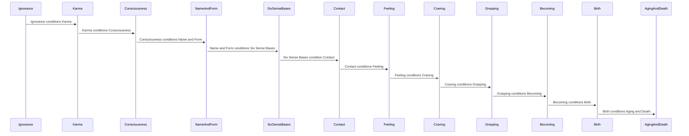
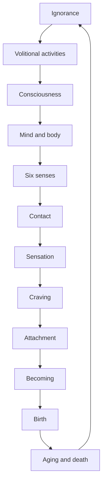
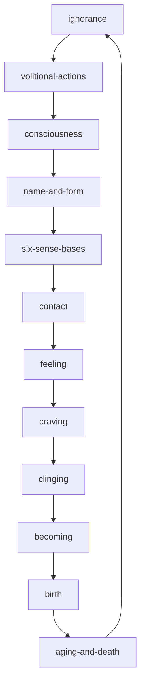

---
tags:
  - interdependence 
  - primordial confusion 
  - Nidanas
  - deduction 
---
# interdependence

- primoridal confusion:

--8<-- "snippets/garfield.md:25:26"

<iframe width="802" height="501" src="https://www.youtube.com/embed/7gCfZVXYOjQ" title="200818 Dependent Co-arising Right Now \ \ Thanissaro Bhikkhu \ \ Dhamma Talk" frameborder="0" allow="accelerometer; autoplay; clipboard-write; encrypted-media; gyroscope; picture-in-picture; web-share" allowfullscreen></iframe>

## meditation

- Find a comfortable position and close your eyes. Take a few deep breaths and relax your body.
- Bring your awareness to the present moment. Notice the sounds, smells, and sensations around you.
- As you breathe, bring your awareness to the sensation of your breath. Notice the rise and fall of your chest and abdomen.
- As you breathe, bring your awareness to the thought of dependent origination. Recall the 12 links of dependent origination and how they are all interconnected.
- As you breathe, bring your awareness to the first link of dependent origination: ignorance. Notice how ignorance leads to samskaras (mental and physical formations).
- As you breathe, bring your awareness to the second link of dependent origination: samskaras. Notice how samskaras lead to consciousness.
- As you breathe, bring your awareness to the third link of dependent origination: consciousness. Notice how consciousness leads to name-and-form.
- As you breathe, bring your awareness to the fourth link of dependent origination: name-and-form. Notice how name-and-form leads to the six sense bases.
- As you breathe, bring your awareness to the fifth link of dependent origination: six sense bases. Notice how the six sense bases lead to contact.
- As you breathe, bring your awareness to the sixth link of dependent origination: contact. Notice how contact leads to feeling.
- As you breathe, bring your awareness to the seventh link of dependent origination: feeling. Notice how feeling leads to craving.
- As you breathe, bring your awareness to the eighth link of dependent origination: craving. Notice how craving leads to clinging.
- As you breathe, bring your awareness to the ninth link of dependent origination: clinging. Notice how clinging leads to becoming.
- As you breathe, bring your awareness to the tenth link of dependent origination: becoming. Notice how becoming leads to birth.
- As you breathe, bring your awareness to the eleventh link of dependent origination: birth. Notice how birth leads to death.
- As you breathe, bring your awareness to the twelfth link of dependent origination: death. Notice how death leads to ignorance.
- Continue to breathe and bring your awareness to the links of dependent origination. Notice how they are all interconnected and how they lead to suffering.
- As you breathe, bring your awareness to the possibility of freedom from suffering. Notice how it is possible to break free from the cycle of dependent origination through enlightenment.
- Continue to breathe and bring your awareness to the present moment. Notice the sounds, smells, and sensations around you.
- When you are ready, open your eyes and bring your awareness back to your surroundings.

This meditation can help you to understand the links of dependent origination and how they are all interconnected. It can also help you to see the possibility of freedom from suffering through enlightenment.

## origination

The Twelve Dependent Origination is called Pratityasamutpada in Sanskrit. It is a key doctrine in Buddhism shared by all schools of Buddhism. It states that all dharmas (phenomena) arise in dependence upon other dharmas: "if this exists, that exists; if this ceases to exist, that also ceases to exist". The basic principle is that all things (dharmas, phenomena, principles) arise in dependence upon other things.

The Twelve Dependent Origination is as follows:

- Avidyā (ignorance)
- Samskarā (mental and physical formations)
- Vijñāna (consciousness)
- Name-and-form (the world of objects)
- Six Sense Bases (eye, ear, nose, tongue, body, and mind)
- Contact (between the sense bases and objects)
- Feeling (pleasant, unpleasant, or neutral)
- Craving (for pleasant feelings to continue)
- Clinging (to objects or ideas)
- Becoming (of a new object or idea)
- Birth (of a new being)
- Death (of a being)

The Twelve Dependent Origination is often depicted as a wheel, with each link leading to the next. The wheel represents the cycle of suffering that beings are caught in. The goal of Buddhism is to break free from this cycle and achieve nirvana.

The Twelve Dependent Origination is a complex and profound doctrine. It is not easy to understand, but it is essential for understanding the Buddhist teachings.

## true mind interdependence

|                 | 12 Links of Dependent Origination               | True Mind Versions                               |
| --------------- | ----------------------------------------------- | ------------------------------------------------ |
| Ignorance       | Ignorance of the Four Noble Truths              | Awakening to the Four Noble Truths               |
| Volitional      | Volitional formation                            | Mindful intention                                |
| Consciousness   | Consciousness arising from volitional formation | Non-dual awareness                               |
| Name-and-form   | Name-and-form                                   | Interbeing, inseparability of form and emptiness |
| Six Sense Bases | Six sense bases                                 | Collective consciousness and the One Mind        |
| Contact         | Contact                                         | Contemplation of emptiness and interbeing        |
| Feeling         | Feeling                                         | Compassionate understanding                      |
| Craving         | Craving                                         | Mindful consumption                              |
| Grasping        | Grasping                                        | Non-attachment, letting go                       |
| Becoming        | Becoming                                        | Engaged practice, acting with compassion         |
| Birth           | Birth                                           | Continuation                                     |
| Aging and Death | Aging and Death                                 | Impermanence and non-self realization            |

## twelve nidanas

The term "nidana" means "cause" or "link."

The Twelve Nidanas are a fundamental teaching in Theravada Buddhism that describe the interdependent chain of events leading to the arising of suffering.

The Twelve Nidanas can be thought of as a wheel, with each link leading to the next and forming a continuous cycle.

The Twelve Nidanas are:

1. Ignorance (Avijja)
1. Volitional Actions (Samskara)
1. Consciousness (Vijnana)
1. Name-and-Form (Namarupa)
1. Six Sense Bases (Sadayatana)
1. Contact (Sparsa)
1. Feeling (Vedana)
1. Craving (Tanha)
1. Clinging (Upadana)
1. Becoming (Bhava)
1. Birth (Jati)
1. Aging and Death (Jaramarana)

Each link leads to the next, creating a cycle of suffering and rebirth.

Understanding the Twelve Nidanas is seen as a key step in realizing the impermanence of all things and in developing the wisdom and insight necessary for liberation from suffering.

## how do you meditate with Paticca Samuppada

Meditating with the teaching of Paticca Samuppada, also known as Dependent Origination, can be a powerful way to gain insight into the nature of reality and the causes of suffering. Here are some steps you can follow to meditate with Paticca Samuppada:

- Find a quiet place to sit: Choose a quiet and comfortable place where you won't be disturbed. Sit comfortably, either in a chair or cross-legged on a cushion.
- Focus on your breath: Take a few deep breaths and then bring your attention to your breath. Focus on the sensation of the breath as it moves in and out of your body.
- Consider the Twelve Nidanas: Start with the first nidana, ignorance, and imagine the arising of this link in your mind. Then move on to the next nidana, volitional actions, and so on, until you reach the last nidana, aging and death.
- Reflect on the interdependence of the links: As you go through each nidana, reflect on how each link leads to the next and how they are all interconnected. Consider the ways in which your own experiences align with the cycle of suffering described by the Twelve Nidanas.
- Observe your thoughts and feelings: As you meditate, observe any thoughts or feelings that arise. Don't try to suppress them or get rid of them, simply observe them and let them pass.
- Continue the meditation: Continue meditating on the Twelve Nidanas for as long as you like, focusing on the interdependence of the links and the impermanence of all things.
- End the meditation: When you're ready to end the meditation, take a few deep breaths, stretch if you need to, and return to your day with a greater sense of insight and clarity.

It may take some time and practice to fully understand the teachings of Paticca Samuppada through meditation, but with consistent practice, you can gain a deeper understanding of the nature of reality and the causes of suffering. It's important to remember that meditation is a personal journey, and what works for one person may not work for another, so be patient and kind to yourself as you explore.

## in theravada what is dependent origination?

Dependent Origination is a key teaching in Theravada Buddhism and is also known as "Paticca Samuppada." It refers to the idea that all phenomena arise in dependence upon other factors, and that they are not created independently. The teaching states that the existence of one thing is dependent upon the existence of other things, and that everything is interrelated and interdependent.

The teaching of Dependent Origination is often illustrated with the Twelve Links of Dependent Origination, which describe the interrelated chain of events that lead to the arising of suffering. According to this teaching, ignorance leads to craving and attachment, which in turn leads to existence, birth, aging, and death, and so on, resulting in suffering.

The goal of understanding Dependent Origination is to realize the impermanence of all things and to see that everything is subject to change and that nothing has a permanent self. This realization leads to the development of insight and wisdom, and the eventual liberation from suffering.

## diagram

<iframe width="726" height="406" src="https://www.youtube.com/embed/fnzLpyDsn3M" title="Edward Witten on modern physics I" frameborder="0" allow="accelerometer; autoplay; clipboard-write; encrypted-media; gyroscope; picture-in-picture; web-share" allowfullscreen></iframe>
