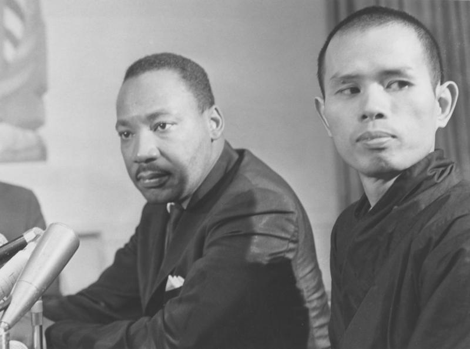

---
tags:
  - interdependence
  - Nidanas
  - concentration
  - mindfulness
---

# thich nhat hahn

<iframe width="819" height="461" src="https://www.youtube.com/embed/F3XqhBigMao" title="Emptiness: Empty of What? | Thich Nhat Hanh (short teaching video)" frameborder="0" allow="accelerometer; autoplay; clipboard-write; encrypted-media; gyroscope; picture-in-picture; web-share" allowfullscreen></iframe>

## thich nhat hanh

Thich Nhat Hanh is a Vietnamese Zen Master, teacher, author, poet and peace activist. He is a founder of the Plum Village tradition, a MINDFULNESS practice center in France and has written more than 100 books on MINDFULNESS and meditation, including the bestseller "The Heart of the Buddha's Teaching." Nhat Hanh is known for promoting engaged Buddhism and has been a leader in the movement for peace and reconciliation in Vietnam.

## cultivating non violence

- In our daily lives, our attention is dispersed.
- Our body is in one place, our breath is ignored, and our mind is wandering.
- As soon as we pay attention to our breath, as we breathe in, these three things—body, breath, and mind—come together.
- This can happen in just one or two seconds.
- You come back to yourself.
- Your awareness brings these three elements together, and you become fully present in the here and the now.
- You are taking care of your body, you are taking care of your breath, and you are taking care of your mind.
- When you make a soup, you have to add together all the right ingredients in harmony and let them simmer.
- Our breath is the broth that brings the different elements together.
- We bathe spirit and mind in our breath and they become integrated so they are one thing. We are whole.
- We don’t need to control our body, mind, and breath. We can just be there for them. We allow them to be themselves. This is nonviolence.

## thich three seals

The Three Seals, also known as the Three Universal Truths, are a central teaching in Buddhism and form the basis of Buddhist philosophy. They are:

1. Impermanence (Anicca): All things are in a constant state of change and nothing lasts forever.
1. Suffering (Dukkha): Life is inherently unsatisfactory and full of suffering, which is caused by craving and attachment.
1. No-self (Anatta): The idea of a permanent self is an illusion and there is no permanent essence to any person or thing.

These Three Seals help to illustrate the nature of reality and the path to liberation from suffering in Buddhism. Understanding and embracing these truths is considered a crucial step on the path to enlightenment.

## thich three keys

The Three Keys, also known as the Three Dharma Seals, are a central teaching in Buddhism and form the basis of Buddhist philosophy. They are:

1. Impermanence (Anicca): All things are in a constant state of change and nothing lasts forever.
1. Suffering (Dukkha): Life is inherently unsatisfactory and full of suffering, which is caused by craving and attachment.
1. No-self (Anatta): The idea of a permanent self is an illusion and there is no permanent essence to any person or thing.

These Three Keys help to illustrate the nature of reality and the path to liberation from suffering in Buddhism. Understanding and embracing these truths is considered a crucial step on the path to enlightenment.

## three doors of liberation

The Three Doors of Liberation, also known as the Three Universal Truths, are a central teaching in Buddhism and form the basis of Buddhist philosophy. They are:

1. Impermanence (Anicca): All things are in a constant state of change and nothing lasts forever.
1. Suffering (Dukkha): Life is inherently unsatisfactory and full of suffering, which is caused by craving and attachment.
1. No-self (Anatta): The idea of a permanent self is an illusion and there is no permanent essence to any person or thing.

These Three Doors of Liberation provide a path to freedom from suffering and ignorance and are seen as a means to attain enlightenment in Buddhism. By understanding and embracing these truths, one can gain insight into the nature of reality and liberation from the cycle of birth and death (Samsara).

## aimlessness

- aimlessness can be confusing, the best analogy is a rose, a rose is find the way it is, it doesn't need to try to be more than a rose, the same applies to people

Thich Nhat Hanh, the Vietnamese Zen Master and teacher, often emphasizes the importance of aimlessness or non-striving in the practice of MINDFULNESS and meditation. He argues that we often have a tendency to constantly strive for something, whether it be material possessions or a certain state of mind. This striving can lead to stress, anxiety, and dissatisfaction.

In his teachings, Thich Nhat Hanh encourages individuals to cultivate a state of aimlessness, where they can let go of their desires and just be in the present moment. He explains that when we let go of our goals and desires, we can experience true peace and happiness. In this state of aimlessness, we can simply be present and enjoy each moment as it unfolds, without being attached to outcomes or results.

In his book, "The Sun My Heart," Thich Nhat Hanh writes: "The most precious gift we can offer others is our presence. When MINDFULNESS embraces those we love, they will bloom like flowers." This highlights the importance of being present and aimless in our relationships with others and the world around us.

## signlessness

Thich Nhat Hanh, the Vietnamese Zen Master and teacher, often emphasizes the importance of signlessness in the practice of MINDFULNESS and meditation. Signlessness refers to the idea that things, events, and experiences do not have inherent meaning or essence and that meaning is created by the way we perceive and interpret them.

In his teachings, Thich Nhat Hanh argues that our clinging to signs and concepts, such as labels and judgments, can lead to suffering and a lack of understanding. He encourages individuals to practice signlessness in order to gain a deeper understanding of reality and to be free from the limitations of our perceptions and interpretations.

Thich Nhat Hanh explains that when we let go of our need to categorize and label things, we can experience them in their true form and see things as they are, rather than as we expect them to be. In this state of signlessness, we can experience greater clarity, peace, and happiness.

In his book, "The Heart of the Buddha's Teaching," Thich Nhat Hanh writes: "Signlessness is the key to liberation. When we are able to see things without the burden of our perceptions and interpretations, we can experience reality in its pure form."

## dharmakaya

Thich Nhat Hanh, the Vietnamese Zen Master and teacher, has written about the concept of Dharmakaya in Buddhist philosophy. Dharmakaya refers to the ultimate nature of reality or the absolute truth. In Buddhist thought, it is the ultimate reality of all things and the ultimate goal of spiritual practice.

Thich Nhat Hanh explains that the Dharmakaya is not separate from our individual experiences and is not something that can be grasped or attained. Instead, it is the underlying essence of all things, including ourselves. He argues that when we practice MINDFULNESS and meditation, we can begin to realize the Dharmakaya within ourselves and the world around us.

Thich Nhat Hanh writes that the Dharmakaya is not a separate entity, but rather the true nature of everything, including ourselves. He explains that when we realize the Dharmakaya, we can experience a deep sense of interconnectedness with all things and a sense of unity with the universe.

In his book, "The Sun My Heart," Thich Nhat Hanh writes: "The Dharmakaya is not something we can see or touch. It is the essence of all things, the truth that lies at the heart of the universe." This highlights the idea that the Dharmakaya is not a physical or separate entity, but rather the underlying truth that pervades all things.

## sambhogakaya

Thich Nhat Hanh, the Vietnamese Zen Master and teacher, has written about the concept of Sambhogakaya in Buddhist philosophy. Sambhogakaya is one of the three bodies (kayas) of a Buddha and is often referred to as the "enjoyment body" or the "body of bliss."

In his teachings, Thich Nhat Hanh explains that the Sambhogakaya is a form of the Buddha that is beyond the physical realm and can only be perceived by enlightened beings. It is said to embody the wisdom and compassion of the Buddha and is seen as a symbol of the ultimate potential for transformation and liberation.

Thich Nhat Hanh argues that the Sambhogakaya represents the connection between the physical realm and the realm of pure consciousness, and can help us to connect with the wisdom and compassion of the Buddha. He writes that when we cultivate MINDFULNESS and compassion in our daily lives, we can experience the Sambhogakaya within ourselves and the world around us.

In his book, "The Heart of the Buddha's Teaching," Thich Nhat Hanh writes: "The Sambhogakaya is the manifestation of the Buddha's wisdom and compassion, a symbol of the ultimate potential for transformation and liberation." This highlights the idea that the Sambhogakaya is a representation of the wisdom and compassion that lies within all of us, and can be realized through spiritual practice.

## nirmanakaya

Thich Nhat Hanh, the Vietnamese Zen Master and teacher, has written about the concept of Nirmanakaya in Buddhist philosophy. Nirmanakaya is one of the three bodies (kayas) of a Buddha and is often referred to as the "manifestation body" or the "body of transformation."

In his teachings, Thich Nhat Hanh explains that the Nirmanakaya is the physical manifestation of the Buddha in the world. It is the form that the Buddha takes in order to teach and guide beings on the path to liberation. He argues that the Nirmanakaya represents the interdependence and interrelatedness of all things and serves as a reminder that the wisdom and compassion of the Buddha are present in the world and can be experienced by all beings.

Thich Nhat Hanh writes that when we practice MINDFULNESS and compassion in our daily lives, we can embody the Nirmanakaya and serve as a manifestation of the Buddha's teachings in the world. He argues that this can help us to transform ourselves and the world around us and to bring peace, love, and understanding to those around us.

In his book, "The Heart of the Buddha's Teaching," Thich Nhat Hanh writes: "The Nirmanakaya is the manifestation of the Buddha's wisdom and compassion in the world. It represents the interdependence and interrelatedness of all things and serves as a reminder that the path to liberation is available to all beings." This highlights the idea that the Nirmanakaya is a representation of the transformative power of the Buddha's teachings, and that through MINDFULNESS and compassion, we can embody this power and bring peace and happiness to the world.

## attributes

| Attribute | Meditative mind | Untrained mind |
|---|---|---|
| Attention | Focused and concentrated | Wandering and unfocused |
| Awareness | Open and receptive | Narrow and selective |
| Emotions | Calm and balanced | Reactive and volatile |
| Thoughts | Clear and present | Busy and distracted |
| Body | Relaxed and at ease | Tense and agitated |
| Senses | Open and receptive | Closed and shut off |
| Relationship to experience | Accepting and non-judgmental | Resistant and judgmental |
| Sense of self | Open and spacious | Narrow and constricted |
| Experience of time | Present and timeless | Past- or future-focused |
| Experience of reality | Vivid and meaningful | Dull and meaningless |
| Sense of purpose | Connected and meaningful | Lost and confused |
| Overall experience | Peaceful and fulfilling | Stressful and unfulfilling |
| Ability to focus on a task | High | Low |
| Ability to manage emotions | High | Low |
| Ability to stay calm under pressure | High | Low |
| Ability to be present in the moment | High | Low |
| Ability to be mindful of thoughts and feelings | High | Low |
| Ability to let go of negative thoughts and emotions | High | Low |
| Ability to be compassionate and understanding | High | Low |
| Ability to live in the present moment | High | Low |
| Ability to experience joy and happiness | High | Low |
| Ability to connect with others | High | Low |
| Ability to find meaning and purpose in life | High | Low |
| Ability to be creative and imaginative | High | Low |
| Ability to solve problems effectively | High | Low |
| Ability to make decisions wisely | High | Low |
| Ability to be resilient in the face of challenges | High | Low |
| Ability to maintain a positive outlook | High | Low |
| Ability to experience gratitude | High | Low |
| Ability to live a meaningful and fulfilling life | High | Low |

As you can see, there are many differences between a meditative mind and an untrained mind. A meditative mind is characterized by focus, awareness, calmness, clarity, openness, acceptance, compassion, creativity, imagination, problem-solving, decision-making, resilience, positive outlook, gratitude, and a sense of purpose. An untrained mind, on the other hand, is characterized by wandering attention, narrow awareness, reactivity, distraction, confusion, judgment, and a sense of purposelessness.

Meditation can help you to develop a meditative mind. By practicing meditation, you can learn to focus your attention, be more aware of your thoughts and feelings, and accept your experiences without judgment. As you develop a meditative mind, you will experience greater peace, clarity, and purpose in your life.

## thich 12 interdependent origination

Thich Nhat Hanh, the Vietnamese Zen Master and teacher, has written about the concept of the "12 links of interdependent origination" in Buddhist philosophy. This concept refers to a chain of causality that explains how suffering arises and how it can be overcome.

According to this teaching, the 12 links of interdependent origination are:

1. Ignorance
1. Volitional formations
1. Consciousness
1. Name and form
1. The six sense bases
1. Contact
1. Feeling
1. Craving
1. Grasping
1. Becoming
1. Birth
1. Aging and death
1. Thich Nhat Hanh explains that these 12 links form a chain of causality that explains the origins of suffering. He argues that ignorance leads to volitional formations, which in turn give rise to consciousness, and so on, ultimately leading to aging and death.

However, Thich Nhat Hanh also argues that this chain of causality is not a rigid, deterministic sequence. Instead, he explains that each link in the chain can influence the others, and that it is possible to interrupt the chain and prevent suffering from arising. He argues that through MINDFULNESS and meditation, we can cultivate wisdom and compassion, which can help us to overcome ignorance and interrupt the chain of causality.

In his book, "The Heart of the Buddha's Teaching," Thich Nhat Hanh writes: "The 12 links of interdependent origination provide us with a deep understanding of the nature of suffering and the path to liberation. By practicing MINDFULNESS and compassion, we can interrupt the chain of causality and end the cycle of suffering." This highlights the idea that the 12 links of interdependent origination offer a roadmap for ending suffering and attaining liberation in Buddhist philosophy.

## how do we water the seeds of our own lucid consciousness

Watering the seeds of lucid consciousness refers to nurturing and cultivating the seeds of awareness and MINDFULNESS within us. Lucid consciousness refers to the clear and awakened state of mind that allows us to see things as they truly are and to understand the nature of reality.

Thich Nhat Hanh, the Vietnamese Zen Master and teacher, has written extensively on how to water the seeds of lucid consciousness. He argues that this can be achieved through the following practices:

Mindfulness meditation: Regular practice of MINDFULNESS meditation can help us to cultivate awareness and focus in the present moment. This can help us to develop our lucid consciousness and to become more attuned to the world around us.

Cultivating positive emotions: By focusing on positive emotions like love, joy, and compassion, we can water the seeds of lucid consciousness and help them to grow.

Engaging in acts of generosity and kindness: By performing acts of kindness and generosity, we can cultivate the seeds of love and compassion within us and water the seeds of lucid consciousness.

Cultivating wisdom: Through studying the teachings of the Buddha and other wise teachers, we can deepen our understanding of the nature of reality and water the seeds of lucid consciousness.

In his teachings, Thich Nhat Hanh emphasizes that the key to watering the seeds of lucid consciousness is to cultivate MINDFULNESS and awareness in all aspects of our lives, not just during meditation. He argues that by integrating MINDFULNESS into our daily activities and relationships, we can nurture and grow the seeds of lucid consciousness and deepen our understanding of the world around us.

In his book, "The Heart of the Buddha's Teaching," Thich Nhat Hanh writes: "By nurturing the seeds of MINDFULNESS and compassion within us, we can water the seeds of lucid consciousness and awaken to the world as it truly is." This highlights the idea that through MINDFULNESS and compassion, we can cultivate the seeds of lucid consciousness and deepen our understanding of reality.

## invoke the name Avalokiteshvara

Avalokiteshvara, also known as the bodhisattva of compassion, is a revered figure in Buddhist tradition. Invoking the name of Avalokiteshvara is a common practice in Mahayana Buddhism and is believed to bring blessings and protection.

The practice of invoking the name of Avalokiteshvara involves repeating the mantra "Om Mani Padme Hum" or simply saying the name "Avalokiteshvara." This repetition is often done in meditation or as part of a chanting practice and is believed to connect the practitioner to the boundless compassion and wisdom of Avalokiteshvara.

In his teachings, Thich Nhat Hanh emphasizes the importance of invoking the name of Avalokiteshvara as a way of connecting to the energy of compassion and awakening the bodhisattva within us. He argues that by invoking the name of Avalokiteshvara, we can tap into the boundless wisdom and compassion of the bodhisattva and use it to help others and ourselves.

In his book, "The Heart of the Buddha's Teaching," Thich Nhat Hanh writes: "By invoking the name of Avalokiteshvara, we can awaken the bodhisattva within us and tap into the boundless compassion and wisdom of this revered figure." This highlights the idea that through invoking the name of Avalokiteshvara, we can connect to the wisdom and compassion of the bodhisattva and deepen our understanding of reality.

## invoke the name manjurishi

Manjushri is a bodhisattva associated with wisdom and insight in Mahayana Buddhism. Invoking the name of Manjushri is a common practice in Tibetan Buddhism and is believed to bring blessings and protection.

The practice of invoking the name of Manjushri involves repeating the mantra "Om A Ra Pa Ca Na" or simply saying the name "Manjushri." This repetition is often done in meditation or as part of a chanting practice and is believed to connect the practitioner to the boundless wisdom and insight of Manjushri.

In Tibetan Buddhist tradition, Manjushri is seen as a powerful figure who can help to dispel ignorance and confusion, and to awaken the wisdom of the practitioner. Invoking the name of Manjushri is seen as a way of calling forth the wisdom and insight of this bodhisattva and using it to gain deeper understanding and clarity.

In his teachings, Thich Nhat Hanh often emphasizes the importance of invoking the name of Manjushri as a way of connecting to the energy of wisdom and insight. He argues that by invoking the name of Manjushri, we can tap into the boundless wisdom and insight of the bodhisattva and use it to help others and ourselves.

In his book, "The Heart of the Buddha's Teaching," Thich Nhat Hanh writes: "By invoking the name of Manjushri, we can awaken the wisdom within us and tap into the boundless insight and clarity of this revered figure." This highlights the idea that through invoking the name of Manjushri, we can connect to the wisdom and insight of the bodhisattva and deepen our understanding of reality.

## great mirror wisdom

"Great Mirror Wisdom" is a concept in Mahayana Buddhism that refers to the innate wisdom that lies within all beings. It is the idea that everyone has the potential to awaken to their true nature, which is pure and shining, just like a clear and bright mirror.

The idea of Great Mirror Wisdom is closely related to the concept of Buddhahood, which is the state of complete enlightenment and perfect wisdom. In Mahayana Buddhism, it is believed that all beings have the potential to awaken to their true nature and become a Buddha.

The Great Mirror Wisdom represents the idea that the wisdom and insight of the Buddha is not something that can be acquired from outside, but rather it is something that lies within us, waiting to be awakened. When we practice MINDFULNESS and cultivate compassion, we can start to uncover and reveal our own Great Mirror Wisdom.

Thich Nhat Hanh often discusses the concept of Great Mirror Wisdom in his teachings, and encourages his students to cultivate awareness and MINDFULNESS in order to awaken to their own innate wisdom. He argues that by connecting to our own Great Mirror Wisdom, we can start to see the world and our own experiences in a new way, and gain a deeper understanding of reality.

In his book, "The Heart of the Buddha's Teaching," Thich Nhat Hanh writes: "The Great Mirror Wisdom is the innate wisdom that lies within all of us. It is like a clear and bright mirror, waiting to be revealed." This highlights the idea that the wisdom and insight of the Buddha is something that lies within all of us, waiting to be awakened.

## true mind versions of 12 originations

- there's a really good section in the book heart of the buddhas teachings, chatgpt needs tuning on this one

In Buddhism, the "12 Interdependent Originations" (Paticca Samuppada) is a teaching that describes the interconnected nature of existence and the way that our experiences are created by a chain of cause and effect. Thich Nhat Hanh often speaks about the 12 Interdependent Originations in his teachings and encourages his students to cultivate a clear understanding and great aspiration to help break the cycle of suffering.

According to Thich Nhat Hanh, the "true mind versions" of the 12 Interdependent Originations are the awakened, unblemished, and undistorted states of mind. In his teachings, he explains that when our mind is in its true state, it is free from the delusion and ignorance that cause us to experience suffering.

The "clear understanding" of the 12 Interdependent Originations refers to a deep and intuitive understanding of the interconnected nature of existence and how our experiences are created by a chain of cause and effect. Thich Nhat Hanh argues that by cultivating a clear understanding of the 12 Interdependent Originations, we can start to see the world and our own experiences in a new way, and gain a deeper understanding of reality.

The "great aspiration" of the 12 Interdependent Originations refers to the commitment and determination to break the cycle of suffering and to awaken to our true nature. Thich Nhat Hanh argues that by cultivating a great aspiration to awaken, we can cultivate the energy and motivation needed to break free from the cycle of suffering and to gain a deeper understanding of reality.

In his book, "The Heart of the Buddha's Teaching," Thich Nhat Hanh writes: "When our mind is in its true state, it is free from the delusion and ignorance that cause us to experience suffering. By cultivating a clear understanding and great aspiration, we can start to see the world and our own experiences in a new way and break free from the cycle of suffering." This highlights the idea that by cultivating a clear understanding and great aspiration, we can start to awaken to our true nature and gain a deeper understanding of reality.

## non violence

Find a quiet place where you won't be disturbed. Sit in a comfortable position and close your eyes.

- Focus on your breath. Take a few deep breaths and try to calm your mind.
- Bring to mind a person, animal, or situation that you feel angry or upset about.
- Recite a mantra or affirmation that supports non-violence, such as "May all beings be free from suffering and harm."
- Visualize a warm and compassionate energy flowing from your heart to the person, animal, or situation that you are thinking about. Imagine the energy of non-violence, love, and compassion enveloping and healing the situation.
- Focus on the sensations of your body and try to feel the compassion and love in your heart.
- Repeat the mantra or affirmation and continue to focus on the warm and compassionate energy flowing from your heart.
- When you feel ready, gently open your eyes. Take a few deep breaths and try to carry the feeling of compassion and love with you as you continue with your day.

Remember, meditation is a process and it may take time to develop a strong practice. Be patient and persistent, and try to make meditating on non-violence a regular part of your routine. With practice, you may find that your mind becomes more peaceful, your relationships become more harmonious, and your life becomes more fulfilling.

## fear

- one of thich's books, this is a powerful cover story

A timeless path for living fearlessly.

A powerful and practical guide to overcoming our debilitating uncertainties and personal terrors by Vietnamese Buddhist Zen Master, poet, scholar, peace activist, and one of the foremost spiritual leaders in the world – Thich Nhat Hanh.

Fear has countless faces: from the fear of failure to worries about everyday life, from financial or environmental uncertainties to the universal despair we all experience when faced by the loss of a friend or loved one. Even when surrounded by all the conditions for happiness, life can feel incomplete when fear keeps us focused on the past and worried about the future. While we all experience fear, it is possible to learn how to avoid having our lives shaped and driven by it.

In these pages, Thich Nhat Hanh, a gifted teacher who was once nominated for the Nobel Peace Prize by Martin Luther King Jr., explores the origins of our fears, illuminating a path to finding peace and freedom from anxiety and offering powerful tools to help us eradicate it from our lives.

> CONCENTRATION means you keep the insight alive for a long time. It’s not just a flash; that’s not enough to liberate you. So in your daily life, you keep that insight of nonself, of emptiness, of impermanence alive. When you see a person, a bird, a tree, or a rock, you see its nature of emptiness.
>
> > Excerpt From Fear: Essential Wisdom for Getting Through the Storm Thich Nhat Hanh.

## Brahma Abodes

(Brahmaviharas) or Four Immeasurable Minds — love, compassion, joy, and equanimity.” Love in Sanskrit is maitri; in Pali it is metta. Compassion is karuna in both languages. Joy is mudita. Equanimity is upeksha in Sanskrit and upekkha in Pali. A vihara is an abode or a dwelling place. The Four Brahmaviharas are the abodes of true love. This address is much greater than a four-star hotel. It is a 1,000-star dwelling. The Four Brahmaviharas are called “immeasurable,” because if you practice them, they will grow in you every day until they embrace the whole world. You will become happier, and everyone around you will become happier, also.”

> Excerpt From The Heart Of The Buddha’s Teaching Hanh, Thich Nhat

## mindfulness

Thich Nhat Hanh defined MINDFULNESS as

- the energy of being aware and awake to the present moment.
- MINDFULNESS means being fully present and attentive to what is happening in our body, mind, and environment in each moment,
- without being distracted or judgmental

Thich Nhat Hanh emphasized the importance of MINDFULNESS in helping us to live more fully and deeply, and to develop greater clarity, compassion, and insight.

He taught various MINDFULNESS practices, including MINDFUL breathing, walking, eating, and speaking, as well as more formal sitting meditation.

Thich Nhat Hanh's teachings on MINDFULNESS emphasize the {++integration of MINDFULNESS into every aspect of our lives, not just during formal meditation practice.++}

He believed that by cultivating MINDFULNESS in each moment, we can reduce stress, anxiety, and suffering, and develop greater awareness, understanding, and connection with ourselves and others.

## concentration

Thich Nhat Hanh defined CONCENTRATION as the ability to focus one's attention on a single object, idea, or activity without being distracted by other thoughts or stimuli. According to him, CONCENTRATION is a key element of mindfulness and meditation practice, as it allows us to develop greater insight, clarity, and calmness of mind.

Thich Nhat Hanh taught that CONCENTRATION is developed through regular meditation practice, and can be cultivated by focusing on a single point of attention, such as the breath, a sound, or a visual image. He also emphasized the importance of cultivating a relaxed and non-judgmental attitude towards the process of concentration, and encouraged his students to approach it with patience, openness, and curiosity.

For Thich Nhat Hanh, CONCENTRATION is not an end in itself, but a means to develop deeper levels of mindfulness and insight. By cultivating concentration, we can gain greater awareness of our thoughts, emotions, and experiences, and develop greater understanding and compassion for ourselves and others. Ultimately, he taught that CONCENTRATION can help us to free ourselves from suffering and develop a more peaceful, harmonious, and fulfilling life.

## Shamatha

Shamatha is a Sanskrit word that refers to a type of meditation that aims to cultivate calmness, tranquility, and concentration. Thich Nhat Hanh often used the term "calm abiding" to refer to shamatha meditation.

Thich Nhat Hanh emphasized that shamatha is an essential foundation for the practice of insight or vipassana meditation, which aims to develop greater clarity, wisdom, and compassion. He taught that by cultivating calmness and concentration through shamatha, we can develop the stability and clarity of mind that are necessary for deeper levels of insight and understanding.

According to Thich Nhat Hanh, shamatha is developed through regular meditation practice, and involves focusing one's attention on a single object, such as the breath or a visual image, and continually returning one's attention to that object whenever the mind becomes distracted or agitated. He also taught that shamatha involves cultivating a non-judgmental and non-reactive attitude towards the process of meditation, and developing an open, curious, and compassionate relationship with one's own mind.

Overall, Thich Nhat Hanh viewed shamatha as an important practice for cultivating inner peace, mental stability, and greater awareness and insight.

## Vipassana

Vipassana is a Pali word that translates to "insight" or "clear seeing" in English. It refers to a type of Buddhist meditation that aims to cultivate awareness and understanding of the nature of reality and the workings of the mind.

Vipassana meditation is often contrasted with shamatha, which is a type of meditation that aims to cultivate calmness and concentration. While shamatha is a foundation for the practice of vipassana, vipassana involves going beyond calmness and concentration to develop deeper levels of insight and understanding.

Thich Nhat Hanh taught that vipassana involves cultivating a clear and direct perception of the impermanent, interdependent, and empty nature of all phenomena, including thoughts, emotions, and perceptions. He emphasized that vipassana requires both mental clarity and emotional openness, and that it involves developing a deep understanding of the causes and conditions that give rise to our experiences.

Overall, Thich Nhat Hanh viewed vipassana as an essential practice for developing greater awareness, understanding, and compassion, and for freeing ourselves from the causes of suffering and living more fully and deeply in the present moment.

## emptiness

In Buddhism, the concept of EMPTINESS refers to the absence of inherent existence or self-nature in all phenomena. It is the idea that all things are dependently originated, interconnected, and lack an independent, permanent essence or self.

Thich Nhat Hanh often taught that the concept of EMPTINESS is not nihilistic, but rather an invitation to see things as they are, without projecting our own biases, expectations, or attachments onto them. He emphasized that the insight into EMPTINESS is a way to see the interdependent nature of all things and to cultivate greater wisdom, compassion, and freedom from suffering.

For Thich Nhat Hanh, the concept of EMPTINESS was not just a philosophical idea, but a practice that involves letting go of our attachment to fixed ideas and beliefs, and cultivating a deep awareness of the impermanent and interdependent nature of all phenomena. By understanding that all things are constantly changing and interrelated, we can develop greater insight and compassion, and live in greater harmony with the world around us.

## simultaneous methods

> how do you focus attention and expand awareness at the same time

By following these steps, you can cultivate both an expanded awareness of your environment and a focused attention on the present moment.

| Step | Practice          |
|------|------------------|
| 1.   | Breath awareness |
| 2.   | Body scan        |
| 3.   | Mindful walking  |

- Step 1. Breath awareness: Find a comfortable seat or lie down in a quiet place. Close your eyes and bring your attention to your breath. Notice the sensation of the breath moving in and out of your body. As you focus on your breath, maintain a broad awareness of your environment and any thoughts or emotions that arise.
- Step 2. Body scan: Lie down on a comfortable surface with your eyes closed. Start from your toes and move up to your head, bringing your attention to each part of your body. As you focus on each body part, try to notice any sensations, such as tension or relaxation. At the same time, maintain an awareness of your environment and any thoughts or emotions that arise.
- Step 3. Mindful walking: Find a quiet place to walk. As you walk, bring your attention to the sensations of your feet touching the ground and the movement of your body. At the same time, maintain an awareness of your environment and any thoughts or emotions that arise.

### targeted meditations

- Attention: Focused attention meditation, such as mindfulness of breath or body scanning.[^1]
- Awareness: Open awareness meditation, such as choiceless awareness or mindfulness of sounds.[^2]
- Thoughts: Observing thoughts meditation, such as noting or labeling thoughts.[^3]
- Emotions: Emotion regulation meditation, such as compassion or loving-kindness meditation.[^4]
- Perception: Perception meditation, such as perception of impermanence or perception of non-self.[^5]
- Judgment: Non-judgmental awareness meditation, such as mindfulness of thoughts or self-compassion.[^6]
- Response: Intentional action meditation, such as mindful movement or walking meditation.[^7]
- Concentration: Concentration meditation, such as samatha or one-pointedness meditation.[^8]
- Insight: Insight meditation, such as vipassana or mindfulness of thoughts.[^9]
- Clarity: Clarity meditation, such as awareness of breath or clear seeing meditation.[^10]
- Equanimity: Equanimity meditation, such as mindfulness of emotions or body-centered equanimity meditation.[^11]

[^1]: [Attention](anapanasati.md)
[^2]: [Awareness](sense.md)
[^3]: [Thoughts](noting.md)
[^4]: [Emotions](metta.md)
[^5]: [Perception](impermenence.md)
[^6]: [Judgment](emptiness.md)
[^7]: [Response](walking.md)
[^8]: [Concentration](shamatha.md)
[^9]: [Insight](vipassana.md)
[^10]: [Clarity](anapanasati.md)
[^11]: [Equanimity](metta.md)
