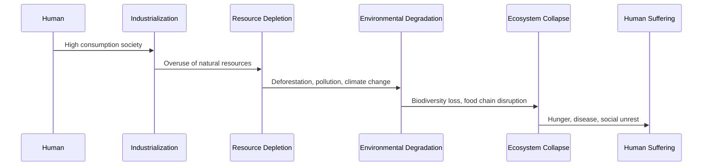

---
tags:
  - overshoot
---
# population overshoot

<iframe width="835" height="470" src="https://www.youtube.com/embed/lPMPINPcrdk" title="Overshoot in a Nutshell: Understanding Our Predicament (31 min)" frameborder="0" allow="accelerometer; autoplay; clipboard-write; encrypted-media; gyroscope; picture-in-picture; web-share" allowfullscreen></iframe>

Population overshoot refers to a situation in which the population of a species, including human beings, exceeds the carrying capacity of its environment, resulting in a reduction of resources, degradation of ecosystems, and a decline in the quality of life for individuals and societies.

The concept of population overshoot is based on the idea that populations of all species are limited by the availability of resources, such as food, water, and habitat. When the population exceeds the carrying capacity of the environment, it results in competition for resources, and increased pressure on the environment. This can lead to the degradation of ecosystems, increased pollution, and a decline in the quality of life for individuals and societies.

The human population has been growing rapidly for the past few centuries, and it is estimated that the current global population of over 7.9 billion people is already beyond the carrying capacity of the planet. This has led to increasing concerns about the sustainability of human populations and the impacts of population overshoot on the environment, resources, and quality of life.

## if we could live forever

some researchers are exploring the use of CRISPR to modify genes that are involved in the aging process or that are implicated in specific diseases, with the {==aim of slowing or reversing the aging process==} or treating certain conditions.

Other researchers are investigating the use of CRISPR {==to regenerate tissues or organs by editing cells to create new cells that can replace damaged or aging cells==}

### total number of humans

it is thought that the total number of humans who have ever lived is somewhere between 100 billion and 120 billion

### the space that many would occupy

Assuming an average population density of 50 people per square kilometer, 120 billion people would require around {==2.4 million square kilometers of land area==}.

### land area

The total land area of the Earth is approximately {==148,940,000 square kilometers==}. This includes all the continents, islands, and other land masses on the planet. It is important to note that this number may vary slightly depending on how land area is defined and measured.

### earths capacity

Estimates of the Earth's carrying capacity for humans range widely, from as few as 1 billion to as many as 1 trillion or more, depending on assumptions and scenarios. However, most estimates fall within a range of 4 to 16 billion people, with the current global population of around 7.9 billion already exceeding the Earth's sustainable carrying capacity according to many experts.
