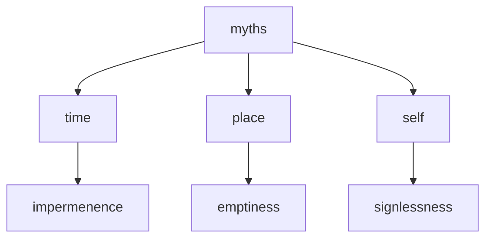

---
tags:
  - myths 
  - time 
  - impermemenance 
  - space 
  - emptiness
  - no self 
  - delusion 
  - basics 
---
# three great myths

The "three great myths" of time, place, and self refer to the Buddhist teaching of the illusory nature of these concepts. These myths are seen as fundamental sources of suffering and ignorance, and are said to obscure our true understanding of reality.

- The myth of time - The Buddhist teaching on the myth of time is that our concept of time as a linear progression of past, present, and future is an illusion. In reality, time is seen as a continuous and interdependent phenomenon, with no permanent beginning or end.
- The myth of place - The Buddhist teaching on the myth of place is that our belief in a permanent, unchanging self is an illusion. Our sense of self is seen as a constantly changing and interdependent phenomenon, shaped by our thoughts, emotions, and experiences.
- The myth of self - The Buddhist teaching on the myth of self is that our belief in a permanent, unchanging self is an illusion. Our sense of self is seen as a constantly changing and interdependent phenomenon, shaped by our thoughts, emotions, and experiences. This illusion creates a sense of separation and duality, leading to suffering and ignorance.

By transcending these myths and realizing their illusory nature, one can experience a state of inner peace, happiness, and freedom from suffering.
