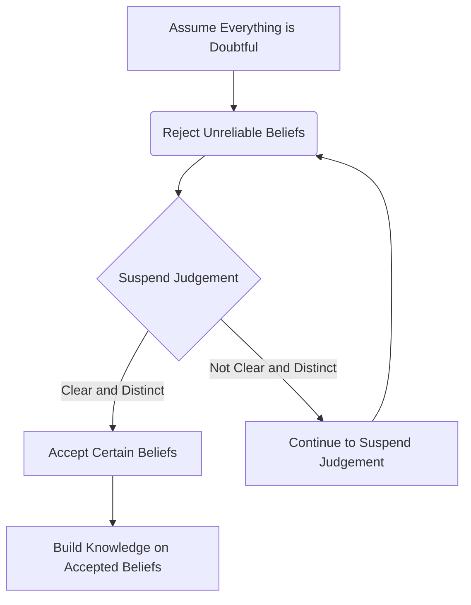

---
tags:
  - dysfunction 
  - language
  - dukkha 
  - style guide 
---
# labels and form[^1]

- language is a double edged sword
- language (name & form) is a root cause in egocentrism in buddhism and psychology

## cartesian doubt

## language barriers

There are many reasons why humans create language barriers, including:

- Fear of the unknown: People may feel threatened by others who speak a different language, and create barriers to protect themselves.
- Nationalism: People may feel a strong attachment to their own language and culture, and view other languages as inferior.
- Lack of education: People who are not educated may have a limited understanding of other languages and cultures, and may create barriers as a result.
- Historical conflict: Past conflicts between different groups may have led to language barriers being created as a way to maintain separation and preserve cultural identity.
- Economic competition: Language barriers can arise as a result of competition between different groups for economic resources and opportunities.
- Stereotyping: People may have preconceived notions about other cultures and languages, and use these stereotypes to justify language barriers.

Overall, language barriers are often a result of a combination of these factors, and can have negative effects on communication, understanding, and cooperation between different groups.

> related cause of conflict

- Territorial disputes: Conflicts over control of land, resources, and strategic locations can often escalate into wars.
- Nationalism: Strong feelings of patriotism and loyalty to one's country can lead to aggressive behavior towards other nations.
- Economic competition: Wars can be driven by a desire to gain access to valuable resources, markets, and trade routes.
- Ideological differences: Differences in political beliefs, religious beliefs, or cultural values can sometimes lead to violent conflicts.
- Power struggles: Wars can result from struggles for power and influence between individuals or groups within a society.
- Ethnic and tribal tensions: Conflicts between different ethnic or tribal groups can arise from historical grievances, competition for resources, or political disputes.
- Political instability: Weak or unstable governments can be more prone to conflict, particularly if they are unable to address social or economic issues.
- Arms races: Countries may engage in military buildups and arms races in response to perceived threats from other nations.
- Alliances: Countries may be drawn into wars as a result of alliances with other nations, particularly if they are obligated to defend their allies.
- Historical grievances: Past conflicts and injustices can create deep-seated animosity between nations, leading to ongoing tensions and the potential for war.

> fields that created language barriers, including:

- International business: Companies that do business with clients or partners in other countries may face language barriers, making it difficult to communicate effectively and negotiate deals.
- Healthcare: Healthcare providers may face language barriers when treating patients who do not speak the same language as them, which can make it difficult to diagnose and treat medical conditions.
- Education: Schools and universities that attract students from different countries may face language barriers in the classroom, which can affect the quality of education provided.
- Government: Governments may face language barriers when communicating with citizens who speak different languages, which can lead to misunderstandings and decreased trust in government institutions.
- Legal: Legal professionals may face language barriers when dealing with clients who do not speak the same language as them, which can make it difficult to provide effective representation.
- Tourism: Tourism can create language barriers when tourists visit countries where they do not speak the language, making it difficult to communicate with locals and navigate the local culture.
- Technology: The rise of global technology companies has created language barriers in the workplace, as companies may have a person from different countries who do not speak the same language.

> Language barrier symptoms

- Miscommunication: Language barriers can result in misinterpretation or misunderstanding of information, leading to confusion and mistakes.
- Frustration: Communication difficulties due to language barriers can be frustrating for both parties involved, leading to tension and stress.
- Isolation: Language barriers can create a feeling of isolation or exclusion for individuals who do not speak the dominant language in a particular setting.
- Anxiety: People who are unable to communicate effectively due to a language barrier may feel anxious or stressed, particularly in situations where clear communication is important.
- Discrimination: Language barriers can lead to discrimination against individuals who are not fluent in the dominant language, particularly in areas such as employment or education.
- Insecurity: Individuals who are not fluent in the dominant language may feel insecure or embarrassed about their language skills, leading to low self-esteem or social anxiety.

> common languages

Ethnologue, a widely-used reference for language information, currently lists over 7,000 living languages, while other estimates suggest there may be up to 8,000 or more. However, many of these languages are endangered or have only a small number of speakers.

The majority of computer programming languages use only English.

To make computer software thousands of programming languages are used, they all do the same thing, manipulate content stored on drives in folders and files, some formats are human readable some are only for a machine to read.

Ai is going to translate these thousands into one integrated language that is human readable, but it will aslo create faster and more efficient programming languages that will replace the ones humans created and we will not understand how they work, we  will only observe the results and retrain.

## the turbo encabulator

- this was a joke, but the real joke is some people still actually talk like this

The turbo encabulator is a fictional technical device that has been used in jokes and satire since the mid-20th century. It is often described using nonsensical technical jargon and is intended to sound impressive while being completely meaningless. The concept of the turbo encabulator is often used as a way to poke fun at technical jargon and over-complicated explanations in engineering and other technical fields. While the turbo encabulator is not a real device, it has become a cultural touchstone and has been referenced in various works of fiction and popular culture.

<iframe width="998" height="665" src="https://www.youtube.com/embed/Ac7G7xOG2Ag" title="&quot;Turbo Encabulator&quot; the Original" frameborder="0" allow="accelerometer; autoplay; clipboard-write; encrypted-media; gyroscope; picture-in-picture; web-share" allowfullscreen></iframe>

## Rhetoric

Rhetoric is the art of persuasive communication, and there are many different methods that can be used to effectively persuade an audience. Some of the top rhetoric methods include:

- Logos: This method relies on using logical reasoning and evidence to convince the audience of the argument's validity. It involves presenting a rational and well-structured argument, using facts, data, and examples to support the argument.
- Pathos: This method appeals to the emotions of the audience. It involves using vivid language, personal stories, and other emotional techniques to connect with the audience on a deeper level, and to evoke a specific emotional response.
- Ethos: This method appeals to the credibility and authority of the speaker. It involves establishing the speaker's expertise, trustworthiness, and character, which can help to increase the audience's confidence in the speaker and in the argument being presented.
- Repetition: This method involves repeating key words or phrases to reinforce the argument and make it more memorable.
- Analogy: This method involves drawing comparisons between two different things to help the audience understand a complex concept in a simpler way. Analogies can be used to create a visual image that the audience can relate to and remember.
- Inclusive language: This method involves using language that includes the audience in the argument, creating a sense of shared ownership and responsibility for the issue being discussed.
- Humor: This method involves using humor to disarm the audience and create a more relaxed and positive atmosphere. Humor can help to engage the audience and make the argument more memorable.
- Antithesis: This method involves using contrasting words or ideas to create a sense of tension and drama in the argument. Antithesis can help to create a memorable and impactful statement that resonates with the audience.
- Irony: This method involves using language that is opposite to the intended meaning, often to highlight the absurdity of a situation or to make a pointed critique. Irony can be a powerful tool for persuading an audience by exposing the contradictions or hypocrisies of an argument.
- Call to action: This method involves encouraging the audience to take a specific action in response to the argument being presented. It involves creating a sense of urgency and importance around the issue, and providing a clear and specific course of action that the audience can take.

> Rhetoric

used to control popular opinion in various ways, including:

- Emotional appeals: Rhetoric can appeal to people's emotions, such as fear, anger, or compassion, to sway their opinions on an issue. For example, a politician might use emotional language to argue for stricter immigration policies by highlighting the dangers of terrorism.
- Use of language: Rhetoric can be used to manipulate language and meaning to frame an issue in a particular way. For example, a political leader might use euphemisms to downplay the severity of an issue, or use loaded language to create a negative impression of their opponents.
- Deception and misinformation: Rhetoric can be used to deceive people by presenting false or misleading information. This can be done through propaganda, selective use of facts, or by presenting information out of context.
- Creating a sense of unity: Rhetoric can be used to create a sense of unity and identity among a group of people, which can be used to control their opinions and actions. This can be done by appealing to shared values or beliefs, or by creating a sense of us vs. them.

Overall, rhetoric can be a powerful tool for shaping public opinion, and it is important to be aware of how it is being used to influence our views on various issues.

## bs detector

- Ambiguity: Using ambiguous language that can be interpreted in different ways, often with the intention of deceiving or confusing the listener.
- Euphemism: Using a more pleasant or neutral term to describe something that is unpleasant or negative, in order to soften the impact of the message.
- Doublespeak: Deliberately using language that is vague, ambiguous, or confusing in order to disguise or obscure the true meaning of the message.
- Jargon: Using technical language or jargon that is unfamiliar to the listener, in order to create an impression of expertise or authority and to exclude those who are not familiar with the terminology.
- Loaded language: Using emotionally charged or loaded language, often with the intention of manipulating the listener's emotions or opinions.
- Misleading statistics: Presenting statistics in a way that is misleading, often by selectively choosing data or presenting it out of context.
- Red herring: Introducing irrelevant or misleading information into an argument, in order to distract the listener from the main point.
- False dichotomy: Presenting a situation as if there are only two options, when in fact there are other alternatives that have not been considered.
- Ad hominem: Attacking the character or motives of the speaker, rather than addressing the substance of the argument.
- Appeal to authority: Using the opinion of an authority figure to support an argument, without providing evidence or logical reasoning to support the claim.

## active voice

Active voice is a grammatical construction in which the subject of a sentence performs the action of the verb. In other words, the focus is on the agent or doer of the action. The active voice is formed by placing the subject before the verb, followed by the object or complement. For example, "John kicked the ball" is in the active voice, whereas "The ball was kicked by John" is in the passive voice. The use of active voice is generally preferred in academic writing because it makes the writing more direct, clear, and concise. It can also make the writing more engaging and persuasive, as it highlights the responsibility of the agent for the action.

## passive voice

Passive voice is a grammatical construction in which the subject of a sentence appears to undergo an action rather than performing it. In passive voice, the focus is on the action itself, rather than the agent performing the action. The passive voice is formed using a form of the auxiliary verb "to be" followed by the past participle of the main verb. For example, "The ball was kicked by John" is in the passive voice, whereas "John kicked the ball" is in the active voice. The use of passive voice is often discouraged in academic writing because it can obscure the agent responsible for the action and make the writing less clear. However, in some cases, such as when the agent is unknown or unimportant, passive voice may be more appropriate.

## Gaslighting

Gaslighting is a form of emotional abuse that involves manipulating or distorting someone's perception of reality in order to gain power or control over them. Here are some behaviors that a person who is gaslighting their a person may exhibit:

- Denying or dismissing a person' concerns or emotions as unimportant or invalid.
- Blaming a person for mistakes or problems that are not their fault.
- Minimizing or denying facts or evidence that contradicts their own version of events.
- Dismissing a person' achievements or contributions, or taking credit for their work.
- Making a person doubt their own memory, perception, or judgment.
- Twisting a person' words or intentions, or using them out of context.
- Invalidating a person' experiences or feelings by telling them they are "too sensitive" or "overreacting."
- Insisting that a person apologize for things they did not do, or that they are responsible for other people's mistakes.
- Criticizing a person excessively or inconsistently, or using mixed messages to confuse them.
- Threatening a person with negative consequences if they do not comply with their demands or expectations.

It is important to note that gaslighting is a serious form of emotional abuse and can have lasting negative effects on a person mental health and well-being.

## cults

Cult leaders may use a variety of brainwashing techniques to control their followers. Here are a few examples:

- Love bombing: Cult leaders may overwhelm new recruits with attention, affection, and praise, creating a sense of belonging and acceptance.
- Mind control: Cult leaders may use techniques like hypnosis, repetition, and meditation to control followers' thoughts and actions.
- Information control: Cult leaders may restrict access to information from the outside world, promoting only their own ideology and belief system.
- Fear and intimidation: Cult leaders may use threats, intimidation, and physical or psychological abuse to control their followers.
- Dehumanization: Cult leaders may encourage their followers to view outsiders as "evil" or "inferior," creating an "us versus them" mentality.
- Groupthink: Cult leaders may use peer pressure and group dynamics to discourage dissent and promote conformity.

> symptoms

- Extreme devotion to a leader or group: Members may idolize and deeply respect the leader or group to the point where it consumes their thoughts and actions.
- Isolation from friends and family: Cults may require members to cut off contact with people outside the group, making it difficult for them to maintain relationships outside the cult.
- Changes in behavior and personality: Members may become unrecognizable to their family and friends as they conform to the group's beliefs and practices.
- Financial exploitation: Many cults require members to donate money or assets to the group, or may require them to work for little or no pay.
- Thought reform: Members may be subjected to psychological manipulation, such as sleep deprivation, public shaming, and isolation, in order to control their thoughts and beliefs.
- Extreme rituals: Cults may require members to perform extreme or dangerous rituals, such as fasting or self-harm, in order to prove their loyalty to the group.

> how to identify gaslighting

- Denying or downplaying someone's experiences or feelings
- Using confusing or contradictory statements to create doubt or confusion
- Blaming the victim for their own distress or problems
- Withholding information or giving misleading information
- Creating a negative environment by using insults, threats, or intimidation
- Isolating the victim from others, either physically or emotionally
- Using positive reinforcement or reward for compliance with the manipulator's demands

## identify narcissism

- Grandiosity and self-importance
- Preoccupation with fantasies of power, success, and attractiveness
- Lack of empathy for others
- Arrogant and haughty behavior
- Tendency to exploit or manipulate others for personal gain
- Envy of others or the belief that others are envious of them
- Belief in their own superiority and uniqueness
- Fragile self-esteem that is easily threatened
- Need for constant admiration and praise
- Sense of entitlement to special treatment or privileges

[^1]:[interdependence](interdependence.md)
