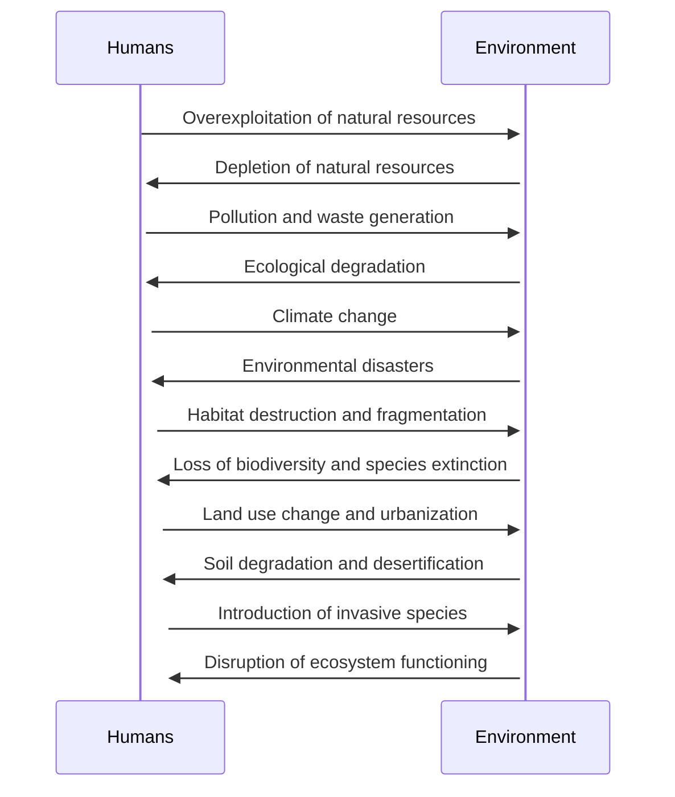

---
tags:
  - ecocide 
---
# ecocide



| Rank | Event                           | Date            | Location         | Description                                                  | Impact                                       |
| ---- | ------------------------------- | --------------- | ---------------- | ------------------------------------------------------------ | -------------------------------------------- |
| 1    | The Great Barrier Reef die-off  | 2016-2017       | Australia        | Warming oceans caused by climate change                      | 50% loss of coral                            |
| 2    | Amazon rainforest deforestation | Ongoing         | Brazil and Peru  | Slash-and-burn agriculture, cattle farming, mining           | Biodiversity loss, emissions                 |
| 3    | Aral Sea drying up              | 1960s - present | Kazakhstan       | Diversion of water for irrigation                            | Ecosystem collapse                           |
| 4    | Dust Bowl                       | 1930s           | Great Plains, US | Unsustainable farming practices, drought                     | Soil erosion, crop failures                  |
| 5    | Gulf of Mexico Dead Zone        | Ongoing         | Gulf of Mexico   | Agricultural runoff causes algal bloom and oxygen loss       | Fish and shellfish die-offs                  |
| 6    | Three Gorges Dam construction   | 1994 - present  | China            | Resettlement of over 1 million people, loss of ecosystem     | Habitat loss, displaced people               |
| 7    | Exxon Valdez oil spill          | 1989            | Alaska, US       | Oil tanker ran aground, spilling millions of gallons of oil  | Ecosystem damage, loss of marine life        |
| 8    | Fukushima nuclear disaster      | 2011            | Japan            | Earthquake and tsunami caused nuclear meltdown               | Environmental contamination, radiation       |
| 9    | Deepwater Horizon oil spill     | 2010            | Gulf of Mexico   | Oil rig explosion caused millions of gallons of oil to spill | Ecosystem damage, loss of marine life        |
| 10   | Bhopal gas tragedy              | 1984            | India            | Gas leak from pesticide plant                                | Over 15,000 deaths, long-term health effects |

| Potential Effects of Global Temperature Rising 3 Degrees |
| -------------------------------------------------------- |
| Increased frequency and intensity of heat waves          |
| More frequent and severe droughts                        |
| More intense hurricanes and tropical storms              |
| Rising sea levels, causing coastal flooding              |
| Disruption to agriculture, leading to food shortages     |
| Increased risk of forest fires and wildfires             |
| Extinction of certain plant and animal species           |
| Spread of disease and illness, such as malaria           |
| Decreased availability of fresh water resources          |
| Economic losses and damage to infrastructure             |

## main drivers of ecocide

<iframe width="710" height="399" src="https://www.youtube.com/embed/uU0DC6qcp18" title="Main Drivers of Collapse, Ecocide, and Likely NTHE - Dowd" frameborder="0" allow="accelerometer; autoplay; clipboard-write; encrypted-media; gyroscope; picture-in-picture; web-share" allowfullscreen></iframe>

```mermaid
journey
    title User Journey for Eco Collapse

    section Causes
        Start --> |Climate Change| Extreme weather events
        Extreme weather events --> |Damage| Infrastructure & Property Loss
        Infrastructure & Property Loss --> |Economic burden| Financial Crisis
        Financial Crisis --> |Austerity measures| Reduced Government support
        Reduced Government support --> |Lack of preparedness| Poor Response to crisis
        Poor Response to crisis --> |Ecosystem degradation| Habitat loss and Wildlife extinction
        Ecosystem degradation --> |Food scarcity| Hunger and malnutrition
        Hunger and malnutrition --> |Disease outbreak| Public Health Crisis

    section Effects
        Climate Change --> |Rising temperatures| Heat waves and Droughts
        Heat waves and Droughts --> |Water scarcity| Reduced access to water
        Reduced access to water --> |Food insecurity| Crop failure and Price spikes
        Crop failure and Price spikes --> |Social unrest| Food riots and Protests
        Food riots and Protests --> |Political instability| Regime change and Conflict
        Political instability --> |Economic collapse| Hyperinflation and Unemployment
        Economic collapse --> |Institutional breakdown| Disruption of basic services
        Disruption of basic services --> |Public health crisis| Outbreak of disease

    section Consequences
        Social unrest --> |Violence and conflict| War and Genocide
        War and Genocide --> |Mass migration| Refugee crisis and Humanitarian disaster
        Refugee crisis and Humanitarian disaster --> |Human suffering| Poverty and Inequality
        Poverty and Inequality --> |Environmental degradation| Ecological collapse and Biodiversity loss
        Ecological collapse --> |Long-term effects| Irreversible damage to ecosystems and Human civilization
        Long-term effects --> |Catastrophic scenarios| Extinction of life on Earth and Collapse of civilization
```