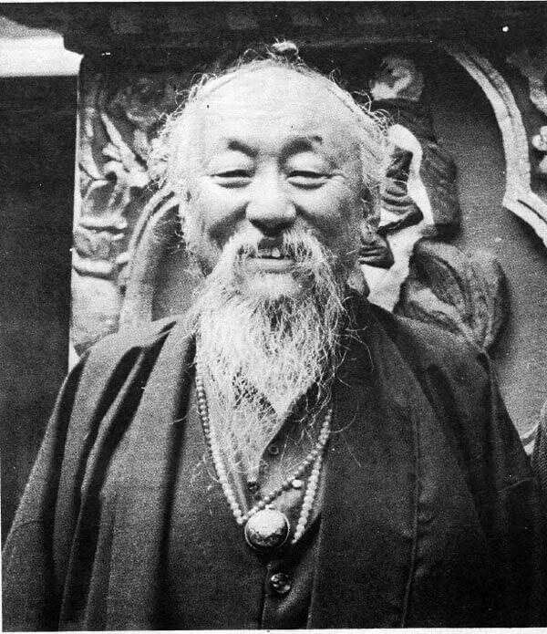
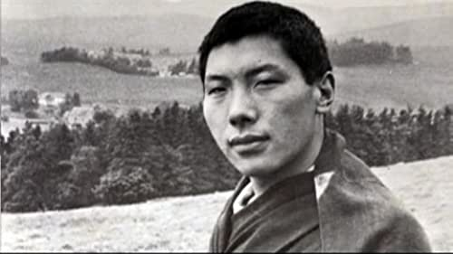

---
tags:
  - all contexts
  - primal confunsion 
  - impermanence 
  - EMPTINESS 
  - space 
  - shunyata
  - anicca 
  - dukkha 
  - anatta 
  - deduction 
---
# emptiness

<iframe width="835" height="470" src="https://www.youtube.com/embed/8thtzm1She8" title="RELATING TO EMPTINESS" frameborder="0" allow="accelerometer; autoplay; clipboard-write; encrypted-media; gyroscope; picture-in-picture; web-share" allowfullscreen></iframe>

## WHAT ARE PHENOMENA EMPTY OF?

When we speak of a phenomenon as being empty, we are referring to its being empty of its own inherent existence. . . . Further, it is not that the object of the negation [inherent existence] formerly existed and is later eliminated, like the forest that existed yesterday and is burned by fire today, with the result that the area is now empty of the forest. Rather, this is an EMPTINESS of an object of negation [inherent existence], which from beginningless time has never been known validly to exist.

> His Holiness the Fourteenth Dalai Lama

## confusions about emptiness

emptiness in meditation is referring to an object being **empty OF an inherent identity**

it is not referring to a vacuum, or empty space, or the void in outer space

think of the periodic table, we know of 118 types of atoms

we say things like "this car exists" but if you take apart a car, you will never find a "car atom"

so where is the car?  you could remove the hood ornament and people will say it's still a car, the car is not in the ornament

but if you put a car on blocks, remove the wheels and engine, is it still a car? it still kind of looks like a car

without an engine it doesn't drive people will argue it's not a car, it's now "car parts"

if someone calls you for a ride you'd say my car is broke or I don't have a car right now

one of many of our primordial confusions is we confuse the [real for the unreal](garfield.md)

if you look and understand it on a deeper level, you see it's true nature

these approaches I'm explaining are also applied to the concept of [a self](sense.md) in meditation

if you meditate on EMPTINESS and your car is stolen or breaks, you're less likely to [cling](aggregates.md), [cry](basics.md#the-51-mental-formations) and [suffer](dukka.md)

you [remind yourself](impermenence.md#benefits) there only appears to be car here and there is a stack of [inter dependant causes](interdependence.md) that we consider to be a car, there are parts that are not a car in theirselves which are combined into an object we at some point satisfy meets a definition of the term car

if I forget, and leave the doors unlocked with the keys in the ignition for example and park downtown, soon there is no car

if someone gifts you a car but they don't transfer the title, someone can take your car and say, no it's mine, you'd have to go to court, the judge would say there is no car in your name [at this time](delusion.md#three-great-myths)

a deeper insight is that nowhere in the universe, ever at any time, was there an object with inherent identity, and there never will be

[everything is changing](zen.md#everything-changes)

## EMPTINESS is the Middle Way between existent and nonexistent

The practice is to nourish the insight into EMPTINESS all day long.

> Excerpt From The Heart Of The Buddha’s Teaching Hanh, Thich Nhat

<iframe width="700" height="394" src="https://www.youtube.com/embed/F3XqhBigMao" title="Emptiness: Empty of What? | Thich Nhat Hanh (short teaching video)" frameborder="0" allow="accelerometer; autoplay; clipboard-write; encrypted-media; gyroscope; picture-in-picture; web-share" allowfullscreen></iframe>

## OUR WORLD IS RELENTLESSLY IMPERMANENT

Change is continuous. Day by day, one season slips into the next. Day turns into night and night to day. Buildings don’t suddenly grow old; rather, second by second, from the moment they’re constructed, they begin to deteriorate. . . . Think of beings inhabiting this universe. How many people born a hundred years ago are still alive? . . . We see the play of impermanence in our relationships as well. How many of our family members, friends, people in our hometown, have died? How many have moved away, disappearing from our lives forever? . . . At one time we felt happy just being near a person we loved. Just to hold that person’s hand made us feel wonderful. Now maybe we can’t stand him, we don’t want to know anything about him. Whatever comes together must fall apart, whatever once fathered must separate, whatever was born must die. Continual change, relentless change, is constant in our world.

> Excerpt From: Reginald A. Ray. “The Wisdom of Tibetan Buddhism.” —Chagdud Tulku Rinpoche”

## DISAPPOINTMENT

We must surrender our hopes and expectations, as well as our fears, and march directly into disappointment, work with disappointment, go into it and make it our way of life. . . . If we can open, then we suddenly begin to see that our expectations are irrelevant compared with the reality of the situations we are facing. This automatically brings disappointment. Disappointment is the best chariot to use on the path of the dharma. It does not confirm the existence of our ego and its dreams.

> Chögyam Trungpa Rinpoche”

## EMPTINESS MEANS ABSENCE OF INHERENT REALITY

(The Buddha) demonstrated that not only in the ordinary sense is there no ego, but no inherent reality can ever be found in anything, no matter where we look. The Buddha taught EMPTINESS as being a function of appearance, that is, the highest quality of appearance—the lack of true existence. The fundamental nature of all appearance is empty. There is no unitary, essential quality, no single identifiable reality, in either the external world that appears to us or the subjective mind. There is no single real nature to anything. There is no self in any appearance, no self in any dharma, no essential nature to anything at all. All dharmas or occurring events do not arise out of an inherent real nature but rather arise from a cause and secondary conditions that permit this cause to yield a particular effect.

> Khenchen Thrangu Rinpoche

## Emptiness, or "shunyata"

Emptiness, or "shunyata" in Sanskrit, is a central teaching in Buddhism, particularly in the Mahayana tradition. It refers to the nature of all phenomena as being devoid of inherent existence.

Here are some of the key attributes of EMPTINESS in Buddhism:

- [Interdependent](interdependence.md) origination: All phenomena arise in dependence upon other causes and conditions, and are therefore not independently existent.
- Impermanence: All phenomena are subject to change and are therefore inherently unsatisfactory.
- Lack of self-nature: The idea that all things, including the self, lack a permanent, unchanging essence.
- EMPTINESS of phenomena: All phenomena are empty of an inherent existence and are merely the coming together of various causes and conditions.
- EMPTINESS of the self: The self is empty of an inherent existence and is merely a collection of five aggregates – form, feeling, perception, mental formations, and consciousness.
- The two truths: The teaching of the two truths, relative and ultimate, helps to explain the relationship between the EMPTINESS of all phenomena and the conventional reality of our everyday experience.
- Liberation: Through the understanding of emptiness, one can achieve liberation from suffering and attain the state of enlightenment.

Emptiness is a profound and complex teaching that can be difficult to understand. However, it is considered a crucial aspect of Buddhist philosophy and is seen as a key to realizing the ultimate nature of reality.

## shunyata benefits of emptiness

Emptiness, or "shunyata" in Sanskrit, is a central teaching in Buddhism, particularly in the Mahayana tradition. Understanding and realizing EMPTINESS has many benefits, both in terms of personal growth and in achieving a greater understanding of reality. Here are some of the benefits of emptiness:

- Overcoming ignorance: EMPTINESS helps to dispel the ignorance that underlies our suffering, leading to a greater understanding of the true nature of reality.
- Letting go of attachments: By realizing the EMPTINESS of all phenomena, one can let go of attachments to things that cause suffering and attain a state of equanimity.
- Overcoming suffering: Through the understanding of emptiness, one can overcome suffering caused by craving and attachment.
- Compassion and wisdom: By seeing all phenomena as empty, one develops a deep compassion for all beings and a wisdom that realizes the ultimate nature of reality.
- Freedom from duality: EMPTINESS helps to break down the dualistic view of the world and opens up the possibility of experiencing reality directly, beyond the dualistic thinking that creates suffering.
- Attaining enlightenment: The ultimate goal of Buddhism is to attain enlightenment, and EMPTINESS is seen as a key aspect of this process.
- Peace and happiness: By realizing emptiness, one can experience a deep peace and happiness that is not dependent on external conditions.

It is important to note that the understanding of EMPTINESS is not just an intellectual concept, but a direct realization that can be experienced through meditation and other spiritual practices.
