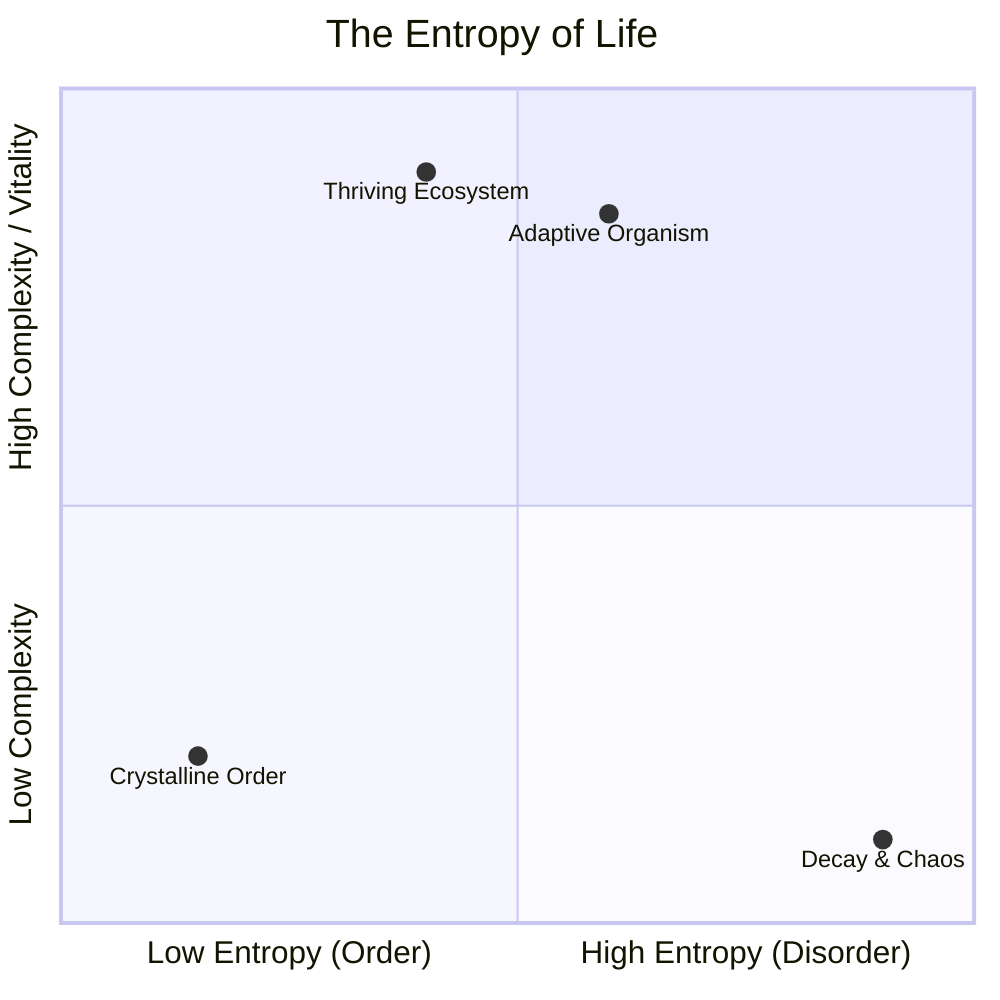
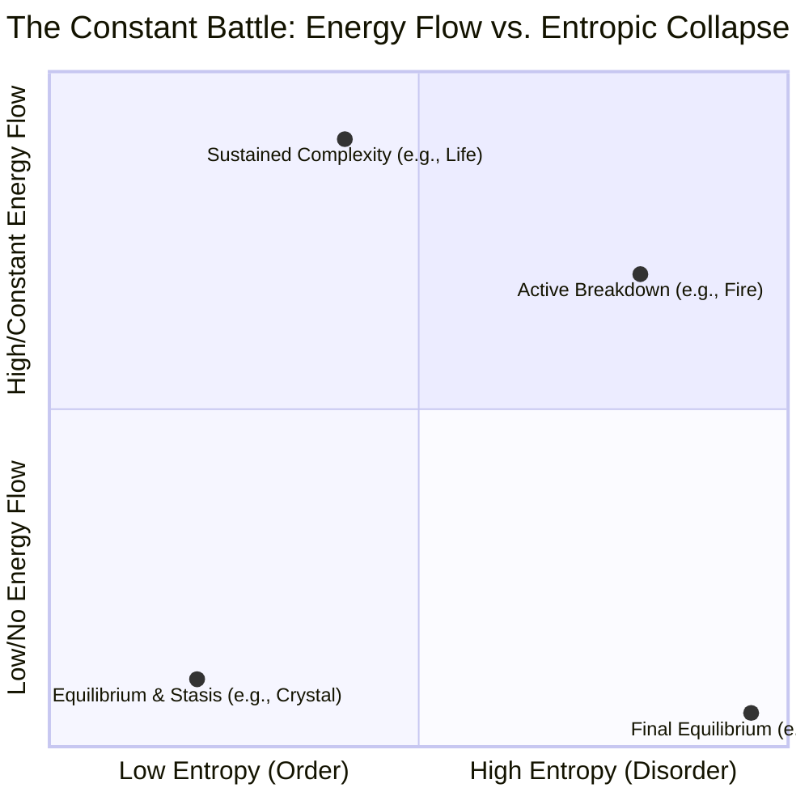

# entropy

- entropy is a collections of forces balancing which drives everything imo
- <https://www.santafe.edu/research/projects/thermodynamics-computation>
- <http://shanenull.com/2024/html/complexity.html>

> My own reasons center around a gradual loss of make-believe, a gradual enlightenment as to the nature of reality, of the world.  ... Don’t chew on something that’s trying to eat you It’s good God hides the truth from children otherwise they wouldn’t have the heart to start He forgot how stupid pain makes you should need the opposite otherwise what good is it
>> cormac mccarthy in various books

> I don't think there's anything wrong with me I think I've just been driven to finally face the truth I don't regard my state of mind as some pessimestic view of the world I regard it as the world itself
>> cormac mccarthy in sunset limited

<iframe width="553" height="983" src="https://www.youtube.com/embed/2wXMMjSlHAM" title="Are We Going Extinct..?" frameborder="0" allow="accelerometer; autoplay; clipboard-write; encrypted-media; gyroscope; picture-in-picture; web-share" referrerpolicy="strict-origin-when-cross-origin" allowfullscreen></iframe>
## brainstorming

- entropy and temporary pockets of life and complexity

