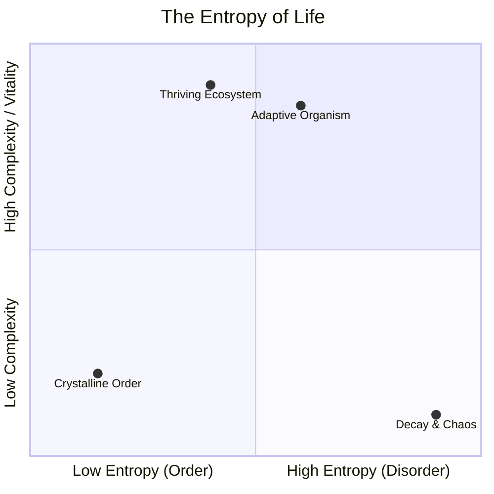
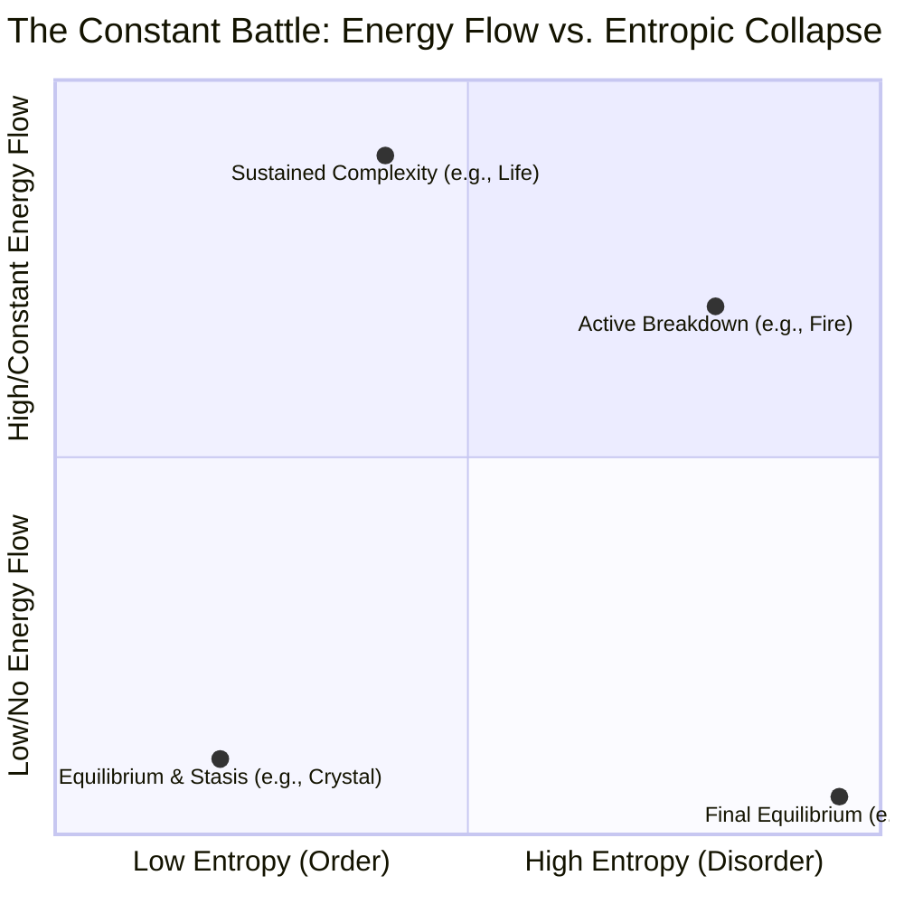

# entropy

- entropy is a collections of forces balancing which drives everything imo
- <https://www.santafe.edu/research/projects/thermodynamics-computation>
- <http://shanenull.com/2024/html/complexity.html>

## brainstorming

- entropy and temporary pockets of life and complexity

