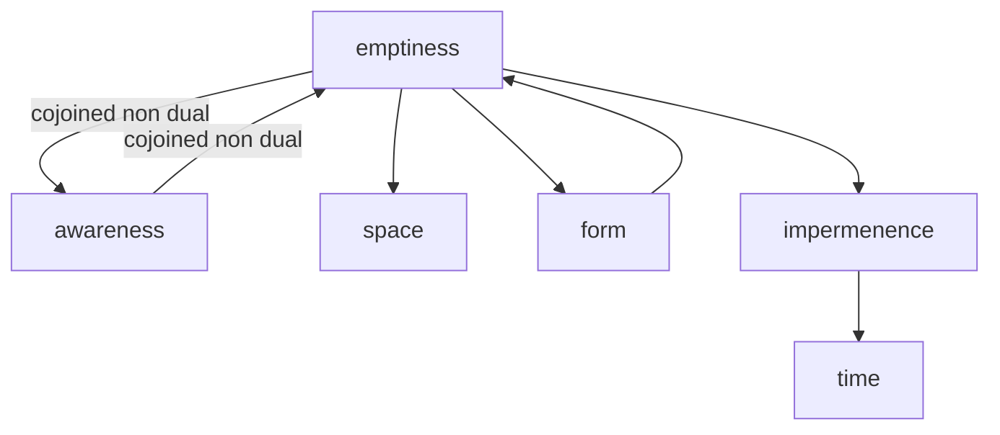

---
tags:
  - impermenence 
  - emptiness 
  - time 
  - maranasati
---
# impermanence

Meditation on impermanence is a common practice in Buddhism, where it is recognized as one of the Three Universal Truths along with suffering and non-self.

This type of meditation involves reflecting on the transience and fleeting nature of all things, including our own bodies, thoughts, and emotions.

The goal of meditation on impermanence is to cultivate a sense of detachment and to overcome attachment to the material world.

By understanding that everything is impermanent and constantly changing, practitioners aim to develop a greater appreciation for the present moment and to reduce feelings of fear and anxiety about the future.

One common method of impermanence meditation is to reflect on the different stages of life, such as birth, aging, illness, and death.

Practitioners may also focus on the impermanence of physical objects and the changing nature of their thoughts and emotions.
