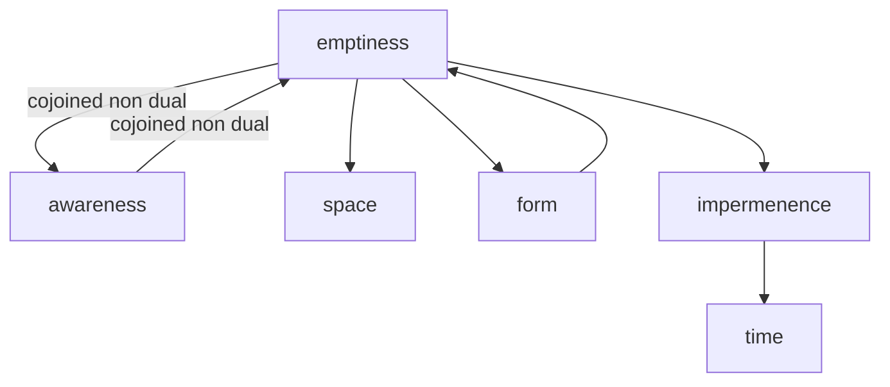

---
tags:
  - impermenence 
  - emptiness 
  - time 
  - maranasati
---
# impermanence

<iframe width="802" height="501" src="https://www.youtube.com/embed/tY7WcDaURp0" title="040807 Questioning Impermanence \ \ Thanissaro Bhikkhu \ \ Dhamma Talks" frameborder="0" allow="accelerometer; autoplay; clipboard-write; encrypted-media; gyroscope; picture-in-picture; web-share" allowfullscreen></iframe>

Meditation on impermanence is a common practice in Buddhism, where it is recognized as one of the Three Universal Truths along with suffering and non-self.

This type of meditation involves reflecting on the transience and fleeting nature of all things, including our own bodies, thoughts, and emotions.

The goal of meditation on impermanence is to cultivate a sense of detachment and to overcome attachment to the material world.

By understanding that everything is impermanent and constantly changing, practitioners aim to develop a greater appreciation for the present moment and to reduce feelings of fear and anxiety about the future.

One common method of impermanence meditation is to reflect on the different stages of life, such as birth, aging, illness, and death.

Practitioners may also focus on the impermanence of physical objects and the changing nature of their thoughts and emotions.

## benefits

- Overcoming attachment: By realizing the transient nature of all things, one can overcome attachment to material possessions and emotions, leading to a more peaceful and contented life.
- Reducing fear of death: By understanding that all things are impermanent and subject to change, one can reduce fear of death and the unknown.
- Promoting wisdom: An appreciation of the impermanence of all things can deepen one's understanding of the nature of reality, leading to greater wisdom.
- Improving mindfulness: Meditation on impermanence encourages mindfulness of the present moment and helps one stay focused on what is happening in the present, rather than dwelling on the past or worrying about the future.
- Encouraging self-reflection: By contemplating impermanence, one can reflect on the purpose and meaning of life, and focus on what is truly important.
