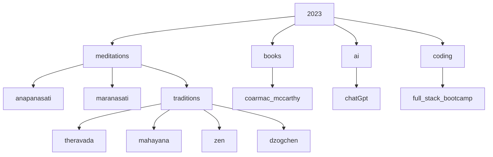

> other experiments 

- [wordpress](https://shanenull.com)
- [django](https://birdup.info)
- [game dev](https://shane0.github.io/adventure/)
- [docusaurus](https://shane0.github.io/docs/)
- [strength training](https://shane0.github.io/strength/)

> topics I'm digging into here

!!! content ""
    this content is mostly quotes from my books or conversations with [chatGPT ai](https://chat.openai.com/)

!!! meditaitons ""
    - [tldr](tldr.md)
    - [anapanasati](anapanasati.md)
    - [maranasati](maranasati.md)

!!! note ""
    I'm reading [cormac mccarthy](cormac.md)'s latest books

!!! note ""
    The design intent should always be less, but better.

    Don't spend time optimizing something that shouldn't exist.

    > elon musk

    "If you cannot explain something in simple terms, you don't understand it."

    > richard feynman

[TAGS]
