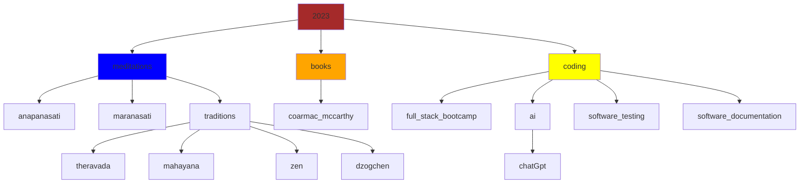

# daily meditation reminders

--8<-- "snippets/dogen.md"

!!! tip "training for your heart and mind"
[flashcards](bujo/08.md){ .md-button }
[tldr videos](tldr.md){ .md-button }
[anapanasati](anapanasati.md){ .md-button }
[maranasati](maranasati.md){ .md-button }
[zen](zen.md){ .md-button }

---

!!! bug "strength training for your body"

    [strength training app](https://shane0.github.io/strength/){ .md-button }

---

## fun facts

| Event               | Age                     |
| ------------------- | ----------------------- |
| Big Bang            | 13.8 billion years ago  |
| Formation of Earth  | 4.5 billion years ago   |
| Emergence of life   | 3.5-4 billion years ago |
| Emergence of humans | ~2.5 million years ago  |
| Modern humans       | ~200,000 years ago      |
| Homo Consumericus   | 70 years ago            |
| Homo Crispr         | 2 years ago             |
| Homo Whoknowswhat   | tbd                     |

---

### are we infected?

It is estimated that about {++8% of human DNA actually originated from viruses that infected our ancestors millions of years ago++}.

### are we chimps?

| Similar Life | Percentage of Genome |
| ------------ | -------------------- |
| Chimpanzee   | 98.7%                |
| Bonobo       | 98.7%                |
| Gorilla      | 98.3%                |
| Orangutan    | 97.9%                |
| Gibbon       | 96%                  |

---

--8<-- "snippets/meditative.md"

### targeted meditations

- Attention: Focused attention meditation, such as mindfulness of breath or body scanning.[^1]
- Awareness: Open awareness meditation, such as choiceless awareness or mindfulness of sounds.[^2]
- Thoughts: Observing thoughts meditation, such as noting or labeling thoughts.[^3]
- Emotions: Emotion regulation meditation, such as compassion or loving-kindness meditation.[^4]
- Perception: Perception meditation, such as perception of impermanence or perception of non-self.[^5]
- Judgment: Non-judgmental awareness meditation, such as mindfulness of thoughts or self-compassion.[^6]
- Response: Intentional action meditation, such as mindful movement or walking meditation.[^7]
- Concentration: Concentration meditation, such as samatha or one-pointedness meditation.[^8]
- Insight: Insight meditation, such as vipassana or mindfulness of thoughts.[^9]
- Clarity: Clarity meditation, such as awareness of breath or clear seeing meditation.[^10]
- Equanimity: Equanimity meditation, such as mindfulness of emotions or body-centered equanimity meditation.[^11]

!!! chatGPT "ai will be used for good and bad"
this content is mostly quotes from my books or conversations with chatGPT ai
my opinion on chatGTP is (currently) it is an extremely useful {==smart encyclopedia==}
{++[hey there ai, will humans live forever or wipe ourselves out completely](collapse.md)?++}

!!! note "the brightest mind that ever lived" - fears and fantasies - I highly recommend [cormac mccarthy](cormac.md)'s movies - cormac's latest books are masterpieces

> topics I'm digging into here

---

!!! note "favorite quotes"
The design intent should always be less, but better.

    Don't spend time optimizing something that shouldn't exist.

    > elon musk

    If you cannot explain something in simple terms, you don't understand it.

    > richard feynman

    Of course, we live in a completely corrupted world where every government is just a bunch of businessmen working for a bunch of bigger businessmen and none of them give a shit about the people, the sad fact is no one knows how to change it, because no one knows how to take on the corporations. So I guess we’re stuck with this system until the oil runs out.

    > woody harrelson

## why stuff happens

<iframe width="668" height="501" src="https://www.youtube.com/embed/S5BhQiny7O0" title="Kurt Vonnegut   The Shapes of Stories" frameborder="0" allow="accelerometer; autoplay; clipboard-write; encrypted-media; gyroscope; picture-in-picture; web-share" allowfullscreen></iframe>

---

## the excrement hits the ventilation duck

- what do we sell out for?

<iframe width="641" height="481" src="https://www.youtube.com/embed/tFuionVJJRg" title="Kurt Vonnegut on Political Satire in America (2005)" frameborder="0" allow="accelerometer; autoplay; clipboard-write; encrypted-media; gyroscope; picture-in-picture; web-share" allowfullscreen></iframe>

<iframe width="668" height="501" src="https://www.youtube.com/embed/m5Few-ZOGXk" title="Kurt Vonnegut on the future of the United States (1987)" frameborder="0" allow="accelerometer; autoplay; clipboard-write; encrypted-media; gyroscope; picture-in-picture; web-share" allowfullscreen></iframe>

---

> other sites

- [wordpress](https://shanenull.com)
- [game dev](https://shane0.github.io/adventure/)
- [docusaurus](https://shane0.github.io/docs/)
- [strength training](https://shane0.github.io/strength/)

---

## tags

[TAGS]

[^1]: [Attention](anapanasati.md)
[^2]: [Awareness](sense.md)
[^3]: [Thoughts](noting.md)
[^4]: [Emotions](metta.md)
[^5]: [Perception](impermenence.md)
[^6]: [Judgment](emptiness.md)
[^7]: [Response](walking.md)
[^8]: [Concentration](shamatha.md)
[^9]: [Insight](vipassana.md)
[^10]: [Clarity](anapanasati.md)
[^11]: [Equanimity](metta.md)
