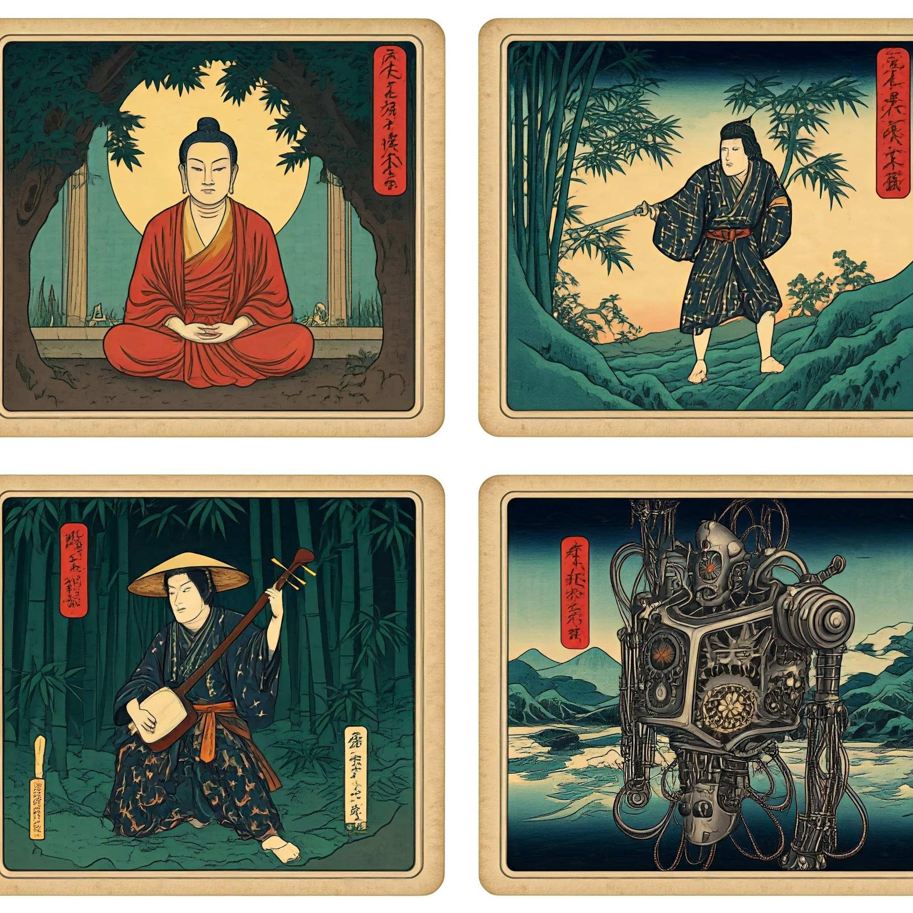
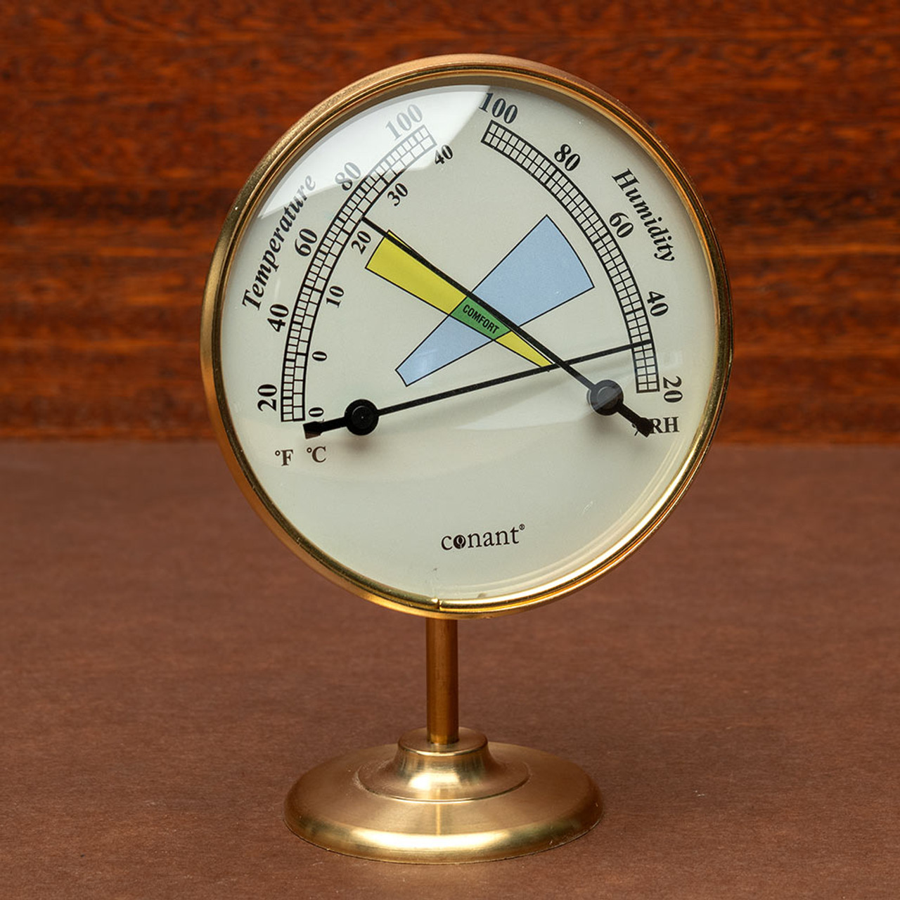
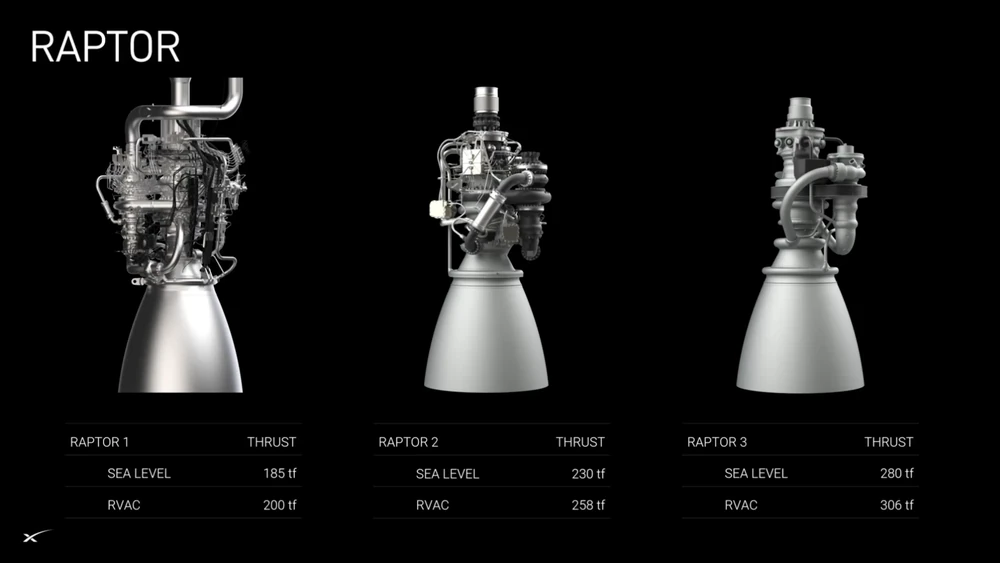

!!! docs

    [workflow template](https://shanenull.com/workflow/){ .md-button } 
    [buddhism](https://shane0.github.io/buddhism/){ .md-button } 
    [music](https://shane0.github.io/music/){ .md-button } 
    [stoicism](https://shane0.github.io/stoicism/){ .md-button }
    [adventures](adventures.md/){ .md-button } 
    [my retro games](https://shanenull.com/adventure/){ .md-button } 

## meditation adventures music and automation

- currently enrolled in a chan buddhism class
- somehow my beard shrank {: style="height:150px;width:150px" .float-left }
- 
- 

<iframe width="800" height="600" src="https://www.youtube.com/embed/ET8tI10G0lo" title="shanenull.com screencast" frameborder="0" allow="accelerometer; autoplay; clipboard-write; encrypted-media; gyroscope; picture-in-picture; web-share" allowfullscreen></iframe>

[TAGS]
