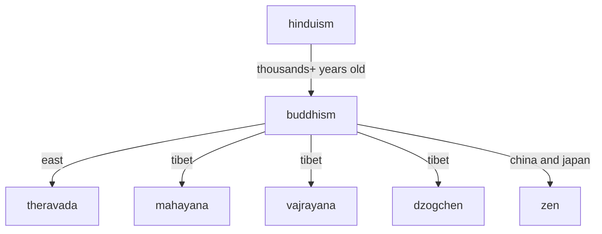

- my notes and chat gtp conversations mainly about books I've read on meditation
- [buddhism by country](https://en.wikipedia.org/wiki/Buddhism_by_country)
- [dhammatalks](https://www.dhammatalks.org/) is a good english translation

[TAGS]
