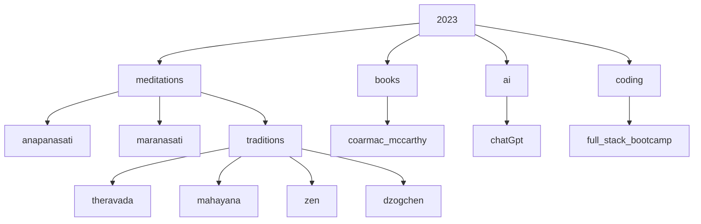

!!! meditations "strength training for your mind"
    [flashcards](bujo/08.md){ .md-button }
    [tldr videos](tldr.md){ .md-button }
    [anapanasati](anapanasati.md){ .md-button }
    [maranasati](maranasati.md){ .md-button }

!!! chatGPT  "ai will be used for good and bad"
    this content is mostly quotes from my books or conversations with chatGPT ai
    my opinion on chatGTP is (currently) it is an extremely useful {==smart encyclopedia==}
    {++hey there ai, will humans [live forever or wipe ourselves out completely](collapse.md)?++}

!!! note "the brightest mind that ever lived"
    - fears and fantasies
    - I highly recommend [cormac mccarthy](cormac.md)'s movies & books, {++ALL OF THEM!!!++}
    - cormac's latest books are hilarious masterpieces

> topics I'm digging into here

!!! note "favorite quotes"
    The design intent should always be less, but better.

    Don't spend time optimizing something that shouldn't exist.

    > elon musk

    If you cannot explain something in simple terms, you don't understand it.

    > richard feynman

> other site experiments

- [wordpress](https://shanenull.com)
- [django](https://birdup.info)
- [game dev](https://shane0.github.io/adventure/)
- [docusaurus](https://shane0.github.io/docs/)
- [strength training](https://shane0.github.io/strength/)

[TAGS]
