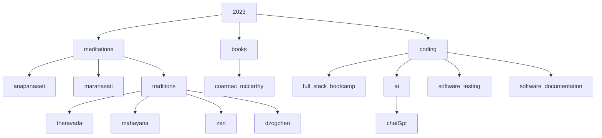

# daily meditation reminders

!!! danger "strength training for your mind"
    [flashcards](bujo/08.md){ .md-button }
    [tldr videos](tldr.md){ .md-button }
    [anapanasati](anapanasati.md){ .md-button }
    [maranasati](maranasati.md){ .md-button }
    [zen](zen.md){ .md-button }

!!! warning "strength training for your body"

    draft: [strength training app](https://shane0.github.io/strength/){ .md-button }

## training the mind and heart

|             | Meditative Mind | Untrained Mind |
|-------------|----------------|----------------|
| Attention   | Focused        | Distracted     |
| Awareness   | Expanded       | Limited        |
| Thoughts    | Observing      | Identifying    |
| Emotions    | Regulating     | Reactive       |
| Perception  | Clear          | Clouded        |
| Judgment    | Non-judgmental | Judgmental     |
| Response    | Intentional    | Automatic      |
| Concentration | Developed     | Scattered     |
| Insight     | Cultivated     | Absent         |
| Clarity]     | Increased      | Decreased      |
| Equanimity]  | Present        | Absent         |

## understanding interdependence

|             | 12 Links of Dependent Origination          | True Mind Versions                                      |
|-------------|--------------------------------------------|--------------------------------------------------------|
| Ignorance   | Ignorance of the Four Noble Truths          | Awakening to the Four Noble Truths                      |
| Volitional  | Volitional formation                        | Mindful intention                                       |
| Consciousness | Consciousness arising from volitional formation | Non-dual awareness                                  |
| Name-and-form | Name-and-form                                | Interbeing, inseparability of form and emptiness        |
| Six Sense Bases | Six sense bases                            | Collective consciousness and the One Mind               |
| Contact     | Contact                                    | Contemplation of emptiness and interbeing                |
| Feeling     | Feeling                                    | Compassionate understanding                             |
| Craving     | Craving                                    | Mindful consumption                                     |
| Grasping    | Grasping                                   | Non-attachment, letting go                              |
| Becoming    | Becoming                                   | Engaged practice, acting with compassion                 |
| Birth       | Birth                                      | Continuation                                           |
| Aging and Death | Aging and Death                            | Impermanence and non-self realization                    |

## targeted meditations

- Attention: Focused attention meditation, such as mindfulness of breath or body scanning.[^1]
- Awareness: Open awareness meditation, such as choiceless awareness or mindfulness of sounds.[^2]
- Thoughts: Observing thoughts meditation, such as noting or labeling thoughts.[^3]
- Emotions: Emotion regulation meditation, such as compassion or loving-kindness meditation.[^4]
- Perception: Perception meditation, such as perception of impermanence or perception of non-self.[^5]
- Judgment: Non-judgmental awareness meditation, such as mindfulness of thoughts or self-compassion.[^6]
- Response: Intentional action meditation, such as mindful movement or walking meditation.[^7]
- Concentration: Concentration meditation, such as samatha or one-pointedness meditation.[^8]
- Insight: Insight meditation, such as vipassana or mindfulness of thoughts.[^9]
- Clarity: Clarity meditation, such as awareness of breath or clear seeing meditation.[^10]
- Equanimity: Equanimity meditation, such as mindfulness of emotions or body-centered equanimity meditation.[^11]

!!! chatGPT  "ai will be used for good and bad"
    this content is mostly quotes from my books or conversations with chatGPT ai
    my opinion on chatGTP is (currently) it is an extremely useful {==smart encyclopedia==}
    {++hey there ai, will humans [live forever or wipe ourselves out completely](collapse.md)?++}

!!! note "the brightest mind that ever lived"
    - fears and fantasies
    - I highly recommend [cormac mccarthy](cormac.md)'s movies & books, {++ALL OF THEM!!!++}
    - cormac's latest books are hilarious masterpieces

> other topics I'm digging into here

!!! note "favorite quotes"
    The design intent should always be less, but better.

    Don't spend time optimizing something that shouldn't exist.

    > elon musk

    If you cannot explain something in simple terms, you don't understand it.

    > richard feynman

> other sites

- [wordpress](https://shanenull.com)
- [django](https://birdup.info)
- [game dev](https://shane0.github.io/adventure/)
- [docusaurus](https://shane0.github.io/docs/)
- [strength training](https://shane0.github.io/strength/)

## tags

[TAGS]

[^1]:[Attention](anapanasati.md)
[^2]:[Awareness](sense.md)
[^3]:[Thoughts](noting.md)
[^4]:[Emotions](metta.md)
[^5]:[Perception](impermenence.md)
[^6]:[Judgment](emptiness.md)
[^7]:[Response](walking.md)
[^8]:[Concentration](shamatha.md)
[^9]:[Insight](vipassana.md)
[^10]:[Clarity](anapanasati.md)
[^11]:[Equanimity](metta.md)
