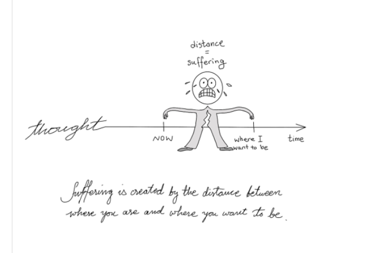
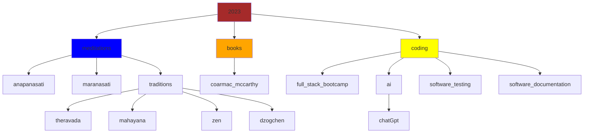

# conversations with chatgtp

<iframe width="802" height="501" src="https://www.youtube.com/embed/GTHd3dn7FJ0" title="the odds of you existing are zero, almost...." frameborder="0" allow="accelerometer; autoplay; clipboard-write; encrypted-media; gyroscope; picture-in-picture; web-share" allowfullscreen></iframe>

> buddhism: six roots

| Root          | Pali/Sanskrit   | Opposite        |
|---------------|----------------|----------------|
| Greed         | lobha          | Non-greed (alobha) |
| Hatred        | dosa           | Non-hatred (adosa) |
| Delusion      | moha           | Non-delusion (amoha) |

--8<-- "snippets/dogen.md"

`Lao Tzu said:`

:   - If you are depressed you are living in the past.
    - If you are anxious you are living in the future.
    - If you are at peace you are living in the present.

--8<-- "snippets/meditative.md"

----

!!! tip "training for your heart and mind"
    [flashcards](bujo/08.md){ .md-button }
    [tldr videos](tldr.md){ .md-button }
    [anapanasati](anapanasati.md){ .md-button }
    [maranasati](maranasati.md){ .md-button }
    [zen](zen.md){ .md-button }
    [strength training app](https://shane0.github.io/strength/){ .md-button }

----

!!! note "favorite quotes"
    The design intent should always be less, but better.

    Don't spend time optimizing something that shouldn't exist.

    > elon musk

    If you cannot explain something in simple terms, you don't understand it.

    > richard feynman

    Of course, we live in a completely corrupted world where every government is just a bunch of businessmen working for a bunch of bigger businessmen and none of them give a shit about the people, the sad fact is no one knows how to change it, because no one knows how to take on the corporations. So I guess we’re stuck with this system until the oil runs out.

    > woody harrelson

> other sites

- [wordpress](https://shanenull.com)
- [game dev](https://shane0.github.io/adventure/)
- [docusaurus](https://shane0.github.io/docs/)
- [strength training](https://shane0.github.io/strength/)

[TAGS]
