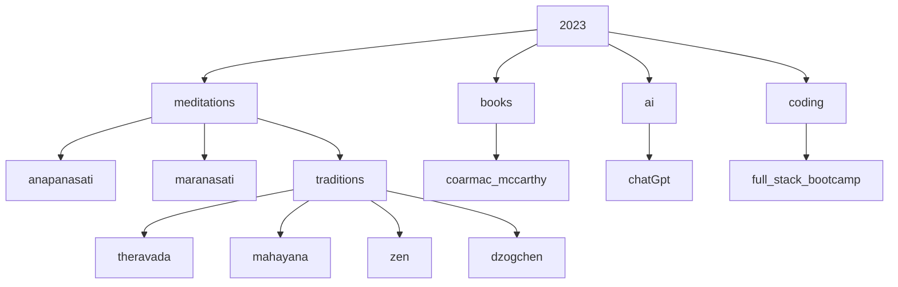

!!! meditations ""
    [tldr videos](tldr.md){ .md-button }
    [anapanasati](anapanasati.md){ .md-button }
    [maranasati](maranasati.md){ .md-button }

!!! chatGPT 
    this content is mostly quotes from my books or conversations with chatGPT ai
    my opinion on chatGTP is it is an extremely useful {==smart encyclopedia==}
    it should be leverated in school, at work and home
    it will be used more than search engines, but does not replace them
    people will still want to search other websites

!!! wow "ai is here, and the answer is not 42"
    {++ai, will humans [live forever or wipe ourselves out completely](collapse.md?++}

!!! note "highly recommended reading"
    I highly recommend [cormac mccarthy](cormac.md)'s books, {++ALL OF THEM!!!++}

> topics I'm digging into here

!!! note "favorite quotes"
    The design intent should always be less, but better.

    Don't spend time optimizing something that shouldn't exist.

    > elon musk

    If you cannot explain something in simple terms, you don't understand it.

    > richard feynman

> other site experiments

- [wordpress](https://shanenull.com)
- [django](https://birdup.info)
- [game dev](https://shane0.github.io/adventure/)
- [docusaurus](https://shane0.github.io/docs/)
- [strength training](https://shane0.github.io/strength/)

[TAGS]
