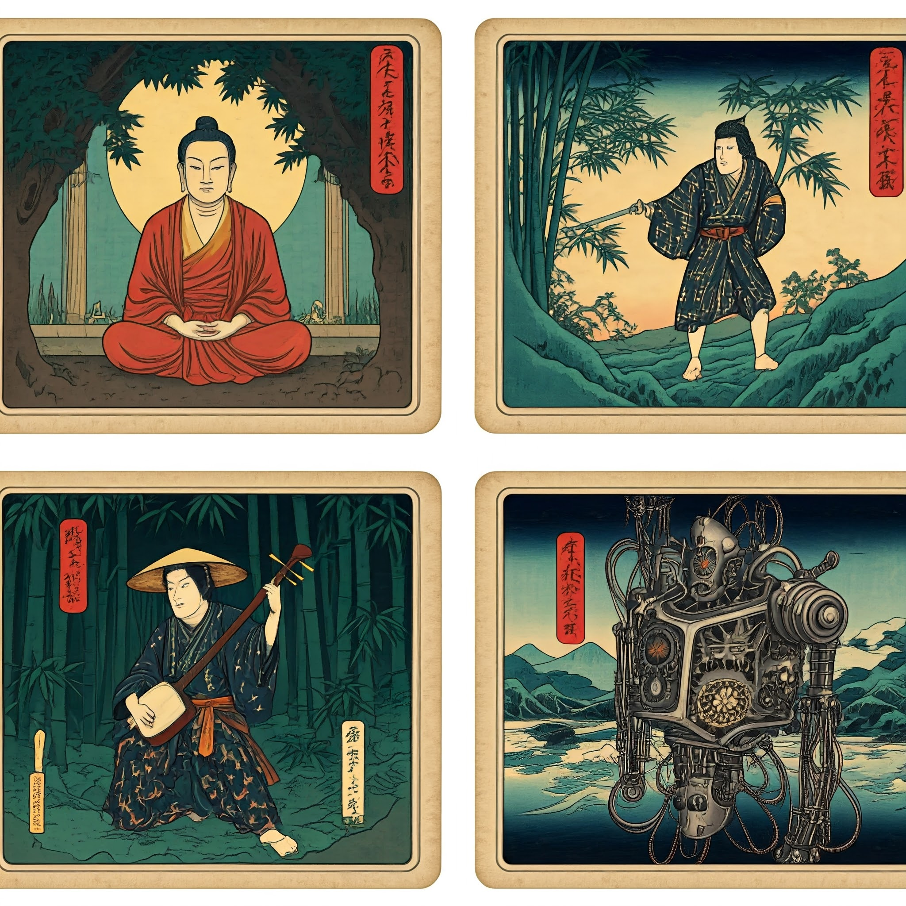
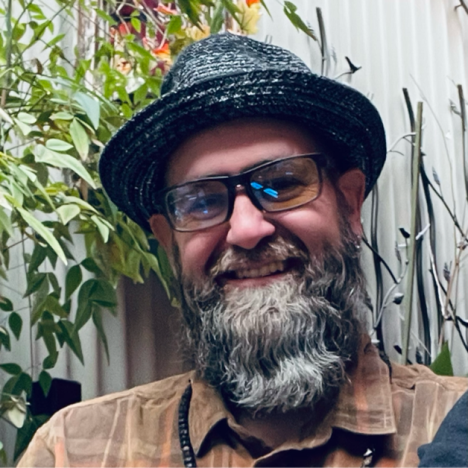

:simple-vim: :simple-qmk: :simple-markdown:  :simple-suckless: :earth_americas: :raccoon: :material-dumbbell: :material-temple-buddhist: :pray: :simple-linux: :material-wardrobe: :material-bash: :simple-jeep: :fontawesome-solid-motorcycle: :simple-python: :material-bicycle: :simple-sqlite: :simple-mongodb: :simple-postgresql: :fontawesome-brands-js: :simple-html5: :simple-sass: :japan: :fontawesome-solid-mountain: :simple-django: :simple-flask: :simple-dota2:

## 2026 research summary

<iframe width="560" height="315" src="https://www.youtube.com/embed/X3-PfZl3HrM?si=E7119urnSVZYJtxB" title="YouTube video player" frameborder="0" allow="accelerometer; autoplay; clipboard-write; encrypted-media; gyroscope; picture-in-picture; web-share" referrerpolicy="strict-origin-when-cross-origin" allowfullscreen></iframe>

### notes for the next version of this the video

- examples of collapses paralleling business as usual: mayans bronze age easter island
- add the jargon dictionary
- I forgot to mention many things
- draw down: for example before humans earth had 6 trillion trees (which sink greenhouse gas) we cut down half (read about easter island)
- we cut down 15 million trees a day just for toilet paper and a bidet is better hygiene + uses 0 trees
- as oil depletes other options draw down faster coal trees etc.
- all new alternative energy is not a transition they are all increasing usage
- most of these topics are about unsustainable aspects of our world aka things that should not even exist and soon will not exist
- complexity and societal collapse has happened voluntarily in the past in very rare instances
- as we are forced to simplify if we do not magically solve these physical limitations (predicaments) we can fallback to prior technology
- biodomes should be a focus we might need them if we continue to pollute earth existing biodomes and bunkers do not work
- collapse of old technology causes the new civilization to have to start research all over
- we can research the old ways that were successful and setup test societies with different sustainable systems
- such as hunter gatherer or as mentioned no till farming herding and other sustainable agriculture
- current defunding and censorship

## meditation adventures music photography automation

- note: 2025-11-24 I will be updating this site very rarely if at all
- I'm moving all my websites to web3 & fly.io
- <https://shane3.com>

!!! docs

    [workflow app template](https://shanenull.com/workflow/){ .md-button } 
    [buddhism class](https://shane0.github.io/buddhism/){ .md-button } 
    [photography](https://shanenull.com/photography/){ .md-button }
    [music](https://shane0.github.io/music/){ .md-button } 
    [stoicism](https://shane0.github.io/stoicism/){ .md-button }
    [adventures](adventures.md/){ .md-button } 
    [my retro games](https://shanenull.com/adventure/){ .md-button } 

## screencast

<iframe width="1381" height="863" src="https://www.youtube.com/embed/Q-wMPMzjYZc" title="2025 web3 workflow yearly updates" frameborder="0" allow="accelerometer; autoplay; clipboard-write; encrypted-media; gyroscope; picture-in-picture; web-share" referrerpolicy="strict-origin-when-cross-origin" allowfullscreen></iframe>

## the beard

(when it was almost guru length)

[TAGS]
