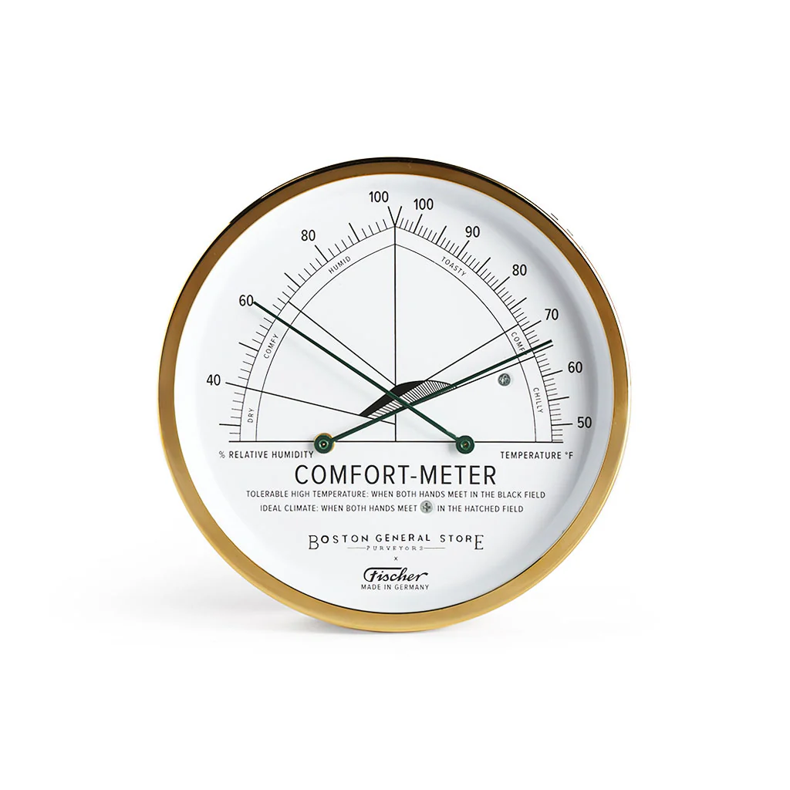

## shane null's research & journals

- currently enrolled in a chan buddhism class
- other topics I'm learning are: stoicism, automation, adventures, music and modernity

## design

- here are some interesting designs
- this allows at a glance intuitive information
- and finer details at the same time

- copmlicated designs should become simple over time
- more reliable and efficient
- the same goes for language

## about this

- this is my mug when my beard was full
- I'm not updating this pic unless my beard decides to man up again it is shamefully wimpy at the moment

{: style="height:150px;width:150px" .float-left }

!!! reference "my attempts at simultaneous brevity and depth with grace"

    [workflow template](https://shanenull.com/workflow/){ .md-button } 
    [buddhism](https://shane0.github.io/buddhism/){ .md-button } 
    [stoicism](https://shane0.github.io/stoicism/){ .md-button }
    [music](https://shane0.github.io/music/){ .md-button } 
    [retro games I coded before the caht robots arrived](https://shanenull.com/adventure/){ .md-button } 
    [adventures](adventures.md/){ .md-button } 
    [tasks](todo.md/){ .md-button } 

<iframe width="800" height="600" src="https://www.youtube.com/embed/ET8tI10G0lo" title="shanenull.com screencast" frameborder="0" allow="accelerometer; autoplay; clipboard-write; encrypted-media; gyroscope; picture-in-picture; web-share" allowfullscreen></iframe>

[TAGS]
