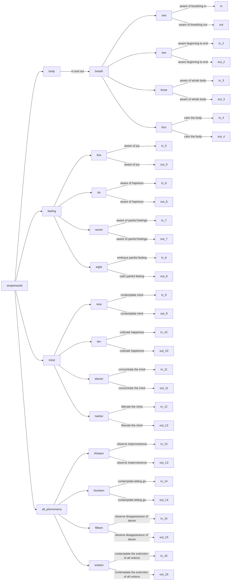
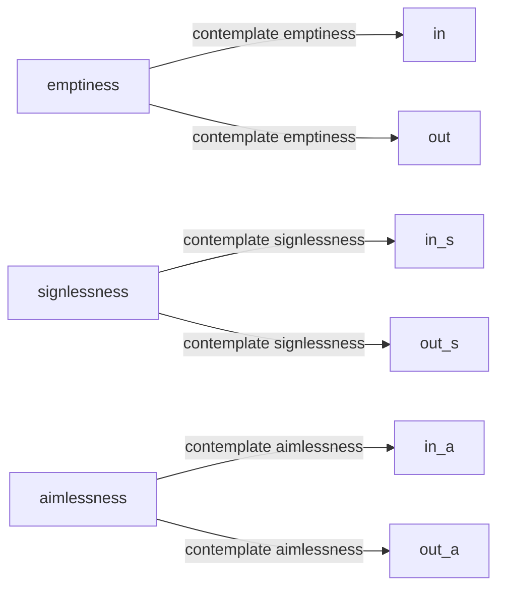
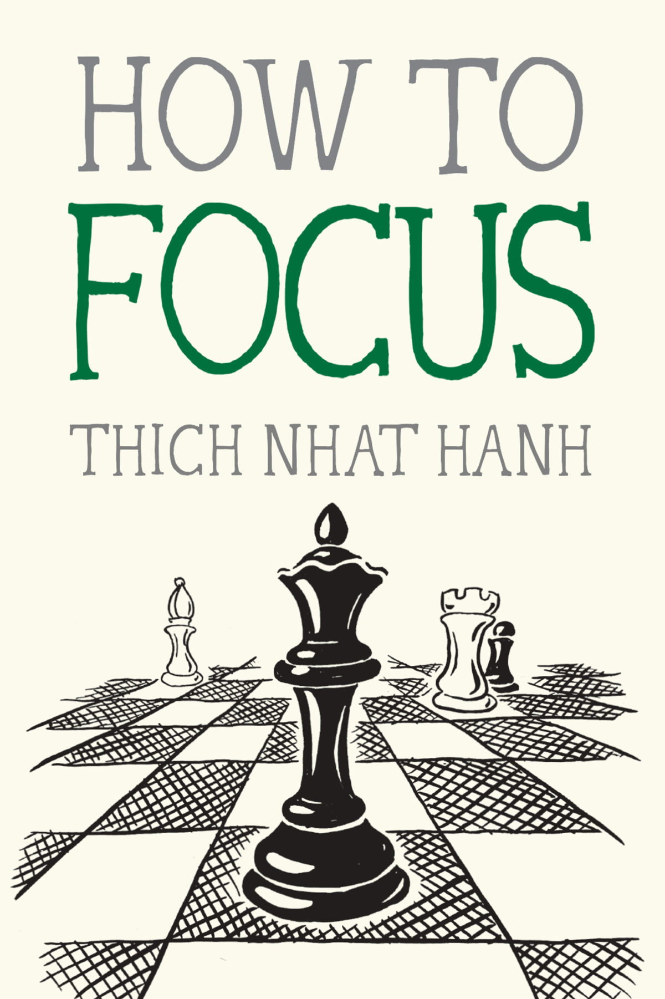

---
tags:
  - anapanasati 
  - emptiness
  - signlessness 
  - aimlessness 
  - shamatha 
  - vipassana 
---

## anapanasati

!!! success "my daily meditation: anapanasati meditation"
    - this meditation uses the breath as a support
    - the book [How to Focus](#how-to-focus) is a good introduction to anapanasati
    - there are 16 steps divided in 4 layers: body, feeling, mind, all phenomena
    - mind: can be extended upsing the [51 mental formations](buddhism/basics.md#the-51-mental-formations)
    - mental formation or emptiness can be extended with [noting](buddhism/noting.md) 
    - or [vipassana](buddhism/vipassana.md)

### bonus: three doors of liberation

## others

| Technique          | Method                                        | Focus                            | Topic                                   |
|--------------------|-----------------------------------------------|----------------------------------|-----------------------------------------|
| Samatha            | Calming the mind through concentration         | One-pointedness, tranquility     | Developing concentration and focus     |
| Vipassana          | Insight meditation, investigating reality      | Mindfulness, awareness           | Gaining insight and wisdom             |
| Anapanasati        | Mindfulness of breathing                       | Breath awareness                 | Cultivating mindfulness and awareness  |
| Satipathana        | Foundations of mindfulness                     | Body, sensations, mind, objects   | Developing mindfulness and awareness   |
| Maranasati         | Mindfulness of death                            | Contemplation of death            | Overcoming fear and attachment to life |

## how to focus

- this book is an excellent introduction to [anapansati](buddhism/anapanasati.md) meditation
- [buy it!](https://www.parallax.org/product/how-to-focus/){ .md-button }

