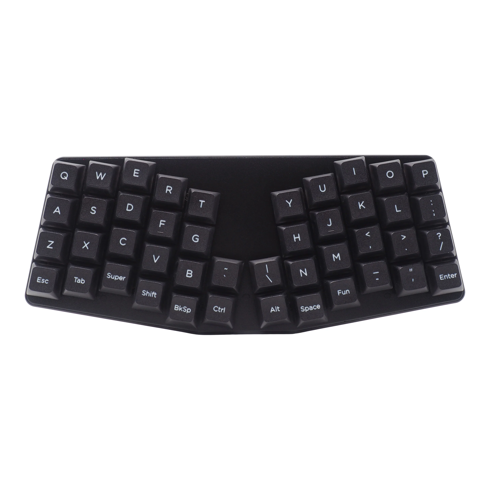
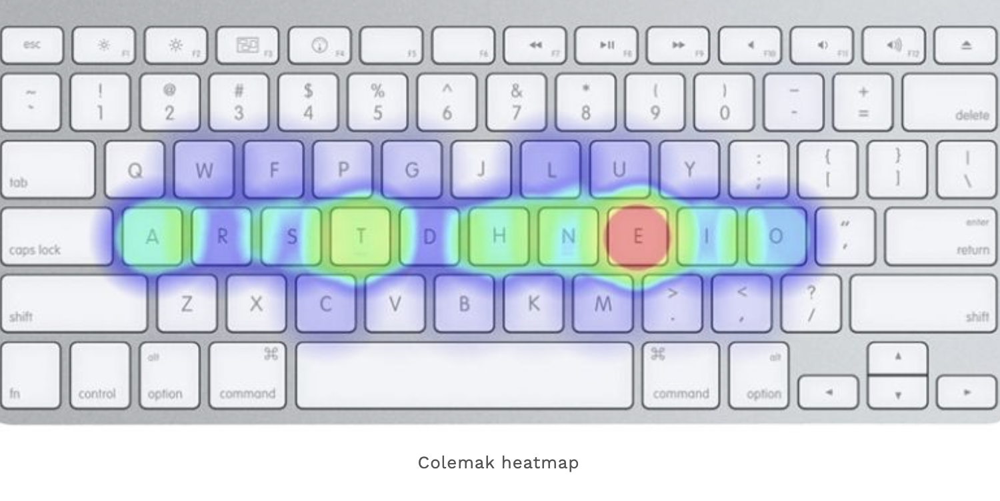
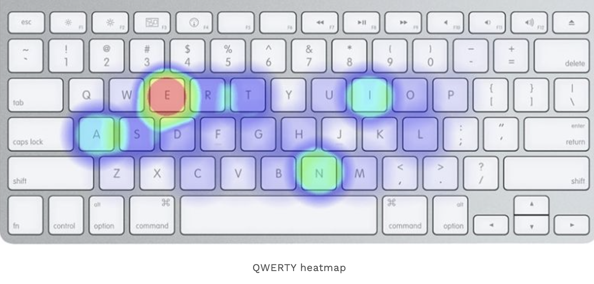

# keyboards

- I used to have a site dedicated to keyboards I will dig it up one day and put it back
- I have build custom keyboards and tried probably 20 different kinds
- there are programmable ortholinear keyboards
- they are well worth the investment in time and money
- I also highly recommend learning vim & the many apps that use vim shortcuts

## layouts

- split: means the keyboard is two pieces accomodating human arms
- ortholinear: means the key layout is a grid pattern
- columnar: means the keys accomodate finger length on a flat plane
- manuform: means the keys accomodate finger length in 3 dimensions

## the atreus

- this is the keyboard I currently use and have used for around 5 years
- there are much better keyboards but this one is convenient and portable
- I would prefer if this keyboard were split and manuform
- my layout has layers for common tasks like print screen cut/copy/paste
- a layer with a numpad
- a layer for coding symbols brackets etc.
- a layer for mouse movements volume etc.

### links

- <https://www.vim.org/>
- <https://colemak.com/Learn>
- <https://config.qmk.fm/#/handwired/dactyl/LAYOUT>

## applying first principles to keyboards

- [first principles](https://shanenull.com/workflow/first/)

Here’s a detailed 7-step process for first principles thinking:

1. **Define the Problem Clearly:**
   - the problem is we need to input content into a computer to communicate
   - the problem is we need to input commands into a computer to have it do work

2. **Gather Existing Knowledge and Assumptions:**
   - Identify the current information, beliefs, or practices around this issue. What do people generally assume is true?
   - people do not want to put in the effort most have stockholm syndrome they do not realize they are suffering
   - to realize how bad a keyboard sucks you have to experience with your hands what a correctly engineered keyboard is like
   - people do not think it is worth the effort to learn to use a keyboard that is designed correctly
   - we could use voice recognition
   - i can type faster than i think plus i tried voice and it still sucks
   - also i don't want to hear everyone around me yapping at a computer with their mouth

3. **Challenge Every Assumption:**
   - Systematically question these assumptions. Ask yourself why things are done a certain way and if these assumptions are necessary or true.
   - people who designed mechanical typewriters had problem figuring out how to prevent "tyepbars" from interfering with each other
   - their solution was to move the keyboard layout around to fit the anatomy of the mechanical typewriter
   - computer keyboards do not have "typebars" under the keys
   - computers are not mechanical typewriters
   - computers can have a keyboard that is designed to fit human anatomy there is no reason to stagger the keys around

4. **Break Down the Problem to its Basic Elements:**
    - the problem is the keyboard should fit human anatomy
    - our arms are spread apart the keyboard should be two pieces so you can place them at the width of your shoulders
    - our thumbs have a wider range of motion so we can utilize thumbs for mor than just a spacebar
    - our fingers have different lengths the keys should accomodate that anatomy
    - software allows moving keys under the fingers eliminating the need to place any keys beyond reach of the fingers

5. **Understand Why These Fundamentals are True:**
   - Validate why the basic elements you've identified are true. Are they based on evidence, or are they assumptions that you mistakenly accepted?
   - machines should perform effort for humans not the other way around

6. **Reconstruct from First Principles:**
   - Build your understanding or solution from the ground up, using only the core truths identified in the previous steps. Work upwards logically without letting conventional thinking influence your approach.
   - how many thumbs do we have? 1 per hand
   - how many fingers do we have? 4 per hand
   - how many keys can the thumb reach comfortably?  3
   - how many keys can the inner fingers reach comfortably?  1 each + 1 upwards + 1 downwards
   - how many keys can the outtermost fingers reach comfortably?  1 each + 1 upwards + 1 downwards + 3 to the left or right

7. **Develop and Test New Solutions:**
   - Once you’ve restructured the problem using first principles, brainstorm novel solutions and test them rigorously. The goal is to arrive at approaches that are more efficient, innovative, or accurate based on your fresh understanding.
   - this problem was already solved there are many programmable keyboards

## history

- [history of stupid keyboard layouts](https://site.xavier.edu/polt/typewriters/typology.html)

## heatmap

- I learned colemak but the problem was sometimes I am in situations where it is not available
- having to retain both qwerty and colemak was inconvenient
- I should revisit this I am much more efficient using colemak it is amazing
- qwerty and institutionalized bad engineering is so lame lol

