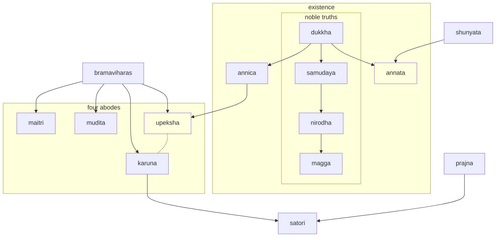

---
tags:
  - meditation 
  - anapanasati 
---
# meditation

- another [buddhism mkdocs project](https://shane0.github.io/workflow/){ .md-button }

!!! tip

    - [plum village](https://plumvillage.org/)
    - [dhamma talks](https://www.dhammatalks.org/)
    - [lotsowahouse](https://www.lotsawahouse.org/tibetan-masters/jamyang-khyentse-chokyi-lodro/key-points-on-trekcho)
    - [daily slide](../daily.html)
    - [noble truths slide](../noble.html)

!!! info

    - currently taking a 20 week chan meditation class: chung tai linji lineage
    - reading a soto zen book: zen illustrated

----

| English      | Sanskrit | Meaning                                                                                                  |
|--------------|----------|----------------------------------------------------------------------------------------------------------|
| Impermanence | Anitya   | Everything is constantly changing and nothing is permanent.                                              |
| Attachment   | Raga     | Clinging to things that are impermanent, such as material possessions, relationships, and ideas.         |
| Ignorance    | Avidya   | The lack of understanding of the true nature of reality, which is impermanence, non-self, and suffering. |

----

## linji chan meditation class

- 2023-09-13: started level 1 class
- 20 weeks meditation essentials
- this is also using a tiddly wiki
- abc: aware be with change
- counting breath
- walking - look at your feet
- class

### 4 noble truths

### heart sutra

```text
Avalokiteshvara Bodhisattva, while practicing the profound prajnaparamita,
Caught sight of the emptiness of all five skandhas,
And thereby freed himself from all suffering and evil.

Here, Shariputra, form is emptiness, emptiness is form.
Form is not other than emptiness, emptiness is not other than form.
That which is form is emptiness, that which is emptiness is form.
The same is true of feeling, thought, karmic formations, and consciousness.

Shariputra, all dharmas are marked with emptiness;
They do not come into being or pass away,
They are not defiled or pure,
They do not increase or decrease.

Therefore, in emptiness, there is no form,
No feeling, no thought, no karmic formations,
No consciousness;
No eyes, no ears, no nose, no tongue, no body, no mind;
No sights, no sounds, no smells, no tastes, no touchables, no objects of mind;
No realm of eyes up to no realm of mind consciousness;
No ignorance, no extinction of ignorance,
Up to no old age and death, and no extinction of old age and death;
No suffering, no cause of suffering, no end of suffering,
No path, no no-path.

There is no wisdom and no attainment.
Because there is nothing to attain,
The bodhisattva, through relying on prajnaparamita,
Has no obscurations of mind,
No fear,
Gone beyond all ills,
Able to attain nirvana.
All buddhas of past, present, and future
Achieved enlightenment through relying on prajnaparamita.

Therefore, know the prajnaparamita as the great mantra,
The mantra of great wisdom,
The highest mantra,
The unequalled mantra,
The mantra that calms all suffering;
True, not false.
Therefore, proclaim the prajnaparamita mantra:
Gate gate paragate parasamgate bodhi svaha.
```

## anapanasati sanskrit table

sanskrit              | topic
----------------------|------------------------------------
anapana               | MINDFULNESS of breathing
kayanupassana         | MINDFULNESS of the whole body
vedananupassana       | MINDFULNESS of bodily sensations
cittanupassana        | MINDFULNESS of ental states
viraganupassana       | Abandoning craving and attachment
upekkhanupassana      | Cultivating a state of equanimity
marananupassana       | MINDFULNESS of death
anapanasati           | MINDFULNESS of breathing in and out
aniccanupassana       | Awareness of impermanence emptiness
dukkhanupassana       | Awareness of suffering dukka
anattanupassana       | Awareness of non-self
viraganupassana       | Developing dispassion
patisantharanupassana | Cultivating detachment
satisampajanna        | Establishing MINDFULNESS as a habit
samadhiganupassana    | Developing CONCENTRATION
nibbananupassana      | Realizing nibanna

| Attribute          | Definition                                                                     |
|--------------------|--------------------------------------------------------------------------------|
| **Awareness**      | The state of being conscious or aware of and responsive to one's surroundings. |
| **Intentionality** | The ability to direct one's attention to something.                            |
| **Selectivity**    | The ability to focus on one thing and ignore others.                           |
| **Subjectivity**   | The experience of the world from a particular point of view.                   |
| **Unity**          | The experience of the world as a coherent whole.                               |
| **Transience**     | The awareness that things are constantly changing.                             |
| **Emotion**        | The experience of feelings such as happiness, sadness, anger, and fear.        |
| **Self-awareness** | The ability to recognize oneself as a separate individual.                     |
| **Free will**      | The ability to make choices about one's actions.                               |

|               | Meditative Mind | Untrained Mind |
|---------------|-----------------|----------------|
| Attention     | Focused         | Distracted     |
| Awareness     | Expanded        | Limited        |
| Thoughts      | Observing       | Identifying    |
| Emotions      | Regulating      | Reactive       |
| Perception    | Clear           | Clouded        |
| Judgment      | Non-judgmental  | Judgmental     |
| Response      | Intentional     | Automatic      |
| Concentration | Developed       | Scattered      |
| Insight       | Cultivated      | Absent         |
| Clarity       | Increased       | Decreased      |
| Equanimity    | Present         | Absent         |

anapanasati (अनापानसति) is a compound word made up of these three parts

- "ana" (अन) means "in-breath"
- "apana" (अपान) means "out-breath"
- "sati" (सति) means "mindfulness" or "awareness"

it refers to the buddhist practice of mindfulness meditation focused on the breath, specifically the sensations of the in-breath and out-breath

in this meditation practice, the meditator cultivates awareness of their breath as it naturally occurs, without trying to control or manipulate it

the aim of this practice is to develop mindfulness, concentration, and insight into the nature of the mind and body

## bard

1. MINDFULNESS of breathing in & out (anapana)
1. MINDFULNESS of breathing in & out all the way through (anapana)
1. MINDFULNESS of the whole body (kayanupassana)
1. MINDFULNESS of bodily sensations (vedananupassana)
1. MINDFULNESS of mental states (cittanupassana)
1. Abandoning craving and attachment (viraganupassana)
1. Cultivating a state of equanimity (upekkhanupassana)
1. MINDFULNESS of death (marananupassana)
1. MINDFULNESS of breathing in and out (anapana-sati)
1. Awareness of impermanence (aniccanupassana)
1. Awareness of suffering (dukkhanupassana)
1. Awareness of non-self (anattanupassana)
1. Developing dispassion (viraganupassana)
1. Cultivating detachment (patisantharanupassana)
1. Establishing MINDFULNESS as a habit (sati-sampajanna)
1. Developing CONCENTRATION (samadhiganupassana)
1. Realizing nibbana (nibbananupassana)

---

- "anapana" (अनापान) - compound word made up of:
  - "ana" (अन) - prefix meaning "in-breath"
  - "apana" (अपान) - prefix meaning "out-breath"

---

- "kayanupassana" (कायानुपस्सना) - compound word made up of:
  - "kaya" (काय) - root meaning "body"
  - "anupassana" (अनुपस्सना) - suffix meaning "observation"

---

- "vedananupassana" (वेदनानुपस्सना) - compound word made up of:
  - "vedana" (वेदना) - root meaning "sensation"
  - "anupassana" (अनुपस्सना) - suffix meaning "observation"

---

- "cittanupassana" (चित्तानुपस्सना) - compound word made up of:
  - "citta" (चित्त) - root meaning "mind"
  - "anupassana" (अनुपस्सना) - suffix meaning "observation"

---

- "viraganupassana" (विरागानुपस्सना) - compound word made up of:
  - "viraga" (विराग) - root meaning "dispassion"
  - "anupassana" (अनुपस्सना) - suffix meaning "observation"

---

- "upekkhanupassana" (उपेक्खानुपस्सना) - compound word made up of:
  - "upekkha" (उपेक्खा) - root meaning "equanimity"
  - "anupassana" (अनुपस्सना) - suffix meaning "observation"

---

- "marananupassana" (मरणानुपस्सना) - compound word made up of:
  - "marana" (मरण) - root meaning "death"
  - "anupassana" (अनुपस्सना) - suffix meaning "observation"

---

- "anapana-sati" (अनापानसति) - compound word made up of:
  - "anapana" (अनापान) - as described above
  - "sati" (सति) - root meaning "mindfulness" or "awareness"

---

- "aniccanupassana" (अनिच्चानुपस्सना) - compound word made up of:
  - "anicca" (अनिच्चा) - root meaning "impermanence"
  - "anupassana" (अनुपस्सना) - suffix meaning "observation"

---

- "dukkhanupassana" (दुक्खानुपस्सना) - compound word made up of:
  - "dukkha" (दुक्ख)

---

## sanskrit word map



| Prajna (प्रज्ञा) | Description                                                                                                                                                                                                                                                                               |
|------------------|-------------------------------------------------------------------------------------------------------------------------------------------------------------------------------------------------------------------------------------------------------------------------------------------|
| Pra (प्र)        | Means "before" or "preliminary"                                                                                                                                                                                                                                                           |
| Jna (ज्ञ)        | Means "to know" or "to understand"                                                                                                                                                                                                                                                        |
| Prajna (प्रज्ञा) | Refers to the wisdom or understanding that comes from deep meditation and insight into the true nature of reality, particularly the concept of emptiness. Prajna is one of the six perfections (paramitas) in Mahayana Buddhism, and is considered essential for achieving enlightenment. |

| Four Types of Prajna  |                                                                                                                                                                                                     |
|-----------------------|-----------------------------------------------------------------------------------------------------------------------------------------------------------------------------------------------------|
| Shravaka Prajna       | Refers to the wisdom or understanding attained by Hinayana practitioners, who seek to attain individual liberation (nirvana) through the realization of the Four Noble Truths.                      |
| Pratyekabuddha Prajna | Refers to the wisdom or understanding attained by solitary practitioners who seek to attain enlightenment for themselves alone, without the help of a teacher or community.                         |
| Bodhisattva Prajna    | Refers to the wisdom or understanding attained by Mahayana practitioners, who seek to attain enlightenment not only for themselves but for the benefit of all sentient beings.                      |
| Tathagata Prajna      | Refers to the highest form of wisdom or understanding, attained by fully enlightened Buddhas, who have realized the ultimate nature of reality and have the ability to teach others to do the same. |

| Three Characteristics of Existence | Description                                                                                                                                                                                                                                                                                                                        |
|------------------------------------|------------------------------------------------------------------------------------------------------------------------------------------------------------------------------------------------------------------------------------------------------------------------------------------------------------------------------------|
| Anicca                             | Refers to the idea that all things are constantly changing and in a state of flux. Nothing in the world is permanent, and everything is subject to birth, aging, sickness, and death.                                                                                                                                              |
| Dukkha                             | Refers to the idea that all things in the world are inherently unsatisfactory and cannot provide lasting happiness or fulfillment. This suffering is caused by our attachment to impermanent things and our ignorance of the true nature of reality.                                                                               |
| Anatta                             | Refers to the idea that there is no fixed or permanent self or soul. Rather, our sense of self is an ever-changing product of our thoughts, emotions, and experiences. The concept of anatta is closely related to the idea of emptiness (shunyata), which is the ultimate nature of all phenomena according to Mahayana Buddhism. |

| English Translation | Sanskrit |
|---------------------|----------|
| Loving-kindness     | Maitri   |
| Compassion          | Karuna   |
| Sympathetic Joy     | Mudita   |
| Equanimity          | Upeksha  |

--8<-- "snippets/meditative.md"

## meditation jargon

- hover the mouse over a term

-8<- "snippets/jargon.md"
