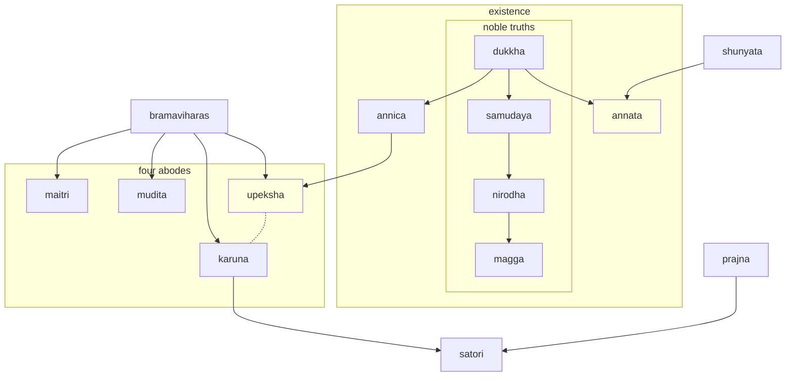

---
tags:
  - meditation 
  - anapanasati 
---
# meditation

!!! tip

    - [plum village](https://plumvillage.org/)
    - [dhamma talks](https://www.dhammatalks.org/)
    - [lotsowahouse](https://www.lotsawahouse.org/tibetan-masters/jamyang-khyentse-chokyi-lodro/key-points-on-trekcho)
    - [daily slide](../daily.html)
    - [noble truths slide](../noble.html)

anapanasati (अनापानसति) is a compound word made up of these three parts

* "ana" (अन) means "in-breath"
* "apana" (अपान) means "out-breath"
* "sati" (सति) means "mindfulness" or "awareness"

it refers to the buddhist practice of mindfulness meditation focused on the breath, specifically the sensations of the in-breath and out-breath

in this meditation practice, the meditator cultivates awareness of their breath as it naturally occurs, without trying to control or manipulate it

the aim of this practice is to develop mindfulness, concentration, and insight into the nature of the mind and body

1. MINDFULNESS of breathing in & out (anapana)
1. MINDFULNESS of breathing in & out all the way through (anapana)
1. MINDFULNESS of the whole body (kayanupassana)
1. MINDFULNESS of bodily sensations (vedananupassana)
1. MINDFULNESS of mental states (cittanupassana)
1. Abandoning craving and attachment (viraganupassana)
1. Cultivating a state of equanimity (upekkhanupassana)
1. MINDFULNESS of death (marananupassana)
1. MINDFULNESS of breathing in and out (anapana-sati)
1. Awareness of impermanence (aniccanupassana)
1. Awareness of suffering (dukkhanupassana)
1. Awareness of non-self (anattanupassana)
1. Developing dispassion (viraganupassana)
1. Cultivating detachment (patisantharanupassana)
1. Establishing MINDFULNESS as a habit (sati-sampajanna)
1. Developing CONCENTRATION (samadhiganupassana)
1. Realizing nibbana (nibbananupassana)

---

* "anapana" (अनापान) - compound word made up of:
  * "ana" (अन) - prefix meaning "in-breath"
  * "apana" (अपान) - prefix meaning "out-breath"

---

* "kayanupassana" (कायानुपस्सना) - compound word made up of:
  * "kaya" (काय) - root meaning "body"
  * "anupassana" (अनुपस्सना) - suffix meaning "observation"

---

* "vedananupassana" (वेदनानुपस्सना) - compound word made up of:
  * "vedana" (वेदना) - root meaning "sensation"
  * "anupassana" (अनुपस्सना) - suffix meaning "observation"

---

* "cittanupassana" (चित्तानुपस्सना) - compound word made up of:
  * "citta" (चित्त) - root meaning "mind"
  * "anupassana" (अनुपस्सना) - suffix meaning "observation"

---

* "viraganupassana" (विरागानुपस्सना) - compound word made up of:
  * "viraga" (विराग) - root meaning "dispassion"
  * "anupassana" (अनुपस्सना) - suffix meaning "observation"

---

* "upekkhanupassana" (उपेक्खानुपस्सना) - compound word made up of:
  * "upekkha" (उपेक्खा) - root meaning "equanimity"
  * "anupassana" (अनुपस्सना) - suffix meaning "observation"

---

* "marananupassana" (मरणानुपस्सना) - compound word made up of:
  * "marana" (मरण) - root meaning "death"
  * "anupassana" (अनुपस्सना) - suffix meaning "observation"

---

* "anapana-sati" (अनापानसति) - compound word made up of:
  * "anapana" (अनापान) - as described above
  * "sati" (सति) - root meaning "mindfulness" or "awareness"

---

* "aniccanupassana" (अनिच्चानुपस्सना) - compound word made up of:
  * "anicca" (अनिच्चा) - root meaning "impermanence"
  * "anupassana" (अनुपस्सना) - suffix meaning "observation"

---

* "dukkhanupassana" (दुक्खानुपस्सना) - compound word made up of:
  * "dukkha" (दुक्ख)

---

## sanskrit word map

| Prajna (प्रज्ञा) | Description                                                                                                                                                                                                                                                                               |
| ------------- | ----------------------------------------------------------------------------------------------------------------------------------------------------------------------------------------------------------------------------------------------------------------------------------------- |
| Pra (प्र)      | Means "before" or "preliminary"                                                                                                                                                                                                                                                           |
| Jna (ज्ञ)      | Means "to know" or "to understand"                                                                                                                                                                                                                                                        |
| Prajna (प्रज्ञा) | Refers to the wisdom or understanding that comes from deep meditation and insight into the true nature of reality, particularly the concept of emptiness. Prajna is one of the six perfections (paramitas) in Mahayana Buddhism, and is considered essential for achieving enlightenment. |

| Four Types of Prajna  |                                                                                                                                                                                                     |
| --------------------- | --------------------------------------------------------------------------------------------------------------------------------------------------------------------------------------------------- |
| Shravaka Prajna       | Refers to the wisdom or understanding attained by Hinayana practitioners, who seek to attain individual liberation (nirvana) through the realization of the Four Noble Truths.                      |
| Pratyekabuddha Prajna | Refers to the wisdom or understanding attained by solitary practitioners who seek to attain enlightenment for themselves alone, without the help of a teacher or community.                         |
| Bodhisattva Prajna    | Refers to the wisdom or understanding attained by Mahayana practitioners, who seek to attain enlightenment not only for themselves but for the benefit of all sentient beings.                      |
| Tathagata Prajna      | Refers to the highest form of wisdom or understanding, attained by fully enlightened Buddhas, who have realized the ultimate nature of reality and have the ability to teach others to do the same. |

| Three Characteristics of Existence | Description                                                                                                                                                                                                                                                                                                                        |
| ---------------------------------- | ---------------------------------------------------------------------------------------------------------------------------------------------------------------------------------------------------------------------------------------------------------------------------------------------------------------------------------- |
| Anicca                             | Refers to the idea that all things are constantly changing and in a state of flux. Nothing in the world is permanent, and everything is subject to birth, aging, sickness, and death.                                                                                                                                              |
| Dukkha                             | Refers to the idea that all things in the world are inherently unsatisfactory and cannot provide lasting happiness or fulfillment. This suffering is caused by our attachment to impermanent things and our ignorance of the true nature of reality.                                                                               |
| Anatta                             | Refers to the idea that there is no fixed or permanent self or soul. Rather, our sense of self is an ever-changing product of our thoughts, emotions, and experiences. The concept of anatta is closely related to the idea of emptiness (shunyata), which is the ultimate nature of all phenomena according to Mahayana Buddhism. |

| English Translation | Sanskrit |
| ------------------- | -------- |
| Loving-kindness     | Maitri   |
| Compassion          | Karuna   |
| Sympathetic Joy     | Mudita   |
| Equanimity          | Upeksha  |

--8<-- "snippets/meditative.md"
