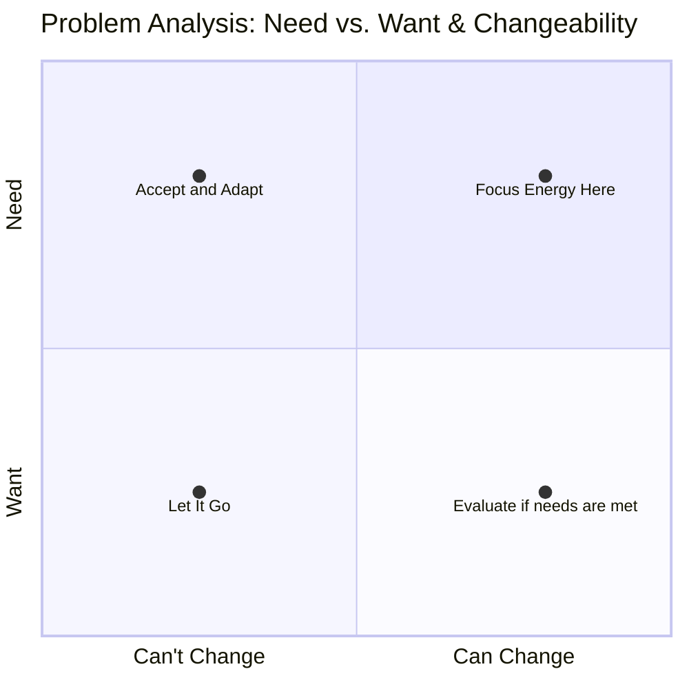

# sustainability

- <https://www.santafe.edu/research/projects/cities-scaling-sustainability>
- focusing your time on wants not needs can unintentionally destroy your needs

> When hungry, I eat; when tired, I sleep
> >> attributed to Master Rinzai

<iframe width="1128" height="635" src="https://www.youtube.com/embed/7HHFH2oQxNA" title="Zen Master Gu Ja - Just eat, sleep and shit" frameborder="0" allow="accelerometer; autoplay; clipboard-write; encrypted-media; gyroscope; picture-in-picture; web-share" referrerpolicy="strict-origin-when-cross-origin" allowfullscreen></iframe>
