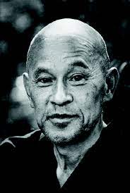

---
tags:
  - non dual 
  - zen 
  - oxherding 
---
# zen

## Shunryu Suzuki

- <https://en.wikipedia.org/wiki/Shunry%C5%AB_Suzuki>

### everything changes

> To realize pure mind in your delusion is practice. If you try to expel the delusion it will only persist the more. Just say, ‘Oh, this is just delusion,’ and do not be bothered by it.
>> Zen Mind, Beginner’s Mind
>>> Shunryu Suzuki

<iframe width="700" height="394" src="https://www.youtube.com/embed/vjpXPECBi5o" title="📖 ZEN MIND, BEGINNER'S MIND by Shunryu Suzuki" frameborder="0" allow="accelerometer; autoplay; clipboard-write; encrypted-media; gyroscope; picture-in-picture; web-share" allowfullscreen></iframe>

## dwell nowhere

"Dwelling nowhere" is a phrase that comes from Zen Buddhism and refers to the state of mind where one is not attached to any particular place, concept, or experience. It is a state of being that transcends dualities and dualistic thinking, and is characterized by a sense of freedom and openness.

In Zen, the idea of "dwelling nowhere" is often associated with the practice of mindfulness and the development of a deep awareness and connection to the present moment. By not getting caught up in thoughts, emotions, or preconceived ideas, one can experience a sense of peace, stillness, and clarity, even in the midst of the most chaotic and challenging circumstances.

The concept of "dwelling nowhere" is also connected to the idea of non-attachment, which is a core teaching of Buddhism. By letting go of attachment and not clinging to anything, one can experience a sense of liberation and freedom from the limitations of the ego and the self.

In Zen practice, "dwelling nowhere" is often cultivated through meditation, mindfulness, and other spiritual practices that help one to still the mind, calm the emotions, and awaken to the true nature of reality. By dwelling nowhere, one can experience a sense of peace, freedom, and fulfillment that is not dependent on external conditions or circumstances.

## 10 bulls

> <https://en.wikipedia.org/wiki/Ten_Bulls>

The Ten Ox-Herding Pictures or Verses is a series of paintings and poems that originated in medieval Japan. They are used as a visual representation of the process of awakening and enlightenment in Buddhism. The series follows the journey of a seeker from ignorance to awakening, symbolized by a young boy searching for an ox, eventually discovering it and mastering it, and ultimately transcending the ox and reaching enlightenment. Each picture or verse represents a stage in the journey, and they are often used as a meditation tool in Zen practice to help the practitioner reflect on their own path towards awakening.

## 10 oxherding verses

The 10 oxherding verses are a series of poems or visual images used in Zen Buddhism to describe the stages of spiritual development leading to enlightenment. The verses describe the seeker as a young oxherder who goes on a journey to find his lost ox, representing the seeker's journey to find enlightenment. The 10 stages depicted are:

- Searching for the ox
- Discovering tracks
- Perceiving the ox's form
- Catching the ox
- Taming the ox
- Riding the ox home
- The ox forgotten
- Both ox and self forgotten
- Reaching the source
- Return to Society

## Zen

is a school of Mahayana Buddhism that originated in China and later spread to Japan and other countries. It emphasizes meditation and direct personal experience of one's own true nature, rather than relying on religious texts or dogma. The historical Buddha, Shakyamuni, is not seen as a god or creator, but rather as a teacher who pointed the way to enlightenment.

The origins of Zen can be traced back to the teachings of the Indian monk Bodhidharma, who is said to have brought Buddhism to China in the 6th century. From there, it developed into the distinct Chinese Chan tradition, which was then introduced to Japan in the 12th century as Zen.

Zen places great emphasis on the practice of meditation, which is considered a means to directly experiencing one's own true nature, or the nature of reality itself. This experience is often referred to as "satori" in Japanese. Zen also places great importance on everyday activities and mindfulness, encouraging the integration of mindfulness into all aspects of life.

Overall, the goal of Zen practice is to awaken to one's true nature, which is said to be pure and unchanging, and to live a life characterized by wisdom, compassion, and peace.

## satori

Satori is a Japanese term that is central to Zen Buddhism. It refers to a sudden realization or awakening to one's true nature. Satori represents a profound understanding of the nature of existence and is often described as an experience of enlightenment or liberation.

In Zen, satori is seen as a direct, intuitive understanding of the nature of reality, beyond concepts, beliefs, or ideas. It is often contrasted with "gradual enlightenment," which is seen as a process of gradually developing understanding and insight over time.

Satori is not considered a permanent state, but rather a momentary experience that can deepen and be integrated into one's life through continued practice. The aim of Zen practice is to cultivate satori, or awaken to one's true nature, in order to live a life characterized by wisdom, compassion, and peace.

Satori is not limited to the realm of religion or spirituality and can be seen as a transformative experience that can occur in any aspect of life, not just in meditation practice.

## zen teachers

Zen has a rich history of notable teachers and practitioners who have helped to shape and transmit the teachings of this tradition. Here are a few of the most well-known Zen teachers:

Bodhidharma: He is considered the founder of Zen in China and is credited with bringing Buddhism from India to China in the 6th century.

Hui-neng: He was the Sixth Patriarch of Zen in China and is known for his teaching of sudden enlightenment, which emphasized the possibility of realizing one's true nature directly and immediately, rather than gradually over time.

Dogen: He was a Japanese Zen master and founder of the Soto school of Zen in Japan. He emphasized the practice of zazen (sitting meditation) as the path to enlightenment.

Hakuin Ekaku: He was a Japanese Zen master and revivalist of the Rinzai school of Zen in Japan. He emphasized the practice of koans (Zen riddles or paradoxes) as a means of realizing one's true nature.

Shunryu Suzuki: He was a Japanese Zen teacher who came to the United States in the 1950s and played a key role in the development of Zen in the West. He is known for his accessible and down-to-earth teaching style.

These are just a few of the many Zen teachers who have contributed to the development and transmission of this tradition. Their teachings and writings continue to inspire and guide practitioners today.

## bodhidharma

Bodhidharma was an Indian monk who is considered the founder of Zen in China. He is said to have traveled from India to China in the 6th century and established the Chan school of Buddhism, which later became known as Zen.

Bodhidharma is known for his teachings on meditation and his emphasis on the direct experience of one's own nature, rather than relying on scriptures or doctrine. He taught that the ultimate goal of Buddhist practice was to awaken to one's true nature and attain enlightenment.

Bodhidharma's teachings and approach to Buddhism were influential in shaping the development of Zen in China and later in Japan. He is also known for his legendary nine years of wall-gazing meditation, which is said to have taken place at the Shaolin Temple in China.

Despite the many legends and myths that surround Bodhidharma, his teachings continue to inspire and guide Zen practitioners today, who seek to awaken to their true nature through the practice of meditation and mindfulness.

## bodhidharma wall gazing

The story of Bodhidharma's wall-gazing meditation is a legendary tale that has become a part of the Zen tradition. According to the legend, Bodhidharma sat in meditation facing a wall for nine years at the Shaolin Temple in China.

The story of Bodhidharma's wall-gazing is often seen as symbolizing his deep commitment to the practice of meditation and his determination to awaken to his true nature. The legend also highlights the idea that the path to enlightenment requires a strong and unwavering commitment, even in the face of challenges and obstacles.

Bodhidharma's wall-gazing meditation has become a symbol of the Zen practice of single-pointed focus and determination. It serves as a reminder of the importance of perseverance and dedication in one's spiritual practice, and inspires practitioners to cultivate the same kind of steadfast commitment in their own lives.

It's important to note that while the story of Bodhidharma's wall-gazing is a popular legend, its historical accuracy is uncertain, and it may have been embellished over time. Nevertheless, it continues to be a central part of the Zen tradition and has had a lasting impact on the development of Zen culture and spirituality.

## hui-neng koan

Hui-neng was a Chinese Zen master and the Sixth Patriarch of Zen in China. He is known for his teachings on sudden enlightenment and his emphasis on direct experience and realization of one's true nature.

One of the most famous koans associated with Hui-neng is the "Platform Sutra." This sutra is a record of Hui-neng's teachings, which include his views on the nature of mind and reality, the practice of meditation, and the path to enlightenment.

In the Platform Sutra, Hui-neng presents the famous koan "What is the nature of mind?" This koan is often used to challenge practitioners to awaken to their true nature beyond words and concepts, and to realize the inseparability of their own mind from the ultimate reality.

The teachings of Hui-neng and his emphasis on direct experience and realization have had a significant impact on the development of Zen in China and continue to influence Zen practitioners today. The koan "What is the nature of mind?" remains a popular and powerful tool for helping practitioners to awaken to their true nature and to experience the wisdom and insight that lies beyond the realm of words and concepts.

## platform sutra outline

The "Platform Sutra" is a Buddhist text attributed to the Chinese Zen master Hui-neng, who was the Sixth Patriarch of Zen in China. This text is a record of Hui-neng's teachings and contains his views on the nature of mind and reality, the practice of meditation, and the path to enlightenment.

Here is a general outline of the key themes and topics covered in the Platform Sutra:

The Nature of Mind: Hui-neng discusses the nature of mind and reality, emphasizing the idea that everything is impermanent and constantly changing, and that ultimate reality is beyond the reach of words and concepts. He also presents the concept of "store consciousness," which is the accumulation of all experiences and memories that make up an individual's unique perception of reality.

The Practice of Meditation: Hui-neng emphasizes the importance of meditation and mindfulness as the path to awakening and realization of one's true nature. He teaches that through the practice of meditation, one can calm the mind, still the fluctuations of thought, and awaken to the nature of mind.

The Path to Enlightenment: Hui-neng presents a path to enlightenment that emphasizes the importance of direct experience and realization, rather than relying on scriptures or doctrine. He teaches that the ultimate goal of Buddhist practice is to awaken to one's true nature and to attain enlightenment.

The Five Ranks: Hui-neng presents the concept of the Five Ranks, which describe the stages of spiritual development and the realization of one's true nature. The Five Ranks are: (1) the rank of ordinary people, (2) the rank of those who have made a spiritual connection, (3) the rank of enlightenment, (4) the rank of great enlightenment, and (5) the rank of those who have transcended enlightenment.

The Mind-Only Doctrine: Hui-neng also discusses the Mind-Only doctrine, which teaches that all phenomena arise from the mind and that ultimate reality is not separate from the mind. This doctrine emphasizes the idea that our perceptions and experiences are constructed by the mind, and that true reality cannot be grasped through the senses or intellect.

These are the main themes and topics covered in the Platform Sutra, which is a seminal text in the Zen tradition and continues to be studied and practiced by Zen practitioners today.

## emptiness is form

The phrase "emptiness is form" is a central teaching in Zen Buddhism that emphasizes the interdependence and mutual co-arising of all phenomena. It teaches that all things are empty of inherent existence, and that form arises in dependence on other factors. This idea helps to dissolve dualistic thinking and to awaken to the true nature of reality.

Here are some steps for meditating on the idea of "emptiness is form:"

- Find a quiet place to sit: Find a quiet, comfortable place to sit where you won't be disturbed. Sit with a straight back and relaxed posture.
- Focus on your breath: Begin by focusing your attention on your breath. Pay attention to the sensation of air moving in and out of your nose. If your mind wanders, simply bring your attention back to your breath.
- Observe your thoughts: As you focus on your breath, you may start to notice thoughts arising in your mind. Observe these thoughts as if you were a witness, but don't get caught up in them. Simply acknowledge them and return your focus to your breath.
- Cultivate a sense of emptiness: As you continue to focus on your breath, cultivate a sense of emptiness. Imagine that all things, including your thoughts and emotions, are like clouds passing through the sky. Let go of attachment to them, and simply allow them to come and go without judgment or resistance.
- Observe the arising of form: As you cultivate a sense of emptiness, observe how form arises in dependence on other factors. See how thoughts, emotions, and sensations arise in response to your environment and the conditions of your mind.
- Cultivate equanimity: Cultivate a sense of equanimity and detachment, as if you were observing a play. Don't cling to anything or resist anything. Simply observe with openness and acceptance.
- Repeat: Repeat this meditation as often as you like, deepening your understanding of the interdependence and mutual co-arising of all things.

By practicing this meditation, you can develop a deeper understanding of the idea that "emptiness is form." You can cultivate a sense of openness, freedom, and peace, and awaken to the true nature of reality beyond dualistic thinking.
