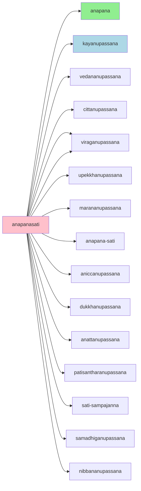

---
tags:
  - non dual 
  - anicca
  - citta
  - dukkha
  - nibanna 
  - daily 
---
# anapanasati

<iframe width="802" height="501" src="https://www.youtube.com/embed/WWUbEnpzCxs" title="101002 The Breath All the Way 16 Steps \ \ Thanissaro Bhikkhu \ \ Dhamma Talks" frameborder="0" allow="accelerometer; autoplay; clipboard-write; encrypted-media; gyroscope; picture-in-picture; web-share" allowfullscreen></iframe>

## what are the 16 steps for anapanasati?

The 16 steps of Anapanasati meditation in the Theravada tradition are a gradual progression that build upon each other, leading to greater levels of mindfulness, concentration, and insight. Here is a general outline of the 16 steps of Anapanasati meditation:

1. MINDFULNESS of breathing (anapana)
1. MINDFULNESS of the whole body (kayanupassana)
1. MINDFULNESS of bodily sensations (vedananupassana)
1. MINDFULNESS of mental states (cittanupassana)
1. Abandoning craving and attachment (viraganupassana)
1. Cultivating a state of equanimity (upekkhanupassana)
1. MINDFULNESS of [death](maranasati.md) (marananupassana)
1. MINDFULNESS of breathing in and out (anapana-sati)
1. Awareness of [impermanence](emptiness.md) (aniccanupassana)
1. Awareness of [suffering](dukka.md) (dukkhanupassana)
1. Awareness of non-self (anattanupassana)
1. Developing dispassion (viraganupassana)
1. Cultivating detachment (patisantharanupassana)
1. Establishing MINDFULNESS as a habit (sati-sampajanna)
1. Developing CONCENTRATION (samadhiganupassana)
1. Realizing [nibbana](nibanna.md) (nibbananupassana)

### anapana

| Prefix | Root Word | Suffix | Meaning |
| --- | --- | --- | --- |
| a- | na | - | Not, without |
| | apa | - | Away, off |
| | ana | - | Breathing, inhaling |
| | pana | - | Drinking, consuming |

### kayanupassana

| Prefix | Root Word | Suffix | Meaning |
| --- | --- | --- | --- |
| | kaya | - | Body |
| anu- | passana | - | Observation, contemplation |

### vedanapassana

| Prefix | Root Word | Suffix | Meaning |
| --- | --- | --- | --- |
| | vedana | - | Sensation, feeling |
| | passana | - | Observation, contemplation |

### cittanupassana

| Prefix | Root Word | Suffix | Meaning |
| --- | --- | --- | --- |
| | citta | - | Mind, consciousness |
| | anu- | passana | - | Observation, contemplation |

### viraganupassana

| Prefix | Root Word | Suffix | Meaning |
| --- | --- | --- | --- |
| | viraga | - | Dispassion, non-attachment |
| | anu- | passana | - | Observation, contemplation |

The word "viraganupassana" in Sanskrit can be broken down into the root word "viraga," which means "dispassion" or "non-attachment," the prefix "anu-" indicating "observation" or "following," and the word "passana" signifying "contemplation" or "observation."

The combined meaning of "viraganupassana" refers to the practice of "contemplation of non-attachment" or "mindfulness of dispassion." It involves observing and contemplating the arising and passing away of desires, attachments, and clinging within oneself, cultivating a state of non-attachment and letting go. This practice is a significant aspect of the Four Foundations of Mindfulness (Satipatthana) in Buddhism, aiding in the development of mindfulness, insight, and liberation from suffering.

### upekkanupassana

| Prefix | Root Word | Suffix | Meaning |
| --- | --- | --- | --- |
| | upekkha | - | Equanimity |
| | anu- | passana | - | Observation, contemplation |

The word "upekkanupassana" in Sanskrit can be broken down into the root word "upekkha," which means "equanimity," the prefix "anu-" indicating "observation" or "following," and the word "passana" signifying "contemplation" or "observation."

The combined meaning of "upekkanupassana" refers to the practice of "contemplation of equanimity" or "mindfulness of impartiality." It involves observing and contemplating the quality of equanimity in one's mental and emotional states, cultivating a balanced and non-reactive stance towards experiences. This practice is an integral part of the Four Foundations of Mindfulness (Satipatthana) in Buddhism, supporting the development of mindfulness, insight, and a deep sense of equanimity.

### viraganupassana

| Prefix | Root Word | Suffix | Meaning |
| --- | --- | --- | --- |
| | viraga | - | Dispassion, non-attachment |
| | anu- | passana | - | Observation, contemplation |

### marananupassana

| Prefix | Root Word | Suffix | Meaning |
| --- | --- | --- | --- |
| | marana | - | Death |
| | anu- | passana | - | Observation, contemplation |

### annicanupassana

| Prefix | Root Word | Suffix | Meaning |
| --- | --- | --- | --- |
| | anicca | - | Impermanence |
| | anu- | passana | - | Observation, contemplation |

### dukkanupassana

### anattanupassana

### viraganupassana

### patisantharanupassana

### sati-sampajanna

### samadhiganupassana

### nibanna.md

## another version

- breathing in (Sanskrit: āyāmi)
- breathing out (Sanskrit: evam)
- aware of the whole body (Sanskrit: sāram)
- calming the whole body (Sanskrit: sukhamayam)
- aware of rapture (Sanskrit: piti)
- aware of pleasure (Sanskrit: suka)
- aware of mental processes (Sanskrit: citta)
- aware of the mind (Sanskrit: citta)
- gladdening the mind (Sanskrit: cittam sukhamayam)
- steadying the mind (Sanskrit: cittam sukhamayam)
- focusing on impermanence (Sanskrit: anityam)
- focusing on fading away (Sanskrit: evanescence)
- focusing on cessation (Sanskrit: nirodhā)
- focusing on relinquishment (Sanskrit: nirodha)
- focusing on the calming of all fabrication (Sanskrit: samādhi)
- focusing on the attainment of knowledge (Sanskrit: prajñā)

## what traditions practice anapanasati

Anapanasati is a MINDFULNESS meditation practice that is widely used in both Theravada and Mahayana Buddhist traditions. It is considered a foundational meditation practice in both traditions, and is often taught as part of the path to insight, liberation, and enlightenment.

In the Theravada tradition, anapanasati is typically taught as part of the Four Foundations of Mindfulness, which includes MINDFULNESS of the body, feelings, mind, and mental objects. In this tradition, anapanasati is often used as a tool for developing CONCENTRATION and insight, and is seen as a means of freeing the mind from distractions and developing greater awareness and understanding of the nature of reality.

In the Mahayana tradition, anapanasati is often taught in the context of the practice of shamatha-vipashyana, which involves the cultivation of both calm abiding (shamatha) and clear seeing (vipashyana). In this tradition, anapanasati is seen as a means of developing both CONCENTRATION and insight, and is used as a tool for gaining insight into the nature of reality and for overcoming the obstacles to enlightenment.

Overall, anapanasati is a widely practiced form of MINDFULNESS meditation in both Theravada and Mahayana Buddhist traditions, and is considered an important tool for developing greater awareness, concentration, and insight.

## what are the theravada instructions for anapanasati?

The Theravada instructions for Anapanasati meditation can vary slightly depending on the teacher or tradition, but the basic principles remain the same. Here is a general outline of the Theravada instructions for Anapanasati meditation:

Find a quiet place to sit: Find a quiet, comfortable place to sit where you will not be disturbed. You can sit in a chair, on a cushion, or on a meditation bench. Maintain good posture and keep your back straight.

Focus on the breath: Close your eyes and focus your attention on the sensation of the breath as it enters and leaves your nostrils. Pay close attention to the sensation of the breath and the rise and fall of your chest.

Follow the breath: As you focus on the breath, allow your mind to follow it. Do not try to control your breath or change its natural rhythm. If your mind begins to wander, gently bring it back to the breath.

Expand your awareness: As you become more relaxed and focused, begin to expand your awareness to include the sensations in your body. Pay attention to any areas of tightness, tension, or discomfort and try to let go of these sensations as you inhale and exhale.

Cultivate mindfulness: Continuously cultivate MINDFULNESS of the breath, body sensations, and mental states. Observe your thoughts and emotions with equanimity and detachment.

Develop concentration: Over time, try to maintain your focus on the breath for longer and longer periods of time. As your CONCENTRATION improves, you may experience deeper states of peace and tranquility.

Integrate meditation into daily life: As you progress in your meditation practice, try to integrate the awareness and MINDFULNESS developed in meditation into your daily life. Apply the principles of Anapanasati meditation to your thoughts, emotions, and actions throughout the day.

These are general instructions for Anapanasati meditation in the Theravada tradition. It's important to find a teacher or meditation center that you trust and to develop a regular practice in order to get the most benefit from the practice. Over time, you may find that the instructions and your approach to the practice evolves as you gain experience and deepen your understanding.

## what are the instructions for anapanasati?

Anapanasati is a MINDFULNESS meditation practice in Buddhism that focuses on the sensation of the breath. The instructions for anapanasati meditation can be outlined as follows:

Find a quiet, comfortable place to sit: Choose a place to sit where you will not be disturbed. You can sit in a chair, on a cushion, or on a meditation bench. It is important to maintain good posture and to keep your back straight.

Focus on the breath: Begin by closing your eyes and focusing your attention on the sensation of the breath as it enters and leaves your nostrils. Pay close attention to the sensation of the breath and the rise and fall of your chest.

Follow the breath: As you focus on the breath, allow your mind to follow it. Don't try to control your breath or change its natural rhythm, simply observe it. If your mind begins to wander, gently bring it back to the breath.

Expand your awareness: As you become more relaxed and focused, begin to expand your awareness to include the sensations in your body. Pay attention to any areas of tightness, tension, or discomfort and try to let go of these sensations as you inhale and exhale.

Cultivate awareness and compassion: As you continue to practice anapanasati, try to cultivate an awareness of the body, mind, and emotions. See if you can observe your thoughts and emotions with a sense of curiosity and compassion.

Maintain focus: Try to maintain your focus on the breath for at least a few minutes at a time. As you become more comfortable with the practice, you can gradually increase the length of your meditation sessions.

These are the basic instructions for anapanasati meditation, but there are many variations and approaches to this practice, and individuals may find that certain modifications or modifications work better for them. The important thing is to develop a regular practice and to be patient with yourself as you develop your MINDFULNESS and CONCENTRATION skills.

## diagram

--8<-- "<https://gist.githubusercontent.com/shane0/a9a62b532f0bbd0e091ceaa63cb73b0e/raw/788903a4a2362667a219cfdf352dbacf70eb29c2/anapanasati.md>"
