---
tags:
  - buddhism
---
# buddhism

## tldr too long didn't read

- once a day practice [anapanasati](anapanasati.md)
- once a day practice [maranasati](maranasati.md)

- use the [2 links below](#recommended-sites) to study buddhism
- make a lifelong habit of studying buddhism

## recommended sites

- [plum village](https://plumvillage.org/)
- [dhammatalks](https://www.dhammatalks.org/)

## rando chatgpt diagrams

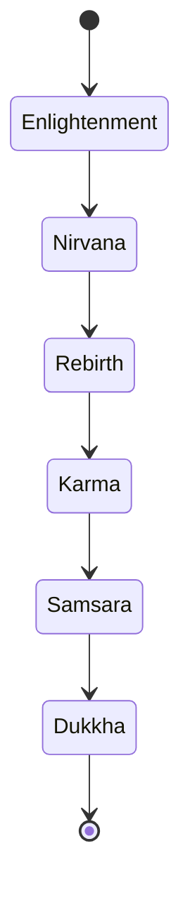

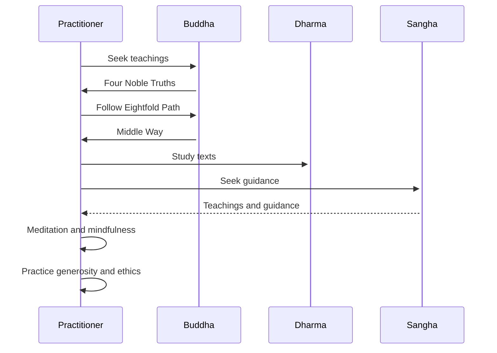

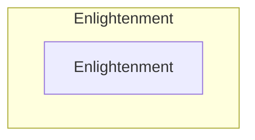

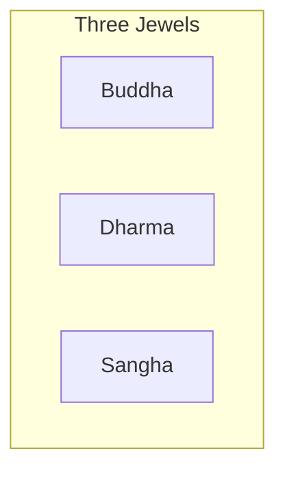

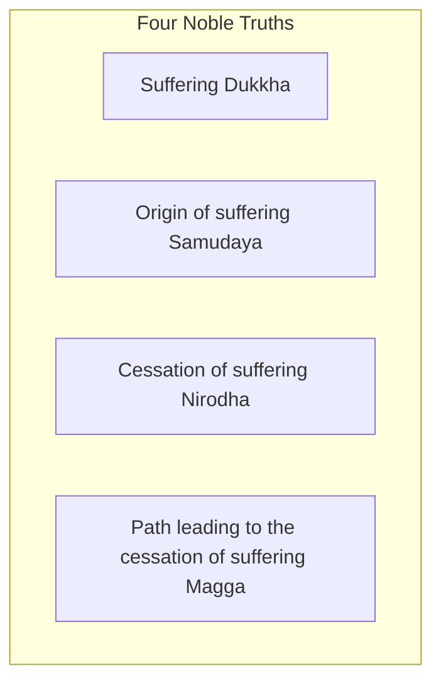

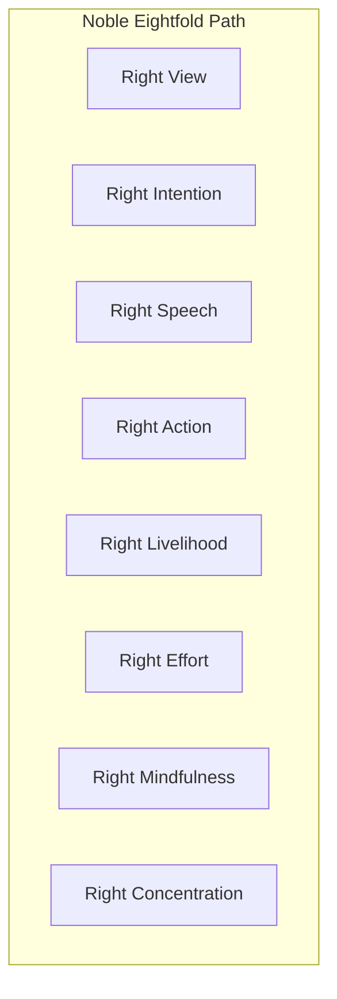

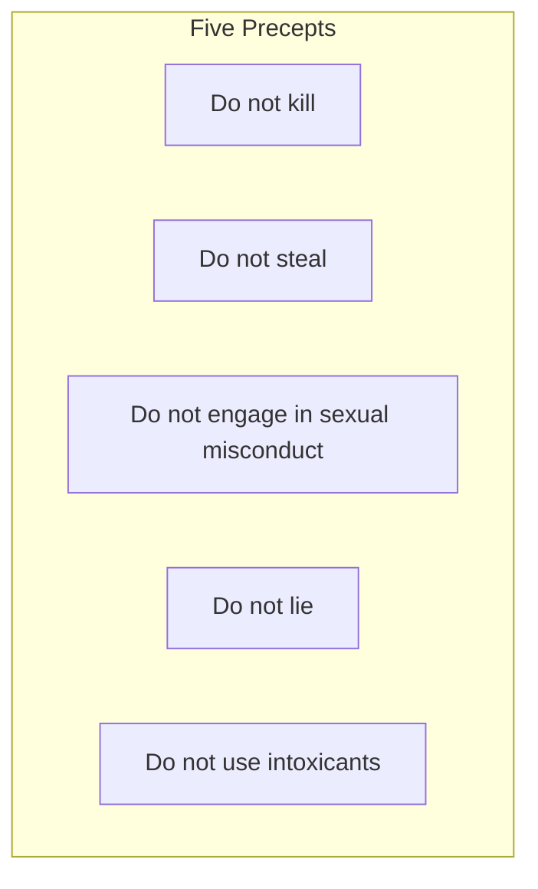

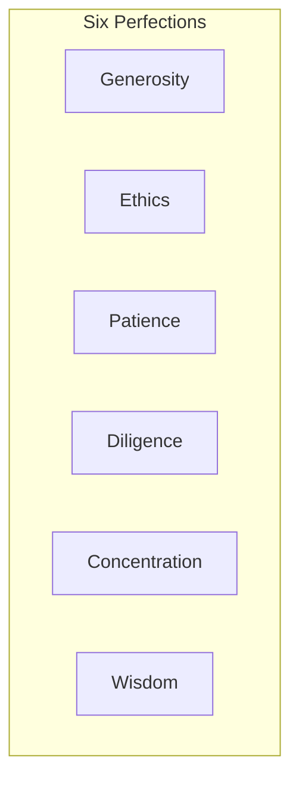

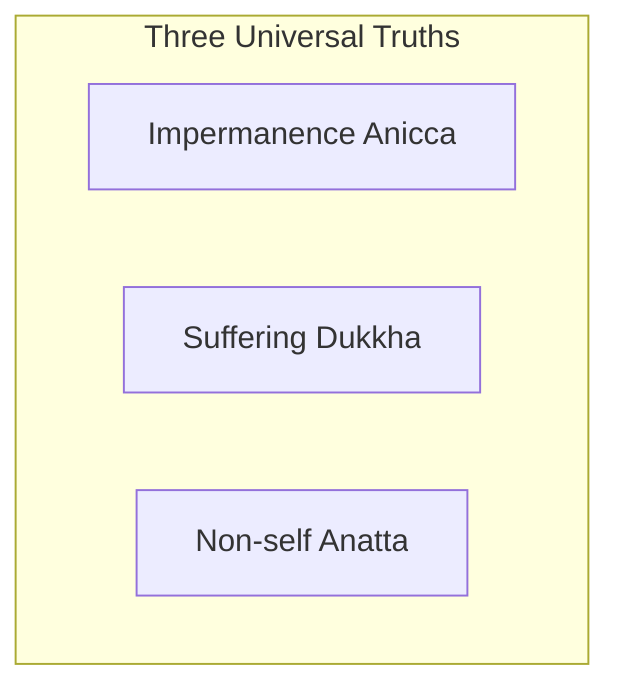

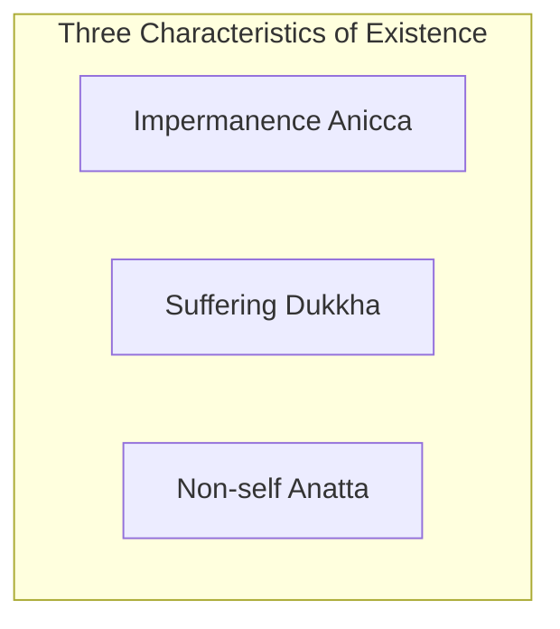

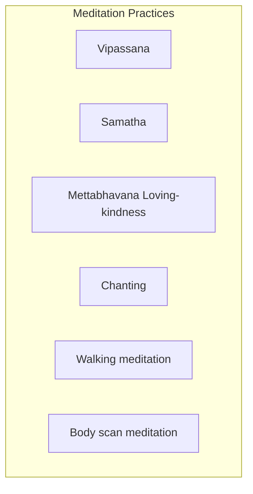

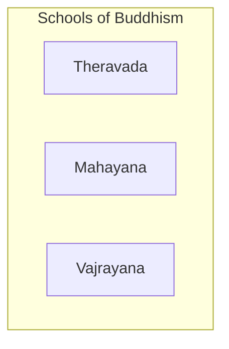

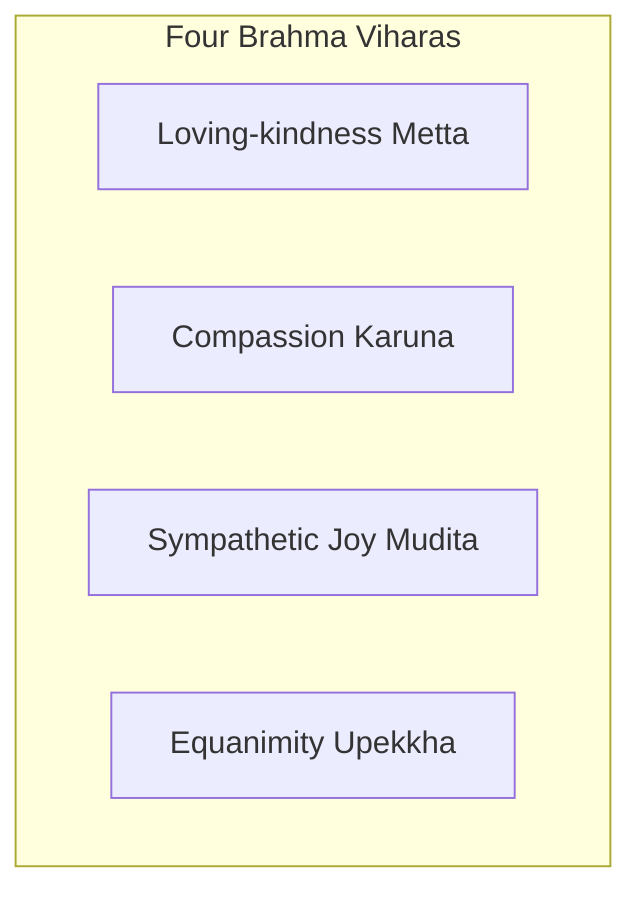

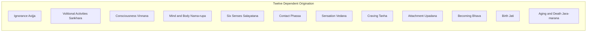

```text
    A --> {Three Jewels}
    A --> {Four Noble Truths}
    A --> {Noble Eightfold Path}
    A --> {Five Precepts}
    A --> {Six Perfections}
    A --> {Three Universal Truths}
    A --> {Three Characteristics of Existence}
    A --> {Meditation Practices}
    A --> {Schools of Buddhism}
    A --> {Four Brahma Viharas}
    A --> {Twelve Dependent Origination}
```

## a rant after 5 years of studying buddhism

I wish I had a webpage like this one when I started...

tmi: my journey

i started studying meditaiton and variations of buddhism during covid

so reading books, watching videos, attending online events

there's way tmi about buddhism, for starters buddha taught 84,000 paths to enlightenment

the pali canon is a big old bookshelf

despite all that info everyone and their cousin wrote another book on meditation and sold it

english translations are often translations of translations of variations of buddhism as it spread to other countries

each of these variations below added a bunch of new jargon

after dozens of books in these variations below I settled on [tldr](#tldr-too-long-didnt-read)

## variations

- [buddhism by country](https://en.wikipedia.org/wiki/Buddhism_by_country)

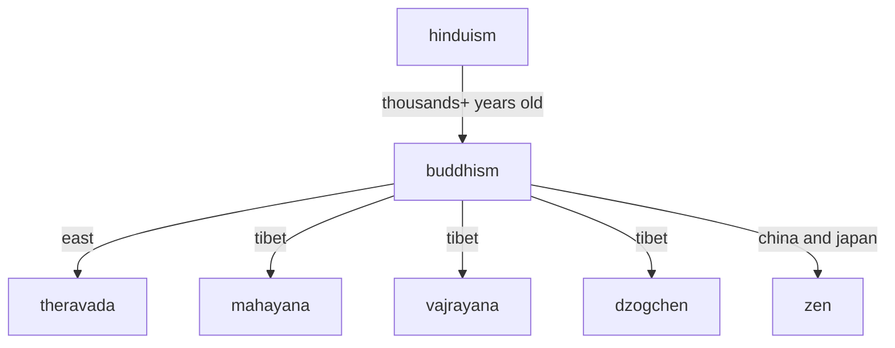
